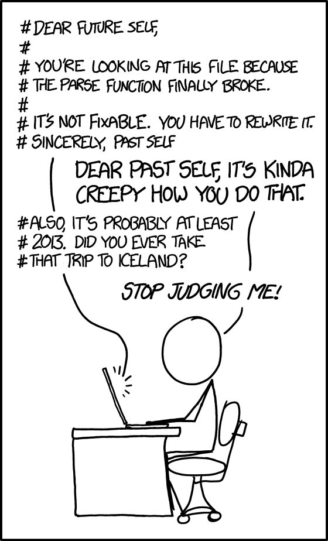

\mainmatter

# Introduction

Welcome! In this guide, we will teach you about statistics using the statistical software R with the interface provided by R Studio.  The purpose of this chapter to is provide you with a set of activities that get you up-and-running in R quickly so get a sense of how it works. In later chatpers we will revisit these same topics in more detail. 

## A focus on workflow

An important part of this guide is training you in a workflow that will avoid many problems than can occur when using R.

## R works with plug-ins

R is a statistical language with many plug-ins called **packages** that you will use for analyses. You can think of R as being like your smartphone. To do things with your phone you need **an App** (R equivalent: a *package*) from the App Store (R equivalent: *CRAN*). Apps need to be **downloaded** (R equivalent: *install.packages*) before you can use them. To use the app you need **Open** it  (R equivalent:  *library command*). These similarities are illustrated in Table \@ref(tab:appstore) below.


```{r appstore, echo = FALSE}
options(width = 60)
app_store <- readr::read_csv("data_app_store_analogy.csv", col_type = readr::cols())
knitr::kable(
  head(app_store), caption = 'R packages are similar to smart phone apps (Kim, 2018)',
  booktabs = TRUE
)
```


## Create an account at R Studio Cloud

[R Studio Cloud](http://www.rstudio.cloud) accounts are free and required for this guide. Please go to the website and set up a new account. 


## Join the class workspace

To do the assignment required for this class you need to join the class workspace on R Studio Cloud\index{R Studio Cloud}. To do so:

1. Log into R Studio Cloud (if you haven't already done so).

2. Go to your university email account and find the message with the subject "R Studio Workspace Invitation". In this message there is a link to the class R Studio Cloud workspace. 

3. Click on the workspace link in the email or paste it into your web browser. You should see a screen like the one below in Figure \@ref(fig:join). Click on the Join button.

```{r join, fig.cap="Screenshot of workspace join message", echo = FALSE, out.width="70%"}
knitr::include_graphics("ch_introduction/images/screenshot_join.png")
```

4. Then you should see the welcome message illustrated in Figure \@ref(fig:welcome). Above this message is the Projects menu option. Click on the word Project.

```{r welcome, fig.cap="Screenshot of welcome message", echo = FALSE, out.width="70%"}

```

5. You should now see the First Project displayed as in \@ref(fig:assignment). Click the Start button. You will then move to a view of R Studio.

```{r assignment, fig.cap="Screenshot of starting first assignment", echo = FALSE, out.width="70%"}
knitr::include_graphics("ch_introduction/images/screenshot_assignment.png")
```

5. In R Studio it is essential you use projects to keep your files organized and in the same spot. For this course, when your start an assignment on R Studio Cloud and the project will already have been made for you. Later you will learn to make your own R Studio Projects.


## Exploring the R Studio Interface

Once you have opened (or created) a Project folder, you are presented with the R Studio interface. There are a few key elements to the user interface that are illustrated in Figure \@ref(fig:interface) In the lower right of the screen you can see the a panel with several tabs (i.e., Files, Plots, Packages, etc) that I will refer to as the Files pane. You look in this pane to see all the files associated with your project. On the left side of the screen is the Console which is an interactive pane where you type and obtain results in real time. I've placed two large grey blocks on the screen with text to more clearly identify the Console and Files panes. Not shown in this figure is the Script panel where we can store our commands for later reuse.

```{r interface, fig.cap = "R Studio interface", echo = FALSE, out.width="70%"}
knitr::include_graphics("ch_introduction/images/screenshot_interface.png")
```

### Console panel

When you first start R, the Console panel is on the left side of the screen. Sometimes there are two panels on the left side (one above the other); if so, the Console panel is the lower one (and labeled accordingly). We can use R a bit like a calculator. Try typing the following into the Console window: 8 + 6 + 7 + 5. You can see that R immediately produced the result on a line preceded by two hashtags (##).

```{r}
8 + 6 + 7 + 5
```

We can also put the result into a variable to store it. Later we can use the print command to see that result. In the example below we add the numbers 3, 0, and 9 and store the result in the variable my_sum. The text "<-" indicate you are putting what is on the right side of the arrow into the variable on the left side of the arrow. You can think of a variable as cup into which you can put different things. In this case, imagine a real-world cup with my_sum written on the outside and inside the cup we have stored the sum of 3, 0, and 9 (i.e., 12).

```{r}
my_sum <- 3 + 0 + 9

```

We can inspect the contents of the my_sum variable (i.e., my_sum cup) with the print command:

```{r}
print(my_sum)
```

Variable are very useful in R. We will use them to store a single number, an entire data set, 
the results of an analysis, or anything else.

### Script Panel

Although you can use R with just with the Console panel, it's a better idea to use scripts via the Script panel - not visible yet. Scripts are just text files with the commands you use stored in them. You can run a script (as you will see below) using the Run or Source buttons located in the top right of the Script panel. 

Scripts are valuable because if you need to run an analysis a second time you don't have to type the command in a second time. You can run the script again and again without retyping your commands. More importantly though, the script provides a record of your analyses. 

A common problem in science is that after an article is published, the authors can't reproduce the numbers in the paper. You can read more about the important problem in a surprising article in the journal [Molecular Brain](https://molecularbrain.biomedcentral.com/articles/10.1186/s13041-020-0552-2). In this article an editor reports how a request for the data underlying articles resulted in the wrong data for 40 out of 41 papers. Long story short -- keep track of the data and scripts you use for your paper. In a later chapter, it's generally poor practice to manipulate or modify or analyze your data using any menu driven software because this approach does not provide a record of what you have done.

## Writing your first script

### Create the script file

Create a script in your R Studio project by using the menu File > New File > R Script.

Save the file with an appropriate name using the File menu. The file will be saved in your Project folder. A common, and good, convention for naming is to start all script names with the word "script" and separate words with an underscore. You might save this first script file with the name "script_my_first_one.R". The advantage of beginning all script files with the word script is that when you look at your list of files alphabetically, all the script files will cluster together. Likewise, it's a good idea to save all data files such that they begin with "data_". This way all the data files will cluster together in your directory view as well. You can see there is already a data file with this convention called "data_okcupid.csv". 

You can see as discussed previously, we are trying to instill an effective workflow as you learn R. Using a good naming convention (that is consistent with what others use) is part of the workflow. When you write your scripts it's a good idea to follow the [tidyverse style guide](https://style.tidyverse.org) for script names, variable name, file names, and more.


### Add a comment to your script

In the previous section you created your first script. We begin by adding a comment to the script. A comment is something that will be read by humans rather than the computer/R. You make comments for other people that will read your code and need to understand what you have done. However, realize that you are also making comments for your future self as illustrated in an [XKCD cartoon](https://xkcd.com/1421/). 

```{r, echo = FALSE, out.width="40%"}

```

A good way to start every script is with a comment that includes the date of your script (or even better when you installed your packages, more on this later). Like smartphone apps, packages are updated regularly. Sometimes after a package is updated it will no longer work with an older script. Fortunately, the [checkpoint package](https://cran.r-project.org/web/packages/checkpoint/index.html)\index{R Studio Cloud} lets users role back the clock and use older versions of packages. Adding a comment with the date of your script will help future users (including you) to use your script with the same version of the package used when you wrote the script. Dating your script is an important part of an effective and reproducible workflow.


```{r}
# Code written on: YYYY/MM/DD 
# By: John Smith
```

Moving forward, I suggest you use comments to make your own personal notes in your own code as your write it. Note that in the above comment I used the internationally accepted date format\index{date format} order Year/Month/Day created by the [International Organization for Standardization](https://www.iso.org/home.html) (ISO). Some people use the mnemonic *Your My Dream* to remember the **Y**ear **M**onth **D**ay order. Wikipedia provides more information about this [International Date Format (ISO 8601)](https://en.wikipedia.org/wiki/ISO_8601). An [XKCD](https://xkcd.com/1179/) cartoon highlights the ISO date format:

```{r, echo = FALSE, out.width="40%"}
knitr::include_graphics("ch_introduction/images/iso8601.png")
```

### Background about the tidyverse

There are generally two broad ways of using R, the older way and the newer way. Using R the older way is refered to as using base R. A more modern approach to using R is the tidyverse\index{tidyverse}. The tidyverse represents a collection of packages the work together to give R a modern workflow. These packages do many things to help the data analyst (loading data, rearranging data, graphing, etc.). We will use the tidyverse approach to R in this guide.

A noted the tidyverse is a collection of packges. Each package adds new commands to R. The number of packges and correspondingly the number of new commands added to R by the tidyverse is large. Below is a list of the tidyverse packages:

```{r, echo = FALSE}
tidyverse::tidyverse_packages(include_self = TRUE)
```


Before you can use a package it needs to be installed -- this is the same as downloading an app from the App Store. Normally, you can install a **single** packages with the install.packages command. Previously, you needed run an install.package command for every package in the tidyverse as illustrated below (though we no longer use this approach).

```{r, eval=FALSE}
# The old way of installing the tidyverse packages
# Like downloading apps from the app store

install.packages("broom", dep = TRUE)
install.packages("cli", dep = TRUE)
install.packages("ggplot", dep = TRUE)
# etc
```

Fortunately, the tidyverse packages can now by installed with a single install.packages command. Specifically, the install.packages command below will install all of the packages listed above.

**Class note: For the "First Lab", I've done the install.packages for you. So there is no need to use the install.packages command below in this first lab.**

```{r, eval = FALSE}
install.packages("tidyverse", dep = TRUE)
```

### Add library(tidyverse) to your script 

The tidyverse is now installed, so we need to activate it. We do that with the library command. Put the library line below at the top of your script file (below your comment):

```{r librarytidyverse, eval = FALSE}
# Code written on: YYYY/MM/DD 
# By: John Smith
library(tidyverse)
```

### Activate tidyverse auto-complete for your script

Select the library(tidyverse) text with your mouse/track-pad so that it is highlighted. Then click the Run button in the upper right of the Script panel. Doing this "runs" the selected text. After you click the Run button you should see text like the following the Console panel:

```{r, echo = FALSE, eval = TRUE}
library(tidyverse)
```

When you use library(tidyverse) to activate the tidyverse you activate the most commonly used subset of the tidyverse packages. In the output you see checkmarks beside names of the tidyverse packages you have activated. 

By activating these packages you have added new commands to R that you will use. Sometimes these packages replace older versions of commands in R. The "Conflicts" section in the output shows you where  the packages you  activated  replaced older R commands with newer R commands. You can activate the other tidyverse package by running a library command for each package -- if needed. No need to do so now.

Most importantly, running the library(tidyverse) prior to entering the rest of your script allows R Studio to present auto-complete options when typing your text. Remember to start each script with the library(tidyverse) command and then Run it so you get the autocomplete options for the rest of the commands your enter.

## Loading your data

### Use read_csv (not read.csv) to open files. 

If you inspect the Files pane on the right of the screen you see the  **data_okcupid.csv** data file in our project directory. We will load this data with the commands below. If you followed the steps above, you should have auto-complete for the tidyverse commands you type for now in -- in the current R session. Enter the command below into your script. As your start to type read_csv you will likely be presented with an auto-complete option. You can use the arrow keys to move up and down the list of options to select the one you want - then press tab to select it.

Once your command looks like the one below select the text and click on the "Run" button.

Note: If you are not in the class, the data file is available from: https://github.com/dstanley4/psyc3250bookdown


```{r firstread}
okcupid_profiles <- read_csv(file = "data_okcupid.csv")

```

The output indicates that you have loaded a data file and the type of data in each column. The sex column is of type col_character which indicates it contains text/letters. Most of the columns are of the type character. The age and height columns contain numbers are correspondingly indicated to be the type col_double. The label col_double indicates that a column of numbers represented in R with [high precision](https://en.wikipedia.org/wiki/Double-precision_floating-point_format). There are other ways of representing numbers in R but this is the type we will see/use most often.

## Checking out your data

There many ways of viewing the actual data you loaded. A few of these are illustrated now. 

### view(): See a spreadsheet view of your data

You can inspect your data in a spreadsheet view by using the view command. Do NOT add this command to your script file -- EVER. Adding it to the script can cause substantial problems. Type this command in the Console.

```{r, eval = FALSE}
view(okcupid_profiles)
```


### print(): See you data in the Console
You can inspect the first few rows of your data with the print() command. It is OK to add a print command to your script. Try the print() command below in the Console:

```{r}
print(okcupid_profiles)
```

### head(): Check out the first few rows of data 

You can inspect the first few rows of your data with the head() command. Try the command below in the Console:

```{r}
head(okcupid_profiles)
```

You can be even more specific and indicate you only want the first three row of your data with the head() command.  Try the command below in the Console:

```{r}
head(okcupid_profiles, 3)
```

### tail(): Check out the last few rows of data 

You can inspect the last few rows of your data with the tail() command. Try the command below in the Console:

```{r}
tail(okcupid_profiles)
```

You can be even more specific and indicate you only want the last three row of your data with the tail() command.  Try the command below in the Console:

```{r}
tail(okcupid_profiles, 3)
```

### summary(): Quick summaries

You can a short summary of your data with the summary() command. Note that we will use the summary() command in many places in the guide. The output of the summary() command changes depending on what you give it - that is put inside the brackets. You can give the summary() command many things such as data, the results of a regression analysis, etc.

Try the command below in the Console. You will see that summary() give the mean and median for each of the numeric variables (age and height).

```{r}
summary(okcupid_profiles)
```


## Run *vs.* Source with Echo *vs.* Source 

There are different ways of running commands in R.  So far you have used two of these. You can enter them into the Console as we have done already. Or you can put them in your script select the text and clickk the Run button. There are four ways of running commands in your script. 

You can:

1. Console: Enter commands directly
2. Script: Select the command(s) and press the Run button.
2. Script: Source (Without Echo)
3. Script: Source With Echo

Two of these approaches involve using the Source button, see Figure \@ref(fig:sourcebutton). You bring up the options for the Source button, illustrated in this figure, by clicking on the small arrow to the right of the word Source. 

```{r sourcebutton, fig.cap = "Source button options", echo=FALSE, out.width="35%"}
knitr::include_graphics("ch_introduction/images/screenshot_source.png")
```

### Run select text

The Run button will run the text you highlight and present the relevant output. You have used this command a fair amount already.

I strongly suggest you ONLY use the Run button when testing a command to make sure it works or to debug a script. Or to run library(tidyverse) as you start working on your script so that you get the autocomplete options.

In general, you should always try to execute your R Scripts using the Source with Echo command (preceded by a Restart, see below). This ensures your script will work beginning to end for you in the future and for others that attempt to use it. Using the Run button in an ad lib basis can create output that is not reproducible.

### Source (without Echo)

Source (without Echo) is not designed for the typical analysis workflow. It is mostly helpful when you run simulations. When you run Source (without Echo) much of the output you would wish to read is suppressed. In general, avoid this option. If you use it, you often won't see what you want to see in the output.

### Source with Echo

The Source with Echo command runs all of the contents of a script and presents the output in the R console. This is the approach you should use to running your scripts in most cases.

Prior to running Source with Echo (or just Source), it's always a good idea to restart R. This makes sure you clear the computer memory of any errors from any previous runs. 

So you should do the following EVERY time you run your script.

1.  Use the menu item: **Session > Restart R**
2.  Click the down arrow beside the Source button, and click on Source With Echo

This will clear potentially problematic previous stats, run the script commands, and display the output in the Console.  Moving forward we will use this approach for running scripts. Once you have used Source wiht Echo once, you can just click the Source button and it will use Source with Echo automatically (without the need to use the pull down option for selecting Source with Echo).


```{block2, type='rmdcaution'}
Using Restart R before you run a script, or R code in general, is a critical workflow tip.
```

## Trying Source with Echo

Put the head(), tail(), and summary() command we used previously into your script. Then save your script using using the File > Save menu. You script should appear as below.

```{r firstsource, eval=FALSE}
# Code written on: YYYY/MM/DD 
# By: John Smith
library(tidyverse)

okcupid_profiles <- read_csv(file = "data_okcupid.csv")

head(okcupid_profiles)

tail(okcupid_profiles)

summary(okcupid_profiles)
```

Now do the following:

1.  Use the menu item: **Session > Restart R**
2.  Click the down arrow beside the Source button, and click on Source With Echo

You should see the output below:

```{r firstsource, eval=TRUE}
```

Congratulations you just ran your first script!


## A few key points about

Sometimes you will need to send a command additional information. Moreover, that information often needs to be grouped together into a vector or a list before you can send it to the command. We'll learn more about doing so in the future but here is a quick over view of vectors and lists to provide a foundation for future chapters.

#### Vector of numbers

We can create a vector of only numbers using the "c" function - which you can think of as being short for "combine" (or concatenate). In the commands below we create a vector of a few even numbers called "even_numbers".

```{r}
even_numbers <- c(2, 4, 6, 8, 10)
```

```{r}
print(even_numbers)
```

We can obtain the second number in the vector using the following notation:

```{r}
print(even_numbers[2])
```


#### Vector of characters

We can also create vectors using only characters. Note that I use **SHIFT RETURN** after each comma to move to the next line.

```{r}
favourite_things <- c("copper kettles",
                      "woolen mittens",
                      "brown paper packages")
```

```{r}
print(favourite_things)
```

As before, can obtain the second item in the vector using the following notation:

```{r}
print(favourite_things[2])
```


### Lists

Lists are similar to vectors in that you can create them and access items by their numeric position. Vectors must be all characters or all numbers. Lists can be a mix of characters or numbers. Most importantly items in lists can be accessed by their label. Note that I use **SHIFT RETURN** after each comma to move to the next line in the code below.

```{r}
my_list <- list(last_name = "Smith",
                first_name = "John",
                office_number = 1913)

print(my_list)
```

You can access an item in a list using double brackets:

```{r}
print(my_list[2])
```

You can access an item in a list by its label/name using the dollar sign:

```{r}
print(my_list$last_name)
print(my_list$office_number)
```

## That's it!

Congratulations! You've reached the end of the introduction to R. Take a break, have a cookie, and read some more about R tomorrow!
