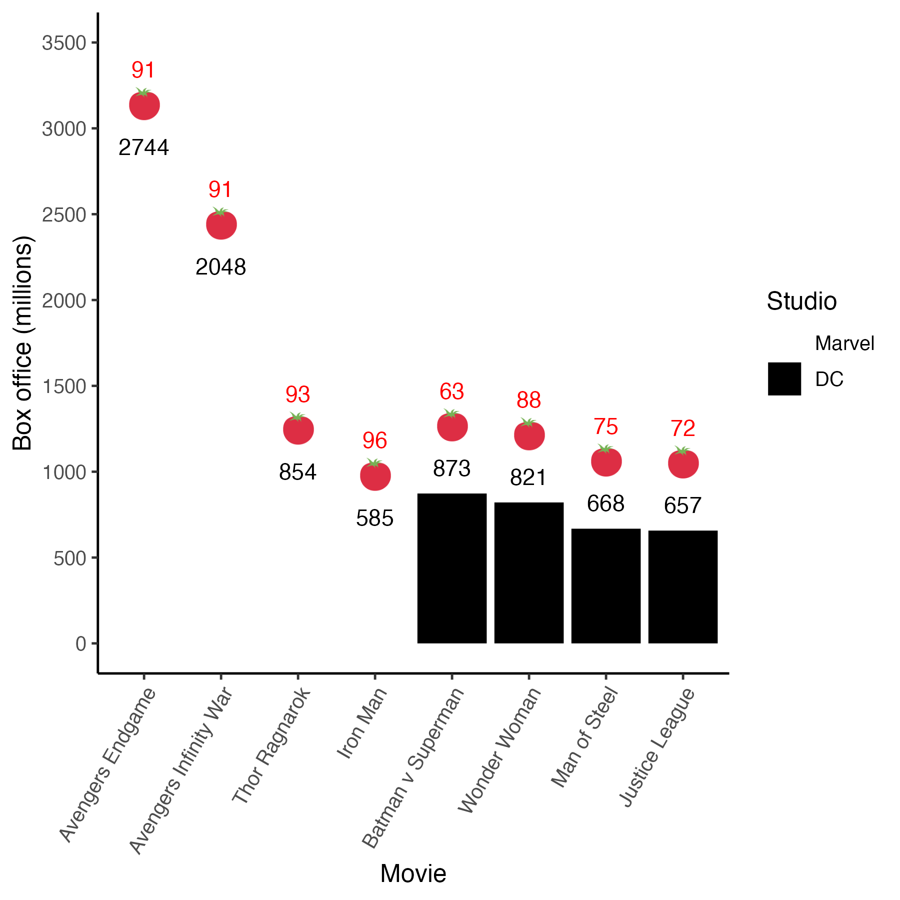

# Graphing

## Required

The data files below are used in this chapter. The files are available at: https://github.com/dstanley4/psyc3290bookdown

| Required Data |
|-------------------|
|data_movies.csv |


The following packages CRAN must be installed:

| Required CRAN Packages |
|-------------------|
|tidyverse          |
|RColorBrewer       |
|remotes            |


The following GitHub packages must be installed:

| Required GitHub Packages |
|--------------------------|
|dill/emoGG |


After the remotes package is installed, it can be used to install a package from GitHub:

```{r, eval = FALSE}
remotes::install_github("dill/emoGG")
```

```{r, include = FALSE}
library(tidyverse)
```


## Data 

To learn about making graphs using the tidyverse we use movie ratings and box office data obtained at the time of writing. Movie ratings were obtained from the [IMDB](https://www.imdb.com) and [RottenTomatoes](https://www.rottentomatoes.com). Box office data (in millions of dollars) was obtained from [Box Office Mojo](https://www.boxofficemojo.com). If you enjoy learning about movies these are all excellent sites. 

We begin by loading data_movies.csv using read_csv(), not read.csv():

```{r, include=FALSE}
library(tidyverse)
movie_data <- read_csv("data_movies.csv")
```

```{r, eval=FALSE}
movie_data <- read_csv("data_movies.csv")
```

Next we inspect movie_data using the print() command. We see that each row of the data set corresponds to a superhero movie. 

```{r}
print(movie_data)
```

Next we use glimpse() to see the columns.

```{r}
glimpse(movie_data)
```

The title and short_title columns provide the full title and short title for each movie. Additionally, the IMDB rating, the Rotten Tomatoes Audience rating, and the Box Office Mojo revenue numbers are provided in the imdb, tomatoes_aud, and boxoffice columns, respectively. Finally, the last column, studio,  indicates the studio that made the movie (Marvel or DC).

It is extremely important for graphing and analyses that you tell R which columns are composed of categorical variables. We do that using the as_factor command. The as_factor command turns a column into a categorical column. We use the mutate command to replace the original column with the column that has been defined as a categorical variables using as_factor. 

```{r}
movie_data <- movie_data %>% 
  mutate(across(.cols = where(is.character), 
                .fns = as_factor))
```


We can confirm the column type has changed by using the glimpse() command again and examing the column types:


```{r}
glimpse(movie_data)
```


## Graph basics 

In this section we teach you how to make a graph from first principles to form a foundation for understanding how the tidyverse graphing command ggplot() works. Note, however, that the approach used for creating a graph in this section is for teaching purposes only. Later we will make graphs in a typical, and more efficient, manner.

We start a graph using the ggplot() command. The ggplot() command creates an empty template for the graph. After creating the template we have to add content (like bars) to the graph using the geom_col() command. We can also add text using the geom_text() command.

Commands that plot information on the graph, such as geom_col(), need to know what data set to use to create the graph. We specify the data set to use via the **data** argument. For example, we use "data = movie_data" to tell a command which data set to use.

Additionally, graphing commands, such as geom_col(), must know the columns/variables to use within that data set when plotting the graph. Specifically, commands need to know which variable/column will vary over the x- and y-axes. We can indicate these columns via the **mapping** argument. For example, we use "mapping = aes(x = short_title, y = boxoffice)" to tell ggplot() that we should use the column short_title along the x-axis and the column boxoffice when determining heights on the y-axis. This information is nested within the aes() command which is short for aesthetic. You are telling ggplot() about the aesthetics for the graph (i.e., which columns to use for the x- and y-axes) using the aes() command. There are a larger number of aesthetics that you can specify within the aes() command (e.g., color, fill, linetype, etc.).

In the examples that follow we tell each command (geom_col, geom_text) which data set and columns to use via the **data** and **mapping** arguments.

Use geom_col() to put each boxoffice column value into a bar.

```{r, out.width="65%"}
my_graph <- ggplot() +
  geom_col(data = movie_data,
           mapping = aes(x = short_title, 
                         y = boxoffice))

print(my_graph)
```


Next, we want to put the boxoffice revenue above each bar so it easier to interpret. In R terms, we are putting a label above each bar. We want the contents for the labels to come from the boxoffice column. Therefore, we add the geom_text() command below:


```{r, out.width="65%"}
my_graph <- ggplot() +
  geom_col(data = movie_data,
           mapping = aes(x = short_title, 
                         y = boxoffice)) +
  geom_text(data = movie_data, 
           mapping = aes(x = short_title, 
                         y = boxoffice, 
                         label = boxoffice))
print(my_graph)
```

Unfortunately, when we position the text at the exact height of each column it overlaps with the column making it difficult to read. We fix this on the next page using nudge_y.

We can nudge each label higher on the y-axis using the *nudge_y* command. In the above code, we nudge it up 150 units. Since nudge_y uses the values on the y-axis we are nudging the labels up by 150 million on the y-axis.

```{r, out.width="65%"}
my_graph <- ggplot() +
  geom_col(data = movie_data,
           mapping = aes(x = short_title, 
                         y = boxoffice)) +
  geom_text(data = movie_data, 
           mapping = aes(x = short_title, 
                         y = boxoffice, 
                         label = boxoffice),
           nudge_y = 150)

print(my_graph)
```


## Graphing efficiently 

You may have noticed that creating the graphs the way we did above required repeating the data and mapping assignments within each command (e.g., geom_text, geom_col). Fortunately, we can use a shortcut and specify the data and mapping only once in the ggplot() command. Once we do that, the contents of the mapping argument are invisibly copied into each subsequent command (e.g., geom_col, geom_text). In this way, we only have to specify the data and the mapping once. 

Examine the code below and compare it to the code above. Notice how in the geom_col() command we don't have anything specified -- the data and mapping from the ggplot command are used. Likewise, notice how in the geom_text() command we only specify the arguments we need that are different from those in the ggplot command. In this case, that means simply adding the nudge_y = 150 to the geom_text command.


```{r, out.width="65%"}
my_graph <- ggplot(data = movie_data,
           mapping = aes(x = short_title,
                         y = boxoffice,
                         label = boxoffice)) +
  geom_col() +
  geom_text(nudge_y = 150) 

print(my_graph)
```

## Aesthetics

Exactly how does that aesthetic, aes(), command work? What happens when we put the data and mapping in the ggplot() command instead of the specific commands such as geom_col()? When we put data and the mapping arguments in the ggplot() command we set those attributes for the entire graph. To understand this, you need to know that ggplot uses an internal data set that we will call the "black box" data set (i.e., inside the [black box](https://en.wikipedia.org/wiki/Black_box) of ggplot). To create a graph ggplot maps/copies columns from your data set (e.g., movie_data) to an internal data set. This internal data set is then used to create the graph. Figure \@ref(fig:showmap) below illustrates what is happening "inside the black box" when you create the graph using the code above.


```{r, showmap, echo = FALSE, out.width = "70%", fig.cap="Internal data structure for ggplot"}
knitr::include_graphics("ch_graphing/images/mapping.png")
```


### Fill color

You might want to influence the color of the bars in the graph such that the bars for Marvel and DC movies have different colors. That's easy to do with the aes() command. We simply tell aes() that the **fill** color of any object in the graph should be determined by the studio column. Simply adding "fill = studio" to the aes() command changes the colors of the bars -- and any other object on the graph for which fill would be relevant. The internal workings are illustrated in Figure \@ref(fig:addfill).

```{r, out.width="65%"}
my_graph <- ggplot(data = movie_data,
           mapping = aes(x = short_title,
                         y = boxoffice,
                         label = boxoffice,
                         fill = studio )) +
  geom_col() +
  geom_text(nudge_y = 150) 

print(my_graph)
```

```{r, addfill,echo = FALSE, out.width = "70%", fig.cap="Adding a fill column to the internal data"}
knitr::include_graphics("ch_graphing/images/mapping_fill.png")
```

### Overriding aes()

Just because you specify something in the ggplot() command doesn't mean that you are "stuck with it" for all your subsequent commands. Recall how at the start of this exercise we specified the data and the mapping for each geom_col() and geom_text() individually. We can still do that. 

Now we want to add the Rotten Tomatoes Audience score for each movie above the box office revenue. But if we use geom_text(), like we did before, it will plot the same boxoffice information because of  "label = boxoffice" in the aes() specification within ggplot(). We want the new geom_text() command to plot different text; that is, we want it to use "label = tomatoes_aud". 

Fortunately, if we simply put "mapping = aes(label = tomatoes_aud)" within the new geom_text() command we get the desired information on the graph. The mapping/aes arguments within geom_text() override the mapping/aes arguments within ggplot(). Or more accurately, the new geom_text() command creates its own version of the internal data set in which the label column is filled with information from tomatoes_aud.

```{r, out.width="65%"}
my_graph <- ggplot(data = movie_data,
           mapping = aes(x = short_title,
                         y = boxoffice,
                         label = boxoffice, 
                         fill = studio)) +
  geom_col() +
  geom_text(nudge_y = 150)  +
  geom_text(mapping = aes(label = tomatoes_aud)) 
print(my_graph)
```

Notice that we have the same problem as before with the text being difficult to read because it overlaps with the bar. We add "nudge_y = 400" to move the text higher than the boxoffice text/label. Don't forget the units used by nudge_y are the units on the y-axis.

```{r, out.width="65%"}
my_graph <- ggplot(data = movie_data,
           mapping = aes(x = short_title,
                         y = boxoffice,
                         label = boxoffice, 
                         fill = studio)) +
  geom_col() +
  geom_text(nudge_y = 150)  +
  geom_text(mapping = aes(label = tomatoes_aud), 
            nudge_y = 400) 
print(my_graph)
```

\newpage

## APA style

Use theme_classic() to make the graph apear in APA style. We use theme_classic(12) to make the graph APA style with a 12-point font:

```{r, out.width="65%"}
my_graph <- ggplot(data = movie_data,
           mapping = aes(x = short_title,
                         y = boxoffice,
                         label = boxoffice, 
                         fill = studio)) +
  geom_col() +
  geom_text(nudge_y = 150)  +
  geom_text(mapping = aes(label = tomatoes_aud), 
            nudge_y = 400) +
  theme_classic(12)

print(my_graph)
```


## Axes

### Range 

We use the coord_cartesian() command to adjust range of axes. In the code below we use coord_cartesian() to make the y-axis range from 0 to 3500.


```{r, out.width="65%"}
my_graph <- ggplot(data = movie_data,
           mapping = aes(x = short_title,
                         y = boxoffice,
                         label = boxoffice, 
                         fill = studio)) +
  geom_col() +
  geom_text(nudge_y = 150)  +
  geom_text(mapping = aes(label = tomatoes_aud), 
            nudge_y = 400) +
  coord_cartesian(ylim = c(0, 3500)) +
  theme_classic(12)


print(my_graph)
```

Note that if you had a continuous variable on the x-axis (we do not in this example), you could set the range of both the x- and y-axes like this:

```{r, eval=FALSE}
coord_cartesian(ylim = c(0, 3500),
                xlim = c(0, 3500))
```


### Ticks 

We use the scale_y_continuous() command to adjust the ticks on the y-axis. We set the ticks on the y-axis to range from 0 to 3500 in 500 tick increments using the scale_y_continuous command below via the breaks argument:

```{r, out.width="65%"}
my_graph <- ggplot(data = movie_data,
           mapping = aes(x = short_title,
                         y = boxoffice,
                         label = boxoffice, 
                         fill = studio)) +
  geom_col() +
  geom_text(nudge_y = 150)  +
  geom_text(mapping = aes(label = tomatoes_aud), 
            nudge_y = 400) +
  coord_cartesian(ylim = c(0, 3500)) +
  scale_y_continuous(breaks = seq(0, 3500, by = 500)) +
  theme_classic(12)

print(my_graph)
```

Note that if you had a continuous variable on the x-axis (we do not in this example), you could set the ticks of the x-axis like the code below using scale_x_continuous:

```{r, eval=FALSE}
scale_x_continuous(breaks = seq(0, 3500, by = 500))
```

### Labels 

Labels are an extremely important part of any graph. This fact is the focus of the [xkcd](https://xkcd.com/833/) cartoon below:

```{r, echo = FALSE, out.width="80%"}
knitr::include_graphics("ch_graphing/images/convincing.png")
```

We use the labs() command to set the labels for the x- and y-axes:

```{r, out.width="65%"}
my_graph <- ggplot(data = movie_data,
           mapping = aes(x = short_title,
                         y = boxoffice,
                         label = boxoffice, 
                         fill = studio)) +
  geom_col() +
  geom_text(nudge_y = 150)  +
  geom_text(mapping = aes(label = tomatoes_aud), 
            nudge_y = 400) +
  coord_cartesian(ylim = c(0, 3500)) +
  scale_y_continuous(breaks = seq(0, 3500, by = 500)) +
  labs(x = "Movie",
       y = "Box office (millions)",
       fill = "Studio") +
  theme_classic(12)

print(my_graph)
```


## Axis values

### Text

What if we want to use the full movie title rather than the short version on the x-axis of the graph? That is, you want to change the values along the x-axis. Two methods are presented below. 

#### Method 1: Recoding axis values 

Our data file contains a column with the long/full version of the movie names. But many times you won't have the additional/longer labels available in this manner. In this situation, you use the scale_x_discrete() command to change the values along the x-axis.

The values along the x-axis come from the short_title column which is a factor. The levels of that factor correspond to the short titles for the movies (Iron, Thor, etc.). We need to relabel the levels of the short_title factor to get a graph with full titles. We relabel the levels of the short_title factor using the scale_x_discrete() command. The graph code with scale_x_discrete() command is below - notice the problem we have with the labels overlapping though. On the next page, we'll use an easier approach though - since we have an extra column with the full titles.

```{r, out.width="65%"}
my_graph <- ggplot(data = movie_data,
           mapping = aes(x = short_title,
                         y = boxoffice,
                         label = boxoffice, 
                         fill = studio)) +
  geom_col() +
  geom_text(nudge_y = 150)  +
  geom_text(mapping = aes(label = tomatoes_aud), 
            nudge_y = 400) +
  coord_cartesian(ylim = c(0, 3500)) +
  scale_y_continuous(breaks = seq(0, 3500, by = 500)) +
  scale_x_discrete(labels=c("Iron" = "Iron Man", 
                            "Thor" = "Thor Ragnarkok",
                            "AV3" = "Avengers Infinity War",
                            "AV4" = "Avengers Endgame",
                            "Sup" = "Man of Steel",
                            "BvS" = "Batman v Superman",
                            "JL" = "Justice League",
                            "WW" = "Wonder Woman")) +
  labs(x = "Movie",
       y = "Box office (millions)",
       fill = "Studio") +
  theme_classic(12)
  

print(my_graph)
```


#### Method 2: Longer label columns 

With our movie data we don't need to use scale_x_discrete() because we have a column in the data with the full titles. Consequently, to use full length titles we just have to change the *mapping*for x from short_title to title. Notice that we still have the problem with overlapping labels on the x-axis!

```{r, out.width="65%"}
my_graph <- ggplot(data = movie_data,
           mapping = aes(x = title,
                         y = boxoffice,
                         label = boxoffice, 
                         fill = studio)) +
  geom_col() +
  geom_text(nudge_y = 150)  +
  geom_text(mapping = aes(label = tomatoes_aud), 
            nudge_y = 400) +
  coord_cartesian(ylim = c(0, 3500)) +
  scale_y_continuous(breaks = seq(0, 3500, by = 500)) +
  labs(x = "Movie",
       y = "Box office (millions)",
       fill = "Studio") +
  theme_classic(12)
  

print(my_graph)
```


### Angle 

Use theme() to adjust the angle of x-axis labels. Notice, however, that the longer titles are vertically centered on each point on the x-axis. In the next section we fix this problem.

**Important**: The theme command must come after the theme_classic command. Otherwise, theme_classic will undo the work done by the theme_command if it appears after the theme command.

```{r, out.width="65%"}
my_graph <- ggplot(data = movie_data,
           mapping = aes(x = title,
                         y = boxoffice,
                         label = boxoffice, 
                         fill = studio)) +
  geom_col() +
  geom_text(nudge_y = 150)  +
  geom_text(mapping = aes(label = tomatoes_aud), 
            nudge_y = 400) +
  coord_cartesian(ylim = c(0, 3500)) +
  scale_y_continuous(breaks = seq(0, 3500, by = 500)) +
  labs(x = "Movie",
       y = "Box office (millions)",
       fill = "Studio") +
  theme_classic(12) +
  theme(axis.text.x = element_text(angle = 60))

print(my_graph)
```


### Alignment

Use theme() and the hjust argument to adjust the alignment of the x-axis labels. To make the titles look correct on the x-axis we need them at an angle, but we also need them right justified against the x-axis. We do that with the the hjust argument (1 means right justify). See the code below:

```{r, out.width="65%"}
my_graph <- ggplot(data = movie_data,
           mapping = aes(x = title,
                         y = boxoffice,
                         label = boxoffice, 
                         fill = studio)) +
  geom_col() +
  geom_text(nudge_y = 150)  +
  geom_text(mapping = aes(label = tomatoes_aud), 
            nudge_y = 400) +
  coord_cartesian(ylim = c(0, 3500)) +
  scale_y_continuous(breaks = seq(0, 3500, by = 500)) +
  labs(x = "Movie",
       y = "Box office (millions)",
       fill = "Studio") +
  theme_classic(12) +
  theme(axis.text.x = element_text(angle = 60, 
                                   hjust = 1))  

print(my_graph)
```


### Order

#### Increasing order

We can make the movie bars go left to right in lowest to highest box office receipt order by changing the factor order prior to creating the graph. We do so with the mutate()  and fct_reorder() commands. The default order is ascending values even though we don't specify it. 

```{r}
movie_data <- movie_data %>% 
  mutate(title = fct_reorder(title,
                             boxoffice))
```


```{r, out.width="65%"}
my_graph <- ggplot(data = movie_data,
           mapping = aes(x = title,
                         y = boxoffice,
                         label = boxoffice, 
                         fill = studio)) +
  geom_col() +
  geom_text(nudge_y = 150)  +
  geom_text(mapping = aes(label = tomatoes_aud), 
            nudge_y = 400) +
  coord_cartesian(ylim = c(0, 3500)) +
  scale_y_continuous(breaks = seq(0, 3500, by = 500)) +
  labs(x = "Movie",
       y = "Box office (millions)",
       fill = "Studio") +
  theme_classic(12) +
  theme(axis.text.x = element_text(angle = 60, 
                                   hjust = 1))  

print(my_graph)
```


#### Decreasing order  

We can make the movie bars go left to right in highest to lowest box office receipt order by changing the factor order prior to creating the graph. We use the same code as before but add the desc() command (i.e.,descending)  around boxoffice in the fct_reorder() call:

```{r}
movie_data <- movie_data %>% mutate(title = fct_reorder(title,
                                  desc(boxoffice)))
```


```{r, out.width="65%"}
my_graph <- ggplot(data = movie_data,
           mapping = aes(x = title,
                         y = boxoffice,
                         label = boxoffice, 
                         fill = studio)) +
  geom_col() +
  geom_text(nudge_y = 150)  +
  geom_text(mapping = aes(label = tomatoes_aud), 
            nudge_y = 400) +
  coord_cartesian(ylim = c(0, 3500)) +
  scale_y_continuous(breaks = seq(0, 3500, by = 500)) +
  labs(x = "Movie",
       y = "Box office (millions)",
       fill = "Studio") +
  theme_classic(12) +
  theme(axis.text.x = element_text(angle = 60, 
                                   hjust = 1))  

print(my_graph)
```


#### Custom order  

We can make the movie bars go left to right in a custom order by changing the factor order prior to creating the graph. Because we want a custom order of the factor levels we use fct_relevel(), instead of the the fct_reorder() command from the previous two examples. Below I use this approach to manually order movies highest to lowest boxoffice within movie studio (Marvel or DC).

```{r}
movie_data <- movie_data %>% 
  mutate(title = fct_relevel(title,
                             "Avengers Endgame",
                             "Avengers Infinity War",
                             "Thor Ragnarok",
                             "Iron Man",
                             "Batman v Superman",
                             "Wonder Woman",
                             "Man of Steel",
                             "Justice League"))
```


```{r, out.width="65%"}
my_graph <- ggplot(data = movie_data,
           mapping = aes(x = title,
                         y = boxoffice,
                         label = boxoffice, 
                         fill = studio)) +
  geom_col() +
  geom_text(nudge_y = 150)  +
  geom_text(mapping = aes(label = tomatoes_aud), 
            nudge_y = 400) +
  coord_cartesian(ylim = c(0, 3500)) +
  scale_y_continuous(breaks = seq(0, 3500, by = 500)) +
  labs(x = "Movie",
       y = "Box office (millions)",
       fill = "Studio") +
  theme_classic(12) +
  theme(axis.text.x = element_text(angle = 60, 
                                   hjust = 1))  

```
```{r, out.width= "65%", echo = FALSE}
ggsave(plot = my_graph, filename = "ch_graphing/images/custom_order.png", width = 5, height = 4, dpi = "print")
knitr::include_graphics("ch_graphing/images/custom_order.png")
```


### Legend order

After inspecting the graph on the previous page, you might think that Marvel should be above DC in the legend. You can do that by reordering the studio factor:

```{r}
movie_data <- movie_data %>% 
  mutate(studio = fct_relevel(studio,
                             "Marvel",
                             "DC"))
```


```{r, out.width="65%"}
my_graph <- ggplot(data = movie_data,
           mapping = aes(x = title,
                         y = boxoffice,
                         label = boxoffice, 
                         fill = studio)) +
  geom_col() +
  geom_text(nudge_y = 150)  +
  geom_text(mapping = aes(label = tomatoes_aud), 
            nudge_y = 400) +
  coord_cartesian(ylim = c(0, 3500)) +
  scale_y_continuous(breaks = seq(0, 3500, by = 500)) +
  labs(x = "Movie",
       y = "Box office (millions)",
       fill = "Studio") +
  theme_classic(12) +
  theme(axis.text.x = element_text(angle = 60, 
                                   hjust = 1))  

```
```{r, out.width= "65%", echo = FALSE}
ggsave(plot = my_graph, filename = "ch_graphing/images/custom_order2.png", width = 5, height = 4, dpi = "print")
knitr::include_graphics("ch_graphing/images/custom_order2.png")
```


## Custom colours

### R palette

You might look at the previous graph and think "Marvel should be red and DC should be blue since those are the colours of their respective logos". You can do that with the code below. Note that you specify the colours in the order the names appear in the legend (top to bottom).

R colour names/pictures can be found here: http://sape.inf.usi.ch/quick-reference/ggplot2/colour

```{r, out.width="65%"}

my_graph <- ggplot(data = movie_data,
           mapping = aes(x = title,
                         y = boxoffice,
                         label = boxoffice, 
                         fill = studio)) +
  geom_col() +
  geom_text(nudge_y = 150)  +
  geom_text(mapping = aes(label = tomatoes_aud), 
            nudge_y = 400) +
  coord_cartesian(ylim = c(0, 3500)) +
  scale_y_continuous(breaks = seq(0, 3500, by = 500)) +
  labs(x = "Movie",
       y = "Box office (millions)",
       fill = "Studio") +
  theme_classic(12) +
  theme(axis.text.x = element_text(angle = 60, 
                                   hjust = 1)) +
  scale_fill_manual(values = c("red", "blue"))
```
```{r, out.width= "65%", echo = FALSE}
ggsave(plot = my_graph, filename = "ch_graphing/images/base_color_graph.png", width = 6, height = 6, dpi = "print")
```


```{r, out.width= "65%", echo = FALSE}

```

### Hex colours

If you are a really big geek (like me) you might look at the previous graph and think "Those aren't the proper colours for the Marvel and DC - lame!" So... you do some internet research and determine that you can specify colours using hexidecimal numbers. More specifically, you find Marvel red is #ed1d24 and DC blue is #0476F2 using hex colour codes. You can use those precise colours via the scale_fill_manual() command below. 

```{r, out.width="65%"}

my_graph <- ggplot(data = movie_data,
           mapping = aes(x = title,
                         y = boxoffice,
                         label = boxoffice, 
                         fill = studio)) +
  geom_col() +
  geom_text(nudge_y = 150)  +
  geom_text(mapping = aes(label = tomatoes_aud), 
            nudge_y = 400) +
  coord_cartesian(ylim = c(0, 3500)) +
  scale_y_continuous(breaks = seq(0, 3500, by = 500)) +
  labs(x = "Movie",
       y = "Box office (millions)",
       fill = "Studio") +
  theme_classic(12) +
  theme(axis.text.x = element_text(angle = 60, 
                                   hjust = 1)) +
  scale_fill_manual(values = c("#ed1d24", "#0476F2"))

```

```{r, out.width= "65%", echo = FALSE}
ggsave(plot = my_graph, filename = "ch_graphing/images/logo_color_graph.png", width = 6, height = 6, dpi = "print")
```


```{r, out.width= "65%", echo = FALSE}
knitr::include_graphics("ch_graphing/images/logo_color_graph.png")
```


## Emoji

Make the graph more fun with the emoGG package. You might like to make the graph more fun by putting tomatoes on the graph to indicate what the extra numbers mean. We can do that with the emoGG package. The installation instructions for this package are at the start of this chapter; note, that it is installed via GitHub rather than the CRAN. Course R Studio Cloud users - the installation has already been done.

After installation you need to activate the emoGG package:
```{r}
library(emoGG)
```


Visit this link to check out the codes for emoji:  https://apps.timwhitlock.info/emoji/tables/unicode

If you scroll down to section 5 Uncategorized on this page you will find the code for a tomato is 1f345. Note that the code below will only work with an internet connection. The command geom_emoji() needs internet access to retrieve the emoji graphic requested.

```{r, echo = FALSE, out.width  = "90%"}
knitr::include_graphics("ch_graphing/images/emoji_table.png")
```

```{r, out.width="65%"}
my_graph <- ggplot(data = movie_data,
           mapping = aes(x = title,
                         y = boxoffice,
                         label = boxoffice, 
                         fill = studio)) +
  geom_col() +
  geom_text(nudge_y = 150)  +
  geom_text(mapping = aes(label = tomatoes_aud), 
            nudge_y = 600, 
            colour = "red") +
  geom_emoji(mapping = aes(y = boxoffice + 400),
             emoji="1f345") +
  coord_cartesian(ylim = c(0, 3500)) +
  scale_y_continuous(breaks = seq(0, 3500, by = 500)) +
  labs(x = "Movie",
       y = "Box office (millions)",
       fill = "Studio") +
  theme_classic(12) +
  theme(axis.text.x = element_text(angle = 60, 
                                   hjust = 1)) +
  scale_fill_manual(values = c("#ed1d24", "#0476F2"))


```

```{r, out.width= "65%", echo = FALSE}
ggsave(plot = my_graph, filename = "ch_graphing/images/emoji_graph.png", width = 6, height = 6, dpi = "print")
```


```{r, out.width= "65%", echo = FALSE}
knitr::include_graphics("ch_graphing/images/emoji_graph.png")
```

## Accessible Colors

The current version of the graph is much improved from where we started at the begining of the chapter. One notable improvement was the use of the "proper" colors for the Marvel and DC studios. Although using these colors was aethetically pleasing, a major consideration is ensuring your graphs are accessible to a wide audience.

Color blindness is an issue that affects approximately five percent of the population. A nuanced discussion of the different types of color blindness is beyond the scope of this chapter. We can, however, take a momement to think about every graph as being composed of two parts that work together to create the colors overall image. We can think of there being a lightness (i.e., light vs. dark) component and a hue component (e.g., magenta, yellow, etc.). Together these two components work together to create colors that we see. This distinction between lightness and hue is relevant to all images not just graphs [see @margulis2005photoshop].  

```{r colorcomparison, out.width= "75%", echo = FALSE, fig.cap = "Hue removed from current graph"}
knitr::include_graphics("ch_graphing/images/nocolorcomparison.png")
```

Figure \@ref(fig:colorcomparison)A presents our current graph whereas Figure \@ref(fig:colorcomparison)B presents the same graph with the hue component removed. You can see that when the hue component is removed that the distinction between the Marvel and DC bars is also removed. The particular colors used to represent Marvel/DC differ in terms of hue but not lightness. Consequently, when we remove the hue component we are left with a graph, \@ref(fig:colorcomparison)B, that does not differentiate between the two studios. In order for a color graph to be accessible to people with color blindness we need to pick colors that vary in terms of lightness as well as hue. We can do that with the help of the RColorBrewer package.

### RColorBrewer

#### Picking a palette

The RColorBrewer package can be used to generate color palettes for graphs that are accessible to people with color blindness. That is, it creates sets of colors, called palettes, for which the colors vary in terms of both lightness and hue. You can see the color-blind accessible palettes, along with their respective names, by using the command below. This code produces a wide range of color-blind accessible palettes with a large number of colors in each palette - as illustrated in Figure \@ref(fig:colorpal).

```{r, include = FALSE}
library(RColorBrewer)
```

```{r, eval = FALSE}
library(RColorBrewer)
display.brewer.all(n = NULL, colorblindFriendly = TRUE)
```

```{r, include=FALSE, eval = FALSE}
library(RColorBrewer)

png("ch_graphing/images/colors_all.png", 
    width = 7*300, 
    height = 12*300,
    res = 300)
display.brewer.all(n = NULL, colorblindFriendly = TRUE)
dev.off()

png("ch_graphing/images/colors_3.png", 
    width = 7*300, 
    height = 12*300,
    res = 300)
display.brewer.all(n = 3,colorblindFriendly = TRUE)
dev.off()

```


```{r colorpal, out.height= "70%", out.width= "70%", echo = FALSE, fig.cap = "Wide range color palette (color-blind accessible)"}
knitr::include_graphics("ch_graphing/images/colors_all.png")
```

\newpage

In Figure \@ref(fig:colorpal), above, we showed palettes with a large number of colors. But if you have a smaller number of possible colors in your graph - you want a palette with fewer colors (to ensure maximum contrast between those colors). You can, for example, obtain palettes with only three colors using the code below. 


```{r, eval = FALSE}
library(RColorBrewer)
display.brewer.all(n = 3, colorblindFriendly = TRUE)
```

The above code generates the three-color palettes presented in Figure \@ref(fig:colorspalthree).

```{r colorspalthree, out.height= "70%", out.width= "70%", echo = FALSE,fig.cap = "Narrow range color palette (color-blind accessible)"}
knitr::include_graphics("ch_graphing/images/colors_3.png")
```

\newpage

#### Using a palette

We can use a color palette by specifying its name within scale_fill_brewer(). We want to use the "Paired" palette in Figure \@ref(fig:colorspalthree) so we use the code: scale_fill_brewer(palette = "Paired"), as illustrated below:

```{r, out.width="65%"}
my_graph <- ggplot(data = movie_data,
           mapping = aes(x = title,
                         y = boxoffice,
                         label = boxoffice, 
                         fill = studio)) +
  geom_col() +
  geom_text(nudge_y = 150)  +
  geom_text(mapping = aes(label = tomatoes_aud), 
            nudge_y = 600, 
            colour = "red") +
  geom_emoji(mapping = aes(y = boxoffice + 400),
             emoji="1f345") +
  coord_cartesian(ylim = c(0, 3500)) +
  scale_y_continuous(breaks = seq(0, 3500, by = 500)) +
  labs(x = "Movie",
       y = "Box office (millions)",
       fill = "Studio") +
  theme_classic(12) +
  theme(axis.text.x = element_text(angle = 60, 
                                   hjust = 1)) +
  scale_fill_brewer(palette = "Paired")
```

```{r, out.width= "65%", echo = FALSE}
ggsave(plot = my_graph, filename = "ch_graphing/images/emoji_graph4.png", width = 6, height = 6, dpi = "print")
```

```{r, out.width= "65%", echo = FALSE}
knitr::include_graphics("ch_graphing/images/emoji_graph4.png")
```

#### Palette subsets

Our graph had only two colors but the "Paired" palette had three colors. When ggplot made the graph it automatically used the first two colors of the three color palette. What if you wanted the second two colors in the palette? We can do that but we have to revert to a manual color process like we used before via the scale_fill_manual(). But we want to do so using the colors from the "Paired" palette. We can obtain the color codes for the "Paired" palette with the code below:

```{r}
brewer.pal(n = 3, name = "Paired")
```

The  numbers in the output correspond to values representing the three colors of the "Paired" palette, see Figure \@ref(fig:pairedpal). If we want the last two colors in the palette for our graph that means we want the colors: #1F78B4 and #B2DF8A.


```{r pairedpal, out.width= "75%", echo = FALSE, fig.cap="Paired palette colors with hex numbers"}
knitr::include_graphics("ch_graphing/images/pairedpalette.png")
```

We can put the two colors we want (#1F78B4 and #B2DF8A) on the graph by using the scale_fill_manual() command - instead of the scale_fill_brewer() command. We can see this in the code below:

```{r, out.width="65%"}
my_graph <- ggplot(data = movie_data,
           mapping = aes(x = title,
                         y = boxoffice,
                         label = boxoffice, 
                         fill = studio)) +
  geom_col() +
  geom_text(nudge_y = 150)  +
  geom_text(mapping = aes(label = tomatoes_aud), 
            nudge_y = 600, 
            colour = "red") +
  geom_emoji(mapping = aes(y = boxoffice + 400),
             emoji="1f345") +
  coord_cartesian(ylim = c(0, 3500)) +
  scale_y_continuous(breaks = seq(0, 3500, by = 500)) +
  labs(x = "Movie",
       y = "Box office (millions)",
       fill = "Studio") +
  theme_classic(12) +
  theme(axis.text.x = element_text(angle = 60, 
                                   hjust = 1)) +
  scale_fill_manual(values = c("#1F78B4", "#B2DF8A"))
```

```{r, out.width= "65%", echo = FALSE}
ggsave(plot = my_graph, filename = "ch_graphing/images/emoji_graph5.png", width = 6, height = 6, dpi = "print")
```

```{r, out.width= "65%", echo = FALSE}
knitr::include_graphics("ch_graphing/images/emoji_graph5.png")
```

Now that we have used a color-blind accessible palette in the graph we can look at the graph without the hue component. In Figure \@ref(fig:colorcomparison2)B, below, notice that the bars representing the two studios are easily distinguishable based on lightness alone. That is, the lightness graph in Figure \@ref(fig:colorcomparison2)B demonstrates the new color-blind accessible colors vary in term of both hue and lightness - not just hue. Therefore, when hue is removed the two colors are distinguishable. This makes the graph accessible to color-blind individuals.

```{r colorcomparison2, out.width= "75%", echo = FALSE, fig.cap = "Color information (i.e., hue) removed from new color-blind accessible graph"}
knitr::include_graphics("ch_graphing/images/nocolorcomparison2.png")
```

### Avoid color

When you only have two colors on a graph another option for creating an accessible graph is to remove the colors entirely and make a black and white graph. In the code below we use scale_fill_manual() with the values "#ffffff" (white) and ""#000000" (black). The intent was to create bars that are white for Marvel and black for DC. Unfortunately, because the graph has a white background you can see this resulted in the Marvel bars disappearing.

```{r, out.width="65%"}
my_graph <- ggplot(data = movie_data,
           mapping = aes(x = title,
                         y = boxoffice,
                         label = boxoffice, 
                         fill = studio)) +
  geom_col() +
  geom_text(nudge_y = 150)  +
  geom_text(mapping = aes(label = tomatoes_aud), 
            nudge_y = 600, 
            colour = "red") +
  geom_emoji(mapping = aes(y = boxoffice + 400),
             emoji="1f345") +
  coord_cartesian(ylim = c(0, 3500)) +
  scale_y_continuous(breaks = seq(0, 3500, by = 500)) +
  labs(x = "Movie",
       y = "Box office (millions)",
       fill = "Studio") +
  theme_classic(12) +
  theme(axis.text.x = element_text(angle = 60, 
                                   hjust = 1)) +
  scale_fill_manual(values = c("#ffffff", "#000000"))
  


```

```{r, out.width= "65%", echo = FALSE}
ggsave(plot = my_graph, filename = "ch_graphing/images/emoji_graph2.png", width = 6, height = 6, dpi = "print")
```

```{r, out.width= "65%", echo = FALSE}

```


How do we get around the Marvel bars disappearing when we use white?

**Color vs. fill.** The ggplot packages makes a distinction between **fill** and **color**. The term **fill** is used to refer to the inside color of bars. In contrast, **color** is used to the refer to the lines that outline the shape of each bar.  In the previous code we used fill to change the colors of the bars but we did not use the "color" argument in a command. In the code below, we modify the geom_col() command to use the "color" argument. Specifically, we change geom_col() to geom_col(color = "black"). This change adds a black outline around all the bars -- including the ones with a white fill. You can see the result is a much improved graph. This black/white graph is accessible to everyone.

```{r, out.width="65%"}
my_graph <- ggplot(data = movie_data,
           mapping = aes(x = title,
                         y = boxoffice,
                         label = boxoffice, 
                         fill = studio)) +
  geom_col(color = "black") +
  geom_text(nudge_y = 150)  +
  geom_text(mapping = aes(label = tomatoes_aud), 
            nudge_y = 600, 
            colour = "red") +
  geom_emoji(mapping = aes(y = boxoffice + 400),
             emoji="1f345") +
  coord_cartesian(ylim = c(0, 3500)) +
  scale_y_continuous(breaks = seq(0, 3500, by = 500)) +
  labs(x = "Movie",
       y = "Box office (millions)",
       fill = "Studio") +
  theme_classic(12) +
  theme(axis.text.x = element_text(angle = 60, 
                                   hjust = 1)) +
  scale_fill_manual(values = c("#ffffff", "#000000"))
  


```

```{r, out.width= "65%", echo = FALSE}
ggsave(plot = my_graph, filename = "ch_graphing/images/emoji_graph3.png", width = 6, height = 6, dpi = "print")
```

```{r, out.width= "65%", echo = FALSE}

```

## Saving

If you have a Mac it is easy to drag and drop a PDF file into MS Word - so making a PDF file is the best bet for saving your graph. You can do so with the code below which creates a 6 inch by 6 inch graph.

### MAC

If you are able to use PDFs in your workflow that's often the best option for saving. PDFs are mathematical in nature and therefore can be printed at any size at high quality. With a MAC you can just drag and drop the PDF file into your MSWord document.

```{r, eval = FALSE}
ggsave(plot = my_graph, 
       filename = "emoji_graph.pdf", 
       width = 6, 
       height = 6)

```

### PC or MAC

If you have a PC it's hard to put a PDF into MSWord. Therefore, save the graph as a .jpg file. You do so with the code below. This creates a picture type file at a resolution (dpi = dots per inch) that is sufficiently high for quality printing.

With a PC you need to use the INSERT menu and insert the graph as a picture in MSWord. With a MAC you can just drag and drop the .jpg file into your MSWord document.

```{r, eval = FALSE}
ggsave(plot = my_graph, 
       filename = "emoji_graph.jpg", 
       width = 6, 
       height = 6, 
       dpi = "print")
```

