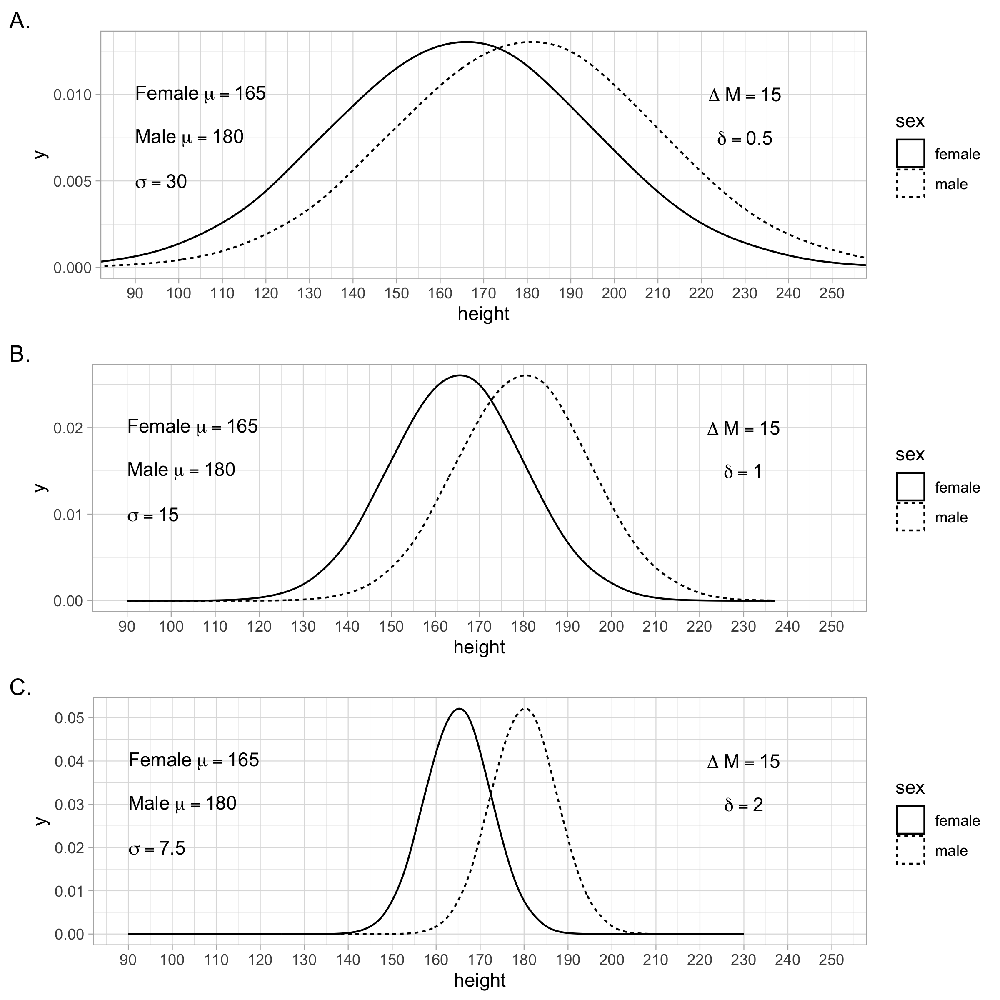

# Populations

```{r, include=FALSE}
library(tidyverse)
```

## Notation

In this chapter we will use summation notation. If you are not familiar with summation notation, we present a brief overview here.

Consider a scenario where we have the IQ data for three participants We use the N symbol to represent the number of participants. Because we have three participants N = 3. The data for these participants is illustrated in Figure \@ref(fig:notationdata).

Notice how each person in the data set can be represented by the variable X: the first person by $X_1$, the second by $X_2$, and the third by $X_3$. Often we refer to individuals in a data set by using the variable X accompanied by a subscript (e.g., 1, 2, 3, etc.).

```{r notationdata, echo = FALSE, out.width="40%", fig.cap = "Data for understanding summation notation"}
knitr::include_graphics("ch_populations/images/screenshot_data_n6.png")
```

Referring to participants using the variable X and subscript is valuable because it can be used in conjunction with the sigma (i.e., $\Sigma$) symbol for summation. Consider the example below in which we use the summation notation to indicate that we want to add all the X values (representing IQ) for the participants. We use a lower case $i$ to represent all possible subscript values. The notation, $i$ = 1, below the $\Sigma$ symbol indicates that we should start with participant 1. The notation, N, above the $\Sigma$ symbol indicates that we should iterate $i$ up to the value indicated by N; in this case 3, because there are three participants.

$$
\begin{aligned} 
\sum_{i=1}^{N} X_i &=  X_1 + X_2 + X_3\\ 
&= 110 + 120 + 100 \\
&= 330
\end{aligned} 
$$

Sometimes, to simplify the notation, the numbers above and below the $\Sigma$ symbol are omitted. Likewise, the $i$ subscript is omitted. There is a general understanding that when these components of the notation are omitted the version of the notation above is implied.

$$
\begin{aligned} 
\sum{X} &= X_1 + X_2 + X_3\\ 
&= 110 + 120 + 100\\
&= 330
\end{aligned} 
$$

**Calculating a mean**. The full version of the notation can be used to indicate how an average/mean is calculated.

$$
\begin{aligned} 
\bar{X} &= \frac{\sum_{i=1}^{N} X_i}{N} \\
&= \frac{X_1 + X_2 + X_3}{3}\\ 
&= \frac{110 + 120 + 100}{3}\\
&= \frac{330}{3}\\
&= 110\\
\end{aligned} 
$$

Likewise, the concise version of the notation can be used to indicate how an average/mean is calculated.

$$
\begin{aligned} 
\bar{X} &= \frac{\sum{X}}{N} \\
&= \frac{X_1 + X_2 + X_3}{3}\\ 
&= \frac{110 + 120 + 100}{3}\\
&= \frac{330}{3}\\
&= 110\\
\end{aligned} 
$$

**Calculating squared differences**. A common task in statistics is to calculate 1) the squared difference between each person and the mean, and 2) add up those squared differences. This calculation is easily expressed with the full version of the notation.

$$
\begin{aligned} 
\sum_{i=1}^{N}{(X_i - \bar{X})^2} &= (X_1-\bar{X})^2 + (X_2-\bar{X})^2 + (X_3-\bar{X})^2\\ 
&= (110-110)^2 + (120-110)^2 + (100-110)^2\\
&= (0)^2 + (10)^2 + (-10)^2 \\
&= 0 + 100 + 100 \\
&= 200
\end{aligned} 
$$

Likewise, the sum of the squared differences from the mean can be expressed using the concise version of the notation.

$$
\begin{aligned} 
\sum{(X - \bar{X})^2} &= (X_1-\bar{X})^2 + (X_2-\bar{X})^2 + (X_3-\bar{X})^2\\ 
&= (110-110)^2 + (120-110)^2 + (100-110)^2\\
&= (0)^2 + (10)^2 + (-10)^2 \\
&= 0 + 100 + 100 \\
&= 200
\end{aligned} 
$$

## Population vs samples

As we move closer to conducting our own research it is critical to make a distinction between populations and samples. A population is the complete set of people/animals about which we want to make conclusions. A sample is a randomly selected subset of the population. In most scenarios it is impractical to work with an entire population and, for practical reasons, we study a subset of the population called a sample.

Researchers, and consumers of research, typically have little interest in making conclusions at the sample level. In general, we care about conclusions that generalize to the population but not conclusions that only apply to specific individuals in the sample. Consider the case of COVID-19. Imagine a research team creates a vaccine that they hope generates immunity to COVID-19. We care very little if the immunity only works for the specific individuals in the study. However, we care a great deal if the immunity works, or is likely to work, for all Canadians or all humans. We study samples but typically wish to make conclusions that apply to the population. Thus, even if you are an experimental researcher it's critical that you think in terms of populations and not samples. Indeed, statistical tests (such as the *t*-test) are a means of helping researchers use sample data to make conclusions at the population level.

In this chapter, our focus is on describing populations. When we calculate a number that summarises an attribute of all of the people/animals in the population we refer to it as a **parameter**.

## A small population

In this section we review how to calculate three commonly used population parameters (mean, variance, and standard deviation). Populations are typically quite large but for simplicity we focus on a population composed of the weights of just three chocolate chip cookies. We refer to the three cookies as $X_1$, $X_2$, and $X_3$. The cookies have the weights of 8, 10, and 12 grams, respectively.

### Mean ($\mu$)

It can be helpful to create a model that describes our data. Of course, the model won't describe every participant perfectly and each participant will differ to some extent from the model.

**Model:** To create a model we first need data, which in this example will be the weight of three different chocolate chip cookies. As mentioned previously, the weights of the three cookies are designated by $X_1$, $X_2$, and $X_3$. A simple model for our cookie weight data is the mean. At the population level the mean is represented by the symbol $\mu$ see Formula \@ref(eq:popmeanch4) below. At the sample level a different notation is used.

```{=tex}
\begin{equation} 
\mu = \frac{\sum{X}}{N}
      (\#eq:popmeanch4)
\end{equation}
```
Using that equation with values:

$$
\begin{aligned} 
\mu &= \frac{\sum{X}}{N} \\
&= \frac{X_1 + X_2 + X_3}{3}\\ 
&= \frac{8 + 10 + 12}{3}\\
&= \frac{30}{3}\\
&= 10\\
\end{aligned} 
$$

We can think of the "mean cookie" as our model for our cookie weight data, see Figure \@ref(fig:meancookie). The "mean cookie" is represented by $\mu$ in equations.

```{r meancookie, echo=FALSE, out.width="60%", fig.cap="Variance as a fit index for the mean"}
knitr::include_graphics("ch_populations/images/cookie.png")
```

**Error:** As mentioned previously, each participant (i.e., cookie) differs to some extent from our model ("mean cookie"). In general this can be conceptualized as:

$$
\begin{aligned} 
X_i &= model + error_i \\
\end{aligned} 
$$

More specifically, the difference between the weight of any individual cookie ($X_i$) and the model ($\mu$) is indicated by $error_i$ as shown below.

$$
\begin{aligned} 
X_i &= \mu + error_i \\
\end{aligned} 
$$

The model, above is just a concise way of describing the following:

$$
\begin{aligned} 
X_1 &= \mu + error_1 \\
X_2 &= \mu + error_2 \\
X_3 &= \mu + error_3 \\
\end{aligned} 
$$

That is the weights of the three cookies ($X_1 = 8$, $X_2 = 10$, and $X_3 = 12$) can be conceptualized as:

$$
\begin{aligned} 
X_1 &= 10 + (-2) \\
X_2 &= 10 + 0 \\
X_3 &= 10 + 2 \\
\end{aligned} 
$$

The mean/average of the population, $\mu = 10$, is a parameter that serves as a model for the cookie weight data. However, it's helpful to have an index, known as variance, that indicates the extent to which the data do not correspond to the model from the model.

### Variance ($\sigma^2$)

Variance is a simple way of calculating a single number to represent how data differ from a model. It is represented, at the population level, by the symbol $\sigma^2$; a different notation is used at the sample level.

Previously, how we expressed the difference/deviation of cookie weights (data) from the model (i.e., mean) with an error term in the equation $X_i = \mu +error_i$, see Figure \@ref(fig:meancookie). The model for all the cookies is $\mu = 10$. If we consider a single cookie weight of 8 grams (a data point represented by $X_1$), the difference between the cookie from the model is -2 (i.e., error):

$$
\begin{aligned} 
X_1 &= 10 + (-2) \\
\end{aligned} 
$$

We want a number that indicates the quality of the cookie model. Specifically, we want a single number that indexes overall how the data (i.e., cookie weights) differ from the model (i.e., the mean cookie). We refer to that index as variance ($\sigma^2$).

**Calculating Squared Differences/Errors.** To calculate variance ($\sigma^2$), we use the errors for the cookies -- how the cookies differ from the mean/model. The first step is to square the errors/differences Those squared numbers are referred to as the "squared differences" or "squared errors". The calculation of the squared error for each cookie weight is shown below. The squared errors (or squared differences) are 4, 0, and 4.

| Cookie Weight | Model      | Squared Difference/Error        |
|---------------|------------|---------------------------------|
| $X_1 = 8$     | $\mu = 10$ | $(X_1 - \mu)^2 =(8 - 10)^2= 4$  |
| $X_2 = 10$    | $\mu = 10$ | $(X_2 - \mu)^2 =(10 - 10)^2= 0$ |
| $X_3 = 12$    | $\mu = 10$ | $(X_3 - \mu)^2 =(12 - 10)^2= 4$ |

**Averaging Squared Errors.** To obtain variance we calculate the average of the squared errors. At the population level the variance is represented by the symbol $\sigma^2$ see Formula \@ref(eq:popvarch4) below. In this formula, $N$ refers to the number of people in the population. At the sample level a different notation is used.

```{=tex}
\begin{equation} 
\sigma^2 = \frac{\sum{(X - \mu)^2}}{N}
      (\#eq:popvarch4)
\end{equation}
```
Using that equation with values:

$$
\begin{aligned} 
\sigma^2 &= \frac{\sum{(X - \mu)^2}}{N}\\
&= \frac{(X_1-\mu)^2 + (X_2-\mu)^2 + (X_3-\mu)^2}{N}  \\ 
&= \frac{(8-10)^2 + (10-10)^2 + (12-10)^2}{3}\\
&= \frac{(-2)^2 + (0)^2 + (2)^2}{3} \\
&= \frac{4 + 0 + 4}{3} \\
&= \frac{8}{3} \\
&= 2.67 grams^2 \\
\end{aligned} 
$$

The resulting variance is 2.67 grams$^2$. The cookie weights were measured in grams. The unit for variance, however, is grams$^2$ because we squared the errors as part of the calculation. Recall the formula for calculating an average (shown below) and compare it to the variance calculation (above). Notice that variance is just an average -- an average of squared errors. Correspondingly, in some areas of statistics they don't use the term variance, they use a synonym - **mean squared error**.

$$
\begin{aligned} 
\bar{X} &= \frac{\sum{X}}{N} \\
\end{aligned} 
$$

It probably strikes you as an odd choice to square the difference between each data point and the model. Why not just use the difference (e.g., $(8 - 10) = -2$) when calculating variance? Why not use the absolute difference (e.g., $|8 - 10|= 2$) when calculating variance? The answer is somewhat complex, but it relates to the more general situation in statistics of trying to find models that best fit the data (which occurs by minimizing errors). When we use squared errors it is easier to apply calculus, via derivatives, to calculate a model that minimizes the errors (i.e., obtains the best fit). Long story short, for complex mathematical reasons, we use squared errors, (rather than just errors) when calculating the fit (or lack of fit) of a model.

**Interpretation**. A variance of zero indicates that the model fits the data perfectly. In the cookie case, if the variance was zero, that would indicate that all the cookies had the same weight as the model, exactly 10 grams. To the extent that the variance is larger than zero it implies the data points (i.e., cookie weights) differ from the model (i.e., the mean cookie). By implication, a larger variance indicates larger differences among the observations (e.g., cookie weights). That is, when the variance is small, cookie weights tend to be similar to the model -- and each other. In contrast, when the variance is large, cookie weights tend to be different from the model -- and each other.

### Standard Deviation ($\sigma$)

An alternative index for how data differ from the mean/model is the standard deviation. To understand standard deviation you have to understand variance. Variance is a single number that indexes how data differ from a model. The interpretation of variance is straight forward. It is the average of the squared differences/errors between the data and the model.

Standard deviation is represented by the symbol $\sigma$ and can be calculated as the square root of variance as in Formula \@ref(eq:popsdch4) below.

```{=tex}
\begin{equation} 
\sigma = \sqrt{\frac{\sum{(X - \mu)^2}}{N}}
      (\#eq:popsdch4)
\end{equation}
```
Using that equation with values:

$$
\begin{aligned} 
\sigma &= \sqrt{\frac{\sum{(X - \mu)^2}}{N}}\\
&= \sqrt{\sigma^2} \\
&= \sqrt{2.67} \\
&= 1.63 grams\\
\end{aligned} 
$$

One reason that people like standard deviation is that it presents the difference between the data and the model in the original units (e.g., grams). This is in contrast to variance which presents the difference betweeen the data and the model in squared units (e.g., 2.67 grams$^2$).

**Interpretation**. Unfortunately, although variance has a straight forward interpretation, standard deviation does not. Sometimes standard deviation is, incorrectly, described as how much data points differ on average from the mean. A quick calculation of the average difference reveals a number (1.33) that does not correspond to the standard deviation (1.63):

$$
\begin{aligned} 
\overline{diff} &= \frac{\sum{|X - \mu|}}{N}\\
&= \frac{|8-10| + |10-10| + |12 - 10|}{3}\\
&= \frac{2 + 0 + 2}{3}\\
&= \frac{4}{3}\\
&= 1.33\\
\end{aligned} 
$$

As illustrated above, standard deviation is not equal to the average of the deviations from the mean. Because standard deviation is not an average, it's much harder to describe how to interpret it. In our view, the best way to think of standard deviation is simply as the square root of variance; because variance has a straight forward interpretation.

Therefore, we encourage you to think primarily in terms of variance rather than standard deviation due to the fact the interpretation of variance is more straightforward. Additionally, variance is foundational in the language used to describe regression and analysis of variance. That said, standard deviation is used in the calculation of some standardized effect sizes - so it is important to know and understand both indices.

Overall, the rules for interpreting standard deviation are similar to those for variance; but the standard deviation values are smaller than variance values. In the cookie case, if the standard deviation was zero, that would indicate that all the cookies had the same weight as the model, exactly 10 grams. To the extent that the standard deviation is larger than zero it implies the data points (i.e., cookie weights) differ from the model (i.e., the mean cookie). By implication, a larger standard deviation indicates larger differences among the observations (e.g., cookie weights). That is, when the standard deviation is small, cookie weights tend to be similar to the model -- and each other. In contrast, when the standard deviation is large, cookie weights tend to be different from the model -- and each other.

```{r, include = FALSE}
library(learnSampling)
library(tidyverse)

# variable means, d-value of 0.5
hdata1 <- get_height_population(mdiff = 5, std = 10)
hdata1$sex <- as.factor(hdata1$sex)
hdata1$dvalue <- 0.5

# variable means, d-value of 1.0
hdata2 <- get_height_population(mdiff = 10, std = 10)
hdata2$sex <- as.factor(hdata2$sex)
hdata2$dvalue <- 1.0

# variable means, d-value of 2.0
hdata3 <- get_height_population(mdiff = 20, std = 10)
hdata3$sex <- as.factor(hdata3$sex)
hdata3$dvalue <- 2.0

textMean1 <- expression(Delta~"M" == 5)
textMean2 <- expression(Delta~"M" == 10)
textMean3 <- expression(Delta~"M" == 20)
textd1 <- expression(delta == 0.50)
textd2 <- expression(delta == 1.00)
textd3 <- expression(delta == 2.00)
textfemale1 <- expression("Female"~mu == 165)
textfemale2 <- expression("Female"~mu == 165)
textfemale3 <- expression("Female"~mu == 165)
textmale1 <- expression("Male"~mu == 170)
textmale2 <- expression("Male"~mu == 175)
textmale3 <- expression("Male"~mu == 185)
texts1 <- expression(sigma == 10)
texts2 <- expression(sigma == 10)
texts3 <- expression(sigma == 10)


g1 <- ggplot(data = hdata1,
       mapping = aes(x = height, linetype = sex)) +
  geom_density(position = "identity", alpha = .50, adjust = 2) +
  coord_cartesian(xlim = c(90, 250)) +
  scale_x_continuous(breaks = seq(90, 250, by = 10)) +
  annotate("text", x = 230, y = .03, 
           parse = T, label = as.character(textMean1)) +
  annotate("text", x = 230, y = .02, 
           parse = T, label = as.character(textd1)) +
  annotate("text", x = 90, y = .03, 
           parse = T, label = as.character(textfemale1), hjust = 0) +
  annotate("text", x = 90, y = .02, 
           parse = T, label = as.character(textmale1), hjust = 0) +
  annotate("text", x = 90, y = .01, 
           parse = T, label = as.character(texts1), hjust = 0) +
  theme_light() +
  labs(tag = "A.")

g2 <- ggplot(data = hdata2,
       mapping = aes(x = height, linetype = sex)) +
  geom_density(position = "identity", alpha = .50, adjust = 2) +
  coord_cartesian(xlim = c(90, 250)) +
  scale_x_continuous(breaks = seq(90, 250, by = 10)) +
  annotate("text", x = 230, y = .03, 
           parse = T, label = as.character(textMean2)) +
  annotate("text", x = 230, y = .02, 
           parse = T, label = as.character(textd2)) +
  annotate("text", x = 90, y = .03, 
           parse = T, label = as.character(textfemale2), hjust = 0) +
  annotate("text", x = 90, y = .02, 
           parse = T, label = as.character(textmale2), hjust = 0) +
  annotate("text", x = 90, y = .01, 
           parse = T, label = as.character(texts1), hjust = 0) +
  theme_light() +
  labs(tag = "B.")

g3 <- ggplot(data = hdata3,
       mapping = aes(x = height, linetype = sex)) +
  geom_density(position = "identity", alpha = .50, adjust = 2) +
  coord_cartesian(xlim = c(90, 250)) +
  scale_x_continuous(breaks = seq(90, 250, by = 10)) +
  annotate("text", x = 230, y = .03, 
           parse = T, label = as.character(textMean3)) +
  annotate("text", x = 230, y = .02, 
           parse = T, label = as.character(textd3)) +
  annotate("text", x = 90, y = .03, 
           parse = T, label = as.character(textfemale3), hjust = 0) +
  annotate("text", x = 90, y = .02, 
           parse = T, label = as.character(textmale3), hjust = 0) +
  annotate("text", x = 90, y = .01, 
           parse = T, label = as.character(texts1), hjust = 0) +
  theme_light() +
  labs(tag = "C.")

png(file = "ch_populations/images/dvalue_ex1.png", res = 300, width = 8*300, height = 8*300)
gridExtra::grid.arrange(g1, g2, g3, nrow =3)
dev.off()
```

```{r, include = FALSE}
library(learnSampling)
library(tidyverse)

# fixed means, d-value of 0.5
hdata1 <- get_height_population(std = 30)
hdata1$sex <- as.factor(hdata1$sex)
hdata1$dvalue <- 0.5

# fixed means, d-value of 1.0
hdata2 <- get_height_population(std = 15)
hdata2$sex <- as.factor(hdata2$sex)
hdata2$dvalue <- 1.0

# same means, d-value of 2.0
hdata3 <- get_height_population(std = 7.5)
hdata3$sex <- as.factor(hdata3$sex)
hdata3$dvalue <- 2.0

textMean1 <- expression(Delta~"M" == 15)
textMean2 <- expression(Delta~"M" == 15)
textMean3 <- expression(Delta~"M" == 15)
textd1 <- expression(delta == 0.50)
textd2 <- expression(delta == 1.00)
textd3 <- expression(delta == 2.00)
textfemale1 <- expression("Female"~mu == 165)
textfemale2 <- expression("Female"~mu == 165)
textfemale3 <- expression("Female"~mu == 165)
textmale1 <- expression("Male"~mu == 180)
textmale2 <- expression("Male"~mu == 180)
textmale3 <- expression("Male"~mu == 180)
texts1 <- expression(sigma == 30)
texts2 <- expression(sigma == 15)
texts3 <- expression(sigma == 7.5)


g1 <- ggplot(data = hdata1,
       mapping = aes(x = height, linetype = sex)) +
  geom_density(position = "identity", alpha = .50, adjust = 2) +
  coord_cartesian(xlim = c(90, 250)) +
  scale_x_continuous(breaks = seq(90, 250, by = 10)) +
  annotate("text", x = 230, y = .01, 
           parse = T, label = as.character(textMean1)) +
  annotate("text", x = 230, y = .0075, 
           parse = T, label = as.character(textd1)) +
  annotate("text", x = 90, y = .01, 
           parse = T, label = as.character(textfemale1), hjust = 0) +
  annotate("text", x = 90, y = .0075, 
           parse = T, label = as.character(textmale1), hjust = 0) +
  annotate("text", x = 90, y = .0050, 
           parse = T, label = as.character(texts1), hjust = 0) +
  theme_light() +
  labs(tag = "A.")

g2 <- ggplot(data = hdata2,
       mapping = aes(x = height, linetype = sex)) +
  geom_density(position = "identity", alpha = .50, adjust = 2) +
  coord_cartesian(xlim = c(90, 250)) +
  scale_x_continuous(breaks = seq(90, 250, by = 10)) +
  annotate("text", x = 230, y = .02, 
           parse = T, label = as.character(textMean2)) +
  annotate("text", x = 230, y = .015, 
           parse = T, label = as.character(textd2)) +
  annotate("text", x = 90, y = .02, 
           parse = T, label = as.character(textfemale2), hjust = 0) +
  annotate("text", x = 90, y = .015, 
           parse = T, label = as.character(textmale2), hjust = 0) +
  annotate("text", x = 90, y = .01, 
           parse = T, label = as.character(texts2), hjust = 0) +
  theme_light() +
  labs(tag = "B.")

g3 <- ggplot(data = hdata3,
       mapping = aes(x = height, linetype = sex)) +
  geom_density(position = "identity", alpha = .50, adjust = 2) +
  coord_cartesian(xlim = c(90, 250)) +
  scale_x_continuous(breaks = seq(90, 250, by = 10)) +
  annotate("text", x = 230, y = .04, 
           parse = T, label = as.character(textMean3)) +
  annotate("text", x = 230, y = .03, 
           parse = T, label = as.character(textd3)) +
  annotate("text", x = 90, y = .04, 
           parse = T, label = as.character(textfemale3), hjust = 0) +
  annotate("text", x = 90, y = .03, 
           parse = T, label = as.character(textmale3), hjust = 0) +
  annotate("text", x = 90, y = .02, 
           parse = T, label = as.character(texts3), hjust = 0) +
  theme_light() +
  labs(tag = "C.")

png(file = "ch_populations/images/dvalue_ex2.png", res = 300, width = 8*300, height = 8*300)
gridExtra::grid.arrange(g1, g2, g3, nrow =3)
dev.off()

```

```{r, include = FALSE}
library(learnSampling)
library(tidyverse)

# variable means, d-value of 1.0
hdata1 <- get_height_population(mdiff = 5, std = 5)
hdata1$sex <- as.factor(hdata1$sex)
hdata1$dvalue <- 1

# variable means, d-value of 1.0
hdata2 <- get_height_population(mdiff = 10, std = 10)
hdata2$sex <- as.factor(hdata2$sex)
hdata2$dvalue <- 1

# variable means, d-value of 2.0
hdata3 <- get_height_population(mdiff = 20, std = 20)
hdata3$sex <- as.factor(hdata3$sex)
hdata3$dvalue <- 1

textMean1 <- expression(Delta~"M" == "5 cm")
textMean2 <- expression(Delta~"M" == "10 cm")
textMean3 <- expression(Delta~"M" == "20 cm")
textd1 <- expression(delta == 1)
textd2 <- expression(delta == 1)
textd3 <- expression(delta == 1)
textfemale1 <- expression("Female"~mu == 165)
textfemale2 <- expression("Female"~mu == 165)
textfemale3 <- expression("Female"~mu == 165)
textmale1 <- expression("Male"~mu == 170)
textmale2 <- expression("Male"~mu == 175)
textmale3 <- expression("Male"~mu == 185)
texts1 <- expression(sigma == 5)
texts2 <- expression(sigma == 10)
texts3 <- expression(sigma == 20)


g1 <- ggplot(data = hdata1,
       mapping = aes(x = height, linetype = sex)) +
  geom_density(position = "identity", alpha = .50, adjust = 2) +
  coord_cartesian(xlim = c(90, 250)) +
  scale_x_continuous(breaks = seq(90, 250, by = 10)) +
  annotate("text", x = 230, y = .064, 
           parse = T, label = as.character(textMean1)) +
  annotate("text", x = 230, y = .048, 
           parse = T, label = as.character(textd1)) +
  annotate("text", x = 90, y = .064, 
           parse = T, label = as.character(textfemale1), hjust = 0) +
  annotate("text", x = 90, y = .048, 
           parse = T, label = as.character(textmale1), hjust = 0) +
  annotate("text", x = 90, y = .032, 
           parse = T, label = as.character(texts1), hjust = 0) +
  theme_light() +
  labs(tag = "A.")

g2 <- ggplot(data = hdata2,
       mapping = aes(x = height, linetype = sex)) +
  geom_density(position = "identity", alpha = .50, adjust = 2) +
  coord_cartesian(xlim = c(90, 250)) +
  scale_x_continuous(breaks = seq(90, 250, by = 10)) +
  annotate("text", x = 230, y = .032 , 
           parse = T, label = as.character(textMean2)) +
  annotate("text", x = 230, y = .024, 
           parse = T, label = as.character(textd2)) +
  annotate("text", x = 90, y = .032, 
           parse = T, label = as.character(textfemale2), hjust = 0) +
  annotate("text", x = 90, y = .024, 
           parse = T, label = as.character(textmale2), hjust = 0) +
  annotate("text", x = 90, y = .016, 
           parse = T, label = as.character(texts2), hjust = 0) +
  theme_light() +
  labs(tag = "B.")

g3 <- ggplot(data = hdata3,
       mapping = aes(x = height, linetype = sex)) +
  geom_density(position = "identity", alpha = .50, adjust = 2) +
  coord_cartesian(xlim = c(90, 250)) +
  scale_x_continuous(breaks = seq(90, 250, by = 10)) +
  annotate("text", x = 230, y = .016, 
           parse = T, label = as.character(textMean3)) +
  annotate("text", x = 230, y = .012, 
           parse = T, label = as.character(textd3)) +
  annotate("text", x = 90, y = .016, 
           parse = T, label = as.character(textfemale3), hjust = 0) +
  annotate("text", x = 90, y = .012, 
           parse = T, label = as.character(textmale3), hjust = 0) +
  annotate("text", x = 90, y = .008, 
           parse = T, label = as.character(texts3), hjust = 0) +
  theme_light() +
  labs(tag = "C.")

png(file = "ch_populations/images/dvalue_ex3.png", res = 300, width = 8*300, height = 8*300)
gridExtra::grid.arrange(g1, g2, g3, nrow =3)
dev.off()


```

```{r, include = FALSE}
library(learnSampling)
library(tidyverse)

# variable means, d-value of 0.5
hdata1 <- get_height_population(mdiff = 2, std = 10)
hdata1$sex <- as.factor(hdata1$sex)
hdata1$dvalue <- 0.5

# variable means, d-value of 1.0
hdata2 <- get_height_population(mdiff = 5, std = 10)
hdata2$sex <- as.factor(hdata2$sex)
hdata2$dvalue <- 1.0

# variable means, d-value of 2.0
hdata3 <- get_height_population(mdiff = 8, std = 10)
hdata3$sex <- as.factor(hdata3$sex)
hdata3$dvalue <- 2.0

textMean1 <- expression(Delta~"M" == 2)
textMean2 <- expression(Delta~"M" == 5)
textMean3 <- expression(Delta~"M" == 8)
textd1 <- expression(delta == 0.20)
textd2 <- expression(delta == 0.50)
textd3 <- expression(delta == 0.80)
textfemale1 <- expression("Female"~mu == 165)
textfemale2 <- expression("Female"~mu == 165)
textfemale3 <- expression("Female"~mu == 165)
textmale1 <- expression("Male"~mu == 167)
textmale2 <- expression("Male"~mu == 170)
textmale3 <- expression("Male"~mu == 173)
texts1 <- expression(sigma == 10)
texts2 <- expression(sigma == 10)
texts3 <- expression(sigma == 10)


g1 <- ggplot(data = hdata1,
       mapping = aes(x = height, linetype = sex)) +
  geom_density(position = "identity", alpha = .50, adjust = 2) +
  coord_cartesian(xlim = c(90, 250)) +
  scale_x_continuous(breaks = seq(90, 250, by = 10)) +
  annotate("text", x = 230, y = .03, 
           parse = T, label = as.character(textMean1)) +
  annotate("text", x = 230, y = .02, 
           parse = T, label = as.character(textd1)) +
  annotate("text", x = 90, y = .03, 
           parse = T, label = as.character(textfemale1), hjust = 0) +
  annotate("text", x = 90, y = .02, 
           parse = T, label = as.character(textmale1), hjust = 0) +
  annotate("text", x = 90, y = .01, 
           parse = T, label = as.character(texts2), hjust = 0) +
  theme_light() +
  labs(tag = "A.",subtitle = "'Small' effect")

g2 <- ggplot(data = hdata2,
       mapping = aes(x = height, linetype = sex)) +
  geom_density(position = "identity", alpha = .50, adjust = 2) +
  coord_cartesian(xlim = c(90, 250)) +
  scale_x_continuous(breaks = seq(90, 250, by = 10)) +
  annotate("text", x = 230, y = .03, 
           parse = T, label = as.character(textMean2)) +
  annotate("text", x = 230, y = .02, 
           parse = T, label = as.character(textd2)) +
  annotate("text", x = 90, y = .03, 
           parse = T, label = as.character(textfemale2), hjust = 0) +
  annotate("text", x = 90, y = .02, 
           parse = T, label = as.character(textmale2), hjust = 0) +
  annotate("text", x = 90, y = .01, 
           parse = T, label = as.character(texts2), hjust = 0) +
  theme_light() +
  labs(tag = "B.",subtitle = "'Medium' effect")

g3 <- ggplot(data = hdata3,
       mapping = aes(x = height, linetype = sex)) +
  geom_density(position = "identity", alpha = .50, adjust = 2) +
  coord_cartesian(xlim = c(90, 250)) +
  scale_x_continuous(breaks = seq(90, 250, by = 10)) +
  annotate("text", x = 230, y = .03, 
           parse = T, label = as.character(textMean3)) +
  annotate("text", x = 230, y = .02, 
           parse = T, label = as.character(textd3)) +
  annotate("text", x = 90, y = .03, 
           parse = T, label = as.character(textfemale3), hjust = 0) +
  annotate("text", x = 90, y = .02, 
           parse = T, label = as.character(textmale3), hjust = 0) +
  annotate("text", x = 90, y = .01, 
           parse = T, label = as.character(texts3), hjust = 0) +
  theme_light() +
  labs(tag = "C.",subtitle = "'Large' effect")

png(file = "ch_populations/images/dvalue_ex4.png", res = 300, width = 8*300, height = 8*300)
gridExtra::grid.arrange(g1, g2, g3, nrow =3)
dev.off()
```

## Visualizing populations

Populations are typically quite large in nature and it's often imposssible to pratically list all of the members of the population. Consequently, it helps to have ways to visual the entire population. In Figure \@ref(fig:popvisual3) we present three ways of visualizing a population. In all three graphs (A, B, C) in this figure the x-axis represents heights in centimeter and the y-axis is used to indicate which values on the x-axis are more common. In Figure \@ref(fig:popvisual3)A we use a large number of X's to indicate the members of the population. Because X's are also used in formulas to represent individual participants, a strength of this graph is that it reminds you that it is a graph reflecting a large number of individuals. In Figure \@ref(fig:popvisual3)B we present a standard histogram that illustrate the distribution of heights. In Figure \@ref(fig:popvisual3)C we present a density curve that illustrate the distribution of heights. All three approaches are useful for illustrating that most people have heights around 170 cm.

```{r, include=FALSE}
library(learnSampling)
library(tidyverse)
 
# variable means, d-value of 0.5
largepop <- get_height_population(mdiff = 5, std = 10)

gp1 <- ggplot(data = largepop,
              mapping = aes(x = height)) +
  stat_histotext(label = "X", breaks = seq(100, 220, by = 5)) +
  coord_cartesian(xlim = c(130, 200)) +
  scale_x_continuous(breaks = seq(100, 220, by = 10)) +
  labs(x = "Height", y = "", tag = "A.") +
  theme_classic()
  
print(gp1)

gp2 <- ggplot(data = largepop,
              mapping = aes(x = height)) +
  geom_histogram(breaks = seq(100, 220, by = 5), fill = "black", alpha = .5) +
  coord_cartesian(xlim = c(130, 200)) +
  scale_x_continuous(breaks = seq(100, 220, by = 10)) +
  labs(x = "Height", y = "", tag = "B.") +
  theme_classic()
  
print(gp2)


gp3 <- ggplot(data = largepop,
              mapping = aes(x = height)) +
  geom_density() +
  coord_cartesian(xlim = c(130, 200)) +
  scale_x_continuous(breaks = seq(100, 220, by = 10)) +
  labs(x = "Height", y = "", tag = "C.") +
  theme_classic()
  
print(gp3)

png(file = "ch_populations/images/popvisual.png", res = 300, width = 6*300, height = 12*300)
gridExtra::grid.arrange(gp1, gp2, gp3, nrow =3)
dev.off()

```

```{r popvisual3, fig.cap  = "Three ways of visualizing a population distribution", echo = FALSE, out.height="80%", out.width="80%"}
knitr::include_graphics("ch_populations/images/popvisual.png")
```

## Comparisons: Same $\sigma$

In this section we review a method of comparing two population means when the populations have the same standard deviation. To facilitate comparing two populations we use the heights of males and females, measured in centimeters, as an example. On average males are taller than females. There is, however, variability in the heights of both males and females. The variability in heights is the same for males and females even though the means differ. We illustrate these differences in a series of figures below. Each figure contains three scenarios (labeled A, B, C) in which we manipulate the mean height and variability of the populations. In each scenario the standard deviation of heights is the same for the male and female populations.

### Standardized units

#### Individual scores

Often when we compare two means we use the original metric. In the case of the male and female heights that metric is centimeters. The original units are a useful way to convey information about the difference between two populations.

In addition to the original unit it is also possible, and sometimes desirable, to use the standardized mean difference. The word *standardized* is used to indicate that the comparison is relative to the standard deviation.

Imagine a population of male heights ($\mu = 170$, $\sigma = 10$) from which we have obtained a single individual, Ian, whose height is 185 cm.

$$
X_{Ian} = 185cm
$$

The original units are useful for describing Ian's height but it doesn't tell us about his height relative to the other people in the population. We have to know the mean and standard deviation of the population to know if Ian is shorter or taller than the average height - and by how much. We use a $z$-score calculation for this purpose:

$$
\begin{aligned} 
z_{Ian} &=  \frac{X_{Ian} - \mu_{males}}{\sigma_{males}}\\ 
&=  \frac{185 - 170}{10}\\
&=  \frac{15}{10}\\
&= 1.50
\end{aligned} 
$$

The above calculation is a ratio. Ratios are used to compare two numbers. The numerator (number on the top) is compared to the denominator (number on bottom) through division. The resulting number tells you how much larger the numerator is than the denominator.

In this case, the numerator is the extent to which Ian is taller than the mean height for males ($X_{Ian} - \mu_{males}$). This numerator is compared to the denominator -- which is the standard deviation for males ($\sigma_{males}$). The resulting number is 1.50 which indicates the numerator is 1.50 times larger than the denominator. In other words, Ian is 1.50 standard deviations taller than the average male. This is a standardized score for Ian's height - it expresses the difference between his height and the mean height in standard deviation units.

#### Independent Group: Population Means

The same approach to generating standardized scores can be applied to population means. Consider a situation where we have population of male heights ($\mu = 170$, $\sigma = 10$) and a population of female heights ($\mu = 165$, $\sigma = 10$). Notice that both populations have the same standard deviation.

We can calculate a standardized value to compare these heights. This standardized value is called the standardized mean difference (SMD). Alternatively, it is also known as Cohen's $d$ which is represented at the population level with the symbol $\delta$. Calculation of the standardized mean difference is based on the premise that both populations have the same standard deviation.

In this calculation the numerator represents the difference between the two population means. The denominator represents the population standard deviation - which is the same for both populations see Formula \@ref(eq:popsmdch4) below.

```{=tex}
\begin{equation} 
\delta =  \frac{\mu_{1} - \mu_{2}}{\sigma}
      (\#eq:popsmdch4)
\end{equation}
```
Using that equation with values:

$$
\begin{aligned} 
\delta &=  \frac{\mu_{males} - \mu_{females}}{\sigma}\\ 
&=  \frac{170 - 165}{10}\\
&=  \frac{5}{10}\\
&= 0.50
\end{aligned} 
$$

The resulting division of this ratio reveals that the numerator is 0.50 times as large (i.e., half as large) as the denominator. That is, the difference between the populations is half as large as the standard deviation. Therefore, the population mean for males is 0.50 standard deviations larger than the population mean for female; $\delta = 0.50$:

### Cohen's $d$ units

Because the unit for the standardized mean difference is the standard deviation it can be easy to interpret if you are unfamiliar with the original units. It is usually a good idea to report the difference between populations in both the original units (cm) and standardized units ($\delta$). Figure \@ref(fig:dex1) illustrates three different population difference scenarios (A through C). The population standard deviation is held constant across the three scenarios. You can see that as the difference between the population means increases in raw units - it does the same in $\delta$ (i.e., Cohen's $d$) units. In raw units (i.e., cm), the difference between the population means for scenarios A through C are 5 cm, 10 cm, and 20 cm, respectively. In standardized units (i.e., standard deviations), the difference between the population means for scenarios A through C are 0.50 standard deviations, 1.0 standard deviations, and 2.0 standard deviations, respectively. In other words, the population-level Cohen's $d$-values are 0.50, 1.0, and 2.0 for scenarios A through C.

```{r dex1, fig.scap = "Illustrating standardized mean difference", fig.cap="The difference between two population means can be expressed in the original units as indicated by $\\Delta M$. Alternatively, the difference can be expressed using a Standardized Mean Difference (SMD). The SMD index is also known as the population-level $d$-value and is represented by the symbol $\\delta$. The SMD is a way of expressing the difference between population means without using the original units. ", echo = FALSE, out.width="100%"}
knitr::include_graphics("ch_populations/images/dvalue_ex1.png")
```

### Cohen's $d$ advantages

The standardized mean difference takes into account the variability of heights around each population mean. This means that the same difference between two population means can produce different standardized mean difference values if the population standard deviation varies. In the scenarios depicted in Figure \@ref(fig:dex2) the population standard deviation becomes increasing small - resulting in larger standardized mean difference values (i.e., $\delta$). This larger $\delta$ value corresponds to progressively less overlap between the two populations. Thus, taking into account the standard deviation of the populations can be viewed as a strength of using the standardized mean difference.

```{r dex2, fig.scap = "Advantages of standadized mean difference", fig.cap="An advantage of using the Standardized Mean Difference (SMD) to index the difference between two population means (i.e., $\\delta$) is that it takes the population standard deviation into account. In these three examples, the difference between the populations means is the same using the original/raw units of centimeters. However, the standard deviation of the populations varies across scenarios A, B, and C. The SMD illustrates that these three scenarios are different. If you only examined the difference in the original units (i.e., $\\Delta M$) you would conclude the effect is the same across the three scenarios. However, by using SMD, indexed by $\\delta$ - the population $d$-value, you see that the effect is progressively stronger from scenario A, to B, to C. This is illustrated by the fact that there is progressively less overlap between the distributions as you move from scenario A to C.", echo = FALSE, out.width="100%"}

```

### Cohen's $d$ caveats

It is important to also look at the original units when interpreting results - not just the standardized mean difference. Examine the scenarios in Figure \@ref(fig:dex3). Notice how the $\delta$ value stays constant across scenarios - as does the overlap of the two distributions. However, inspect the shape of the curves and the original units to see how the scenarios vary. Both the original units and the standardized mean difference (i.e., Cohen's $d$) provide important interpretational information - don't rely on just one of them.

```{r dex3, fig.scap = "Caveats for standardized mean difference", fig.cap="The three scenarios in this figure illustrate that a Standardized Mean Difference (i.e., population $d$-value or $\\delta$) can remain constant across scenarios when there is a change in the raw difference (i.e., $\\Delta M$) between the population means. This SMD is consistent across the three scenario despite a change in the mean difference using original units; this occurs because the standard deviations also changes across the three scenarios.", echo = FALSE, out.width="100%"}
knitr::include_graphics("ch_populations/images/dvalue_ex3.png")
```

## Comparisons: Different $\sigma$

The calculation of the standardized mean difference values ($\delta$-values) above assumed that the two populations had identical standard deviations. In some scenarios, you might reasonably expect the standard deviations to be different for two populations. When the **populations** being compared have different standard deviations, we can still calculate a standardized mean difference (i.e, $\delta$-value) but we need to pick one of the standard deviations to use in the formula. In many cases, it makes sense to think of one population as the frame of reference for the comparison; a "Control" population of sorts. In this case, you use the standard deviation of the control population as the reference/denominator when calculating the $\delta$-value as illustrated in Formula \@ref(eq:popsmdcontrolch4) below. Make sure you recognize we are talking about a scenario with different population standard deviations (not sample standard deviations) as the appropriate situation for this type of calculation.

```{=tex}
\begin{equation} 
\delta =  \frac{\mu_{1} - \mu_{2}}{\sigma_{control}}
      (\#eq:popsmdcontrolch4)
\end{equation}
```
## Comparisons: Repeated Measures

Sometimes we measures the members of a single population twice and are interested in the change across occasions. Consider a scenario where everyone in a large population (*N* = 1000000) attempts to loose weight over a given period of time. We weigh everyone in the population at time 1 before the weight loss attempt. Then we weigh everyone in the population at time 2 after the weight loss attempt.

Think of this scenario concretely with respect to how we would record this information. Imagine a large spreadsheet with 1000000 rows - each representing a person. There are two columns. The first column contains time 1 weights. The second column contains time 2 weights. We are interested in how weights changed across the times. So we create a third column, called diff, by subtracting time 1 weight from time 2 weights. That is, diff = time 2 weight - time 1 weight. The new diff column indicates how the weights for each person have changed over the diet. We can think of this single column of differences as being a population. This column is used to calculate the repeated-measures $\delta$-value. Specifically, the mean of the diff column ($bar{x}_{diff}$) and the standard deviation of the diff column ($s_{diff}$) are used in Formula \@ref(eq:popsmddiffch4) below:

```{=tex}
\begin{equation} 
\delta =  \frac{\mu_{diff}}{\sigma_{diff}}
      (\#eq:popsmddiffch4)
\end{equation}
```
## Comparison Benchmarks

Regardless of how the standardized mean difference (i.e., $\delta$-value) is calculated, Cohen suggested that the values of 0.20, 0.50, and 0.80 correspond to the effect size labels of small, medium, and large, respectively [@cohen1988]. These effect sizes are illustrated in Figure \@ref(fig:dex4). As described in an interesting [blog post](https://replicationindex.com/2015/09/22/the-statistical-power-of-abnormal-social-psychological-research-a-revew-by-jacob-cohen/), these benchmark values came from reviewing a single issue of the *Journal of Abnormal and Social Psychology*. Basing benchmarks on such a small number of studies is potentially problematic - as is the fact that at that time all the studies were prone to publication bias. A recent investigation [see @schafer2019meaningfulness] of effect sizes in pre-registered studies, with no publication bias, suggests substantially lower benchmark values.

```{r dex4, fig.cap="Cohen's (1988) effect size benchmarks", echo = FALSE, out.width="100%"}
knitr::include_graphics("ch_populations/images/dvalue_ex4.png")
```

You can visualize any $\delta$ value (i.e., population $d$-value) using the rpsychologist [website](https://rpsychologist.com/d3/cohend/). This website also provides a number of interesting statistics such as the percentage of overlapping values in two populations for a given $\delta$/d value. Take a minute to use this website now.

Cohen's benchmarks for standardized mean differences are displayed in the table below. These effect size labels should be interpreted with caution. The magnitude of an effect is best considered in the context of the field of research and the consequences of an effect on individuals in both the short and long run.

| Cohen (1988) Label |     Value      |
|:------------------:|:--------------:|
|       Small        | $\delta$ = .20 |
|       Medium       | $\delta$ = .50 |
|       Large        | $\delta$ = .80 |

## Population relations

Often researchers are interested in the extent to which one variable is related to another variable. For example, to what extent does variability in weight relate to variability in height? In other words, is there a relation between weight and height? One approach to this question is to calculate a regression equation relating weight to height - this provides an index of the relation in the original units of the variables. Here we focus on a second approach to describing the relation between variables, namely, the correlation. The correlation is standardized effect size for the *linear* relation between two variables.

A population correlation is represented by the symbol $\rho$ (pronounced rho) and calculated using Formula \@ref(eq:poprho4) below. The correlation may range from -1.00 to 1.00. A strong negative correlation indicates that as one variable increases the other decreases. A positive correlation indicates that as one variable increases the other increases. There are at least thirteen ways to conceptualize a correlations [see @lee1988thirteen] but it's easiest to think of it as an index of the extent to which the variables covary in a linear way.

```{=tex}
\begin{equation} 
\rho =  \frac{\Sigma (X - \mu_X)(Y - \mu_Y)}{\sqrt{\Sigma (X - \mu_X)^2\Sigma (Y - \mu_Y)^2}}
      (\#eq:poprho4)
\end{equation}
```
```{r, include=FALSE, eval=FALSE}
sigma = diag(2)
mu <- c(0,0)
set.seed(1)
n = 30000
sigma[1,2] <- .1
sigma[2,1] <- sigma[1,2] 
rho70 <- MASS::mvrnorm(n = n, Sigma = sigma, mu = mu, empirical = TRUE)
sigma[1,2] <- .3
sigma[2,1] <- sigma[1,2] 
rho30 <- MASS::mvrnorm(n = n, Sigma = sigma, mu = mu, empirical = TRUE)
sigma[1,2] <- .5
sigma[2,1] <- sigma[1,2] 
rho50 <- MASS::mvrnorm(n = n, Sigma = sigma, mu = mu, empirical = TRUE)

rho70[,1] <- rho70[,1]*15+140
rho70[,2] <- rho70[,2]*15+170
rho30[,1] <- rho30[,1]*15+140
rho30[,2] <- rho30[,2]*15+170
rho50[,1] <- rho50[,1]*15+140
rho50[,2] <- rho50[,2]*15+170

rho70 <- data.frame(round(rho70,1))
rho30 <- data.frame(round(rho30,1))
rho50 <- data.frame(round(rho50,1))
names(rho70) <- c("weight", "height")
names(rho30) <- c("weight", "height")
names(rho50) <- c("weight", "height")

rho3lab <- expression(rho == ".30")
rho5lab <- expression(rho == ".50")
rho7lab <- expression(rho == ".10")

library(ggplot2)
r70plot <- ggplot(data = rho70,
                  mapping = aes(x = height, y = weight)) +
  geom_point(alpha = .30) +
  scale_x_continuous(breaks = seq(100, 250, by = 20)) +
  scale_y_continuous(breaks = seq(70, 250, by = 20)) +
  coord_cartesian(xlim = c(110,250), ylim = c(70, 210)) +
  annotate(geom = "text", x= 220, y = 90, label = rho7lab, parse = TRUE) +
  theme_classic()

r50plot <- ggplot(data = rho50,
                  mapping = aes(x = height, y = weight)) +
  geom_point(alpha = .30) +
  scale_x_continuous(breaks = seq(100, 250, by = 20)) +
  scale_y_continuous(breaks = seq(70, 250, by = 20)) +
  coord_cartesian(xlim = c(110,250), ylim = c(70, 210)) +
  annotate(geom = "text", x= 220, y = 90, label = rho5lab, parse = TRUE) +
  theme_classic()

r30plot <- ggplot(data = rho30,
                  mapping = aes(x = height, y = weight)) +
  geom_point(alpha = .30) +
  scale_x_continuous(breaks = seq(100, 250, by = 20)) +
  scale_y_continuous(breaks = seq(70, 250, by = 20)) +
  coord_cartesian(xlim = c(110,250), ylim = c(70, 210)) +
  annotate(geom = "text", x= 220, y = 90, label = rho3lab, parse = TRUE) +
  theme_classic()

png(filename = "ch_populations/images/rho_example.png",
    width = 4*300,
    height = 7*300,
    res = 300)
gridExtra::grid.arrange(r70plot, r30plot, r50plot)
dev.off()

```

Because a correlation only provides an index of a linear relation - it is important to plot the data. Weak correlations (close to zero) may indicate there is not a linear relation. But there may still be a relation between the variables - just not one that follows a straight line. Indeed, the same correlation may take many different forms. Consider the data sets from the datasauRus package presented in Figure \@ref(fig:datarex). The graphs for each data set appear quite different. Yet, the following is true for all 12 data sets:

-   The mean of X is 54.3 and the standard deviation is 16.8
-   The mean of Y is 47.8 and the standard deviation is 26.9
-   The correlation between X and Y is $\rho$ = -.06

Therefore, make sure you ALWAYS graph your data. The numbers only tell part of the story.

```{r, include=FALSE}
library(datasauRus)
datadozen <- datasaurus_dozen %>% filter(dataset != "dots")
  
rexgraph <- ggplot(datadozen, aes(x=x, y=y))+
  geom_point()+
  theme_classic() +
  facet_wrap(~dataset, ncol=3)


ggsave(plot = rexgraph, 
       filename = "ch_populations/images/datarex.png", 
       width = 6, height = 6, 
       dpi = 300)

```

```{r datarex, fig.cap="Various data sets with the same correlation, same means, and same standard deviations", echo = FALSE, out.height="80%", out.width="80%"}

```

## Relation benchmarks

Plots of linear relations are presented in Figure \@ref(fig:rhoplot). The three graphs in this figure corresponds to Cohen's benchmarks for correlations (i.e., $\rho$), displayed in the table below.

| Cohen (1988) Label |    Value     |
|:------------------:|:------------:|
|       Small        | $\rho$ = .10 |
|       Medium       | $\rho$ = .30 |
|       Large        | $\rho$ = .50 |

These effect size labels should be interpreted with caution. The magnitude of an effect is best considered in the context of the field of research and the consequences of an effect on individuals in both the short and long run.

```{r rhoplot, fig.cap="Populations of various strengths.", echo = FALSE, out.height="60%"}
knitr::include_graphics("ch_populations/images/rho_example.png")
```

\newpage

## Key points

1.  Populations are described using numbers called parameters.

2.  Population-level parameters are often represented using Greek letter.

3.  Commonly used parameters include mean ($\mu$ or $\bar{X}$), variance ($\sigma^2$), or standard deviation ($\sigma$).

4.  Individual scores can be expressed in standardized units.

5.  Population differences can be described in original raw units or standardized units called the standardized mean difference (SMD).

6.  SMD is based on the premise that the two populations being compared have the same standard deviation.

7.  SMD is a ratio that compares two numbers (the numerator and the denominator).

8.  Make sure you understand what is represented by both the numerator and denominator in the SMD ratio.

9.  SMD (i.e., Cohen's d) represents the number of standard deviations between two population means. Recall both populations have the same standard deviation.

10. SMD is indicated at the population level using the Greek letter delta ($\delta$). At the sample level we tend to use the term "$d$-value" or "Cohen's $d$".

## Minor Points

1.  Standardized mean differences are reported with a leading zero: $\delta$ = 0.50.

2.  Correlations are reported *without* a leading zero: $\rho$ = .30.

3.  The difference in reporting is an APA-style issue. Values that are bounded between 0 and 1 (or between -1 and +1) are reported without a leading zero (e.g., $\rho$ and $r$). Values that are not bounded are reported with the leading zero (e.g., $\delta$ and $d$).

## Self Assessment

1.  What is the difference between parameters and statistics?

2.  Are the formulas (excluding notation differences) always the same for parameters and statistics? If not, explain why not?

3.  Grade 4 students in Ontario are taller than the Grade 3 students. Specifically, $\delta$ = 0.30. How would you describe what this value means to an audience of experts at a conference? How would you describe what this values means to community members during a talk at the local public library?

4.  We reviewed three different ways of calculating a standardized mean different ($\delta$). What is the appropriate circumstance to use each formula? Describe a concrete scenario for each one.

5.  There is a strong relation between two variables that follows an upside-down U-shape. Would you expect there to be a strong correlation between these two variables? Why or why not?
