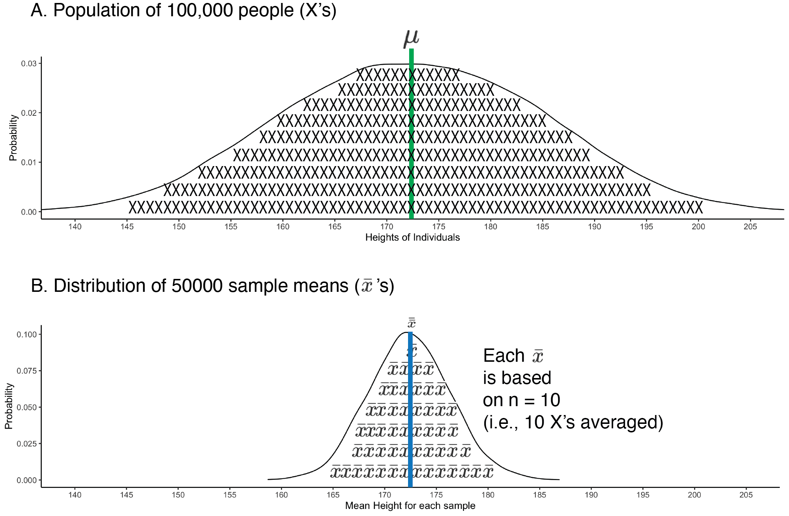

# Sampling Accuracy

The following CRAN packages must be installed:

| Required CRAN Packages |
|-------------------|
|tidyverse          |
|remotes            |

The following GitHub packages must be installed:

| Required GitHub Packages |
|--------------------------|
|dstanley4/learnSampling |


A GitHub package can be installed using the code below:

```{r, eval = FALSE}
remotes::install_github("dstanley4/learnsampling")
```


## Overview

Researchers are usually interested in describing the attributes of a population; numbers that describe the population are called parameters. Two parameters that are frequently of interest are the mean and variance of the population. Unfortunately, it’s rarely possible to obtain information from every member of a population to calculate a parameter. Consequently, researchers use subsets of the population called samples to estimate parameters. Numbers calculated from sample data are called statistics. Typically, sample statistics are used to estimate population parameters.

Sample statistics, however, often differ from population parameters. The difference between a sample statistic and the population parameter occurs because the sample data is random subset of the population data — with correspondingly fewer observations. This difference is typically refered to as **sampling error**.

Sometimes a sample statistic will be higher than the population parameter; other times the sample statistic will be lower than the population parameter. Because random sampling is used to select the sample data the direction and magnitude of the difference between the sample statistic and the population parameter will vary randomly. 

Sample accuracy refers to the extent to which sample statistics correctly estimate the population parameter. We typically used the terms biased and unbiased to describe the accuracy of sample statistics. Consider a scenario where we take many thousands of samples from the same population. For each sample, we calculate a statistic (e.g., the mean). If the average of the sample statistics (e.g., sample means) equals the population parameter (e.g., population mean) then we refer to the statistic as being unbiased. In contrast, if the average of the sample statistics (e.g., sample means) does not equal the population parameter (e.g., population mean) then we refer to the statistic as being biased. 

Further complicating matters is  the fact that the formula used for a sample statistic may, or may not, be the same as the formula used for the corresponding population parameter. This occurs because the purpose of the sample statistic is typically not to describe the sample. Rather the purpose of the sample statistic is to estimate the population parameter. Depending on the parameter, you may or may not be able to use the same formula with sample data as you would with population data.

Also keep in mind that, even if you conduct experiments, the distinction between samples and populations is relevant to you. Consider a scenario where you run an experiment to test the effectiveness of a particular drug. Half the rats are assigned to a placebo condition (e.g., saline injection) whereas the other half of the rats are assigned to the drug condition (e.g., drug injection). Recognize that the placebo-condition rats are considered a sample from a much larger population of all rats who could have received the placebo. Likewise, the drug-condition rats are considered a sample of a much large population of all rats who could have received the drug. Indeed, when you conduct your analyses on this experiment the results do not tell you about the rats in your study - rather they tell you about rats in general (i.e., the larger populations of rats). Therefore, when we discuss the importance of estimating a population parameter from a sample realize that it applies to both experimental and survey research.


## Data for the chapter

In this chapter we will use a population of heights to learn about random sampling. To engage in the learning activities you need to activate the required packages: 

```{r, include=FALSE}
library(tidyverse)
library(learnSampling)
```

```{r}
library(tidyverse)
library(learnSampling)
```

Next, we create a large population with 100,000 people using the get_height_population() command:

```{r}
pop_data <- get_height_population() 
```

The print() command can be used to confirm that the population contains 100,000 people. We see that each row in pop_data represents a single person. There is a column called height that contains the heights for everyone in the population.

```{r}
print(pop_data)
```

## Notation

In the formulas below, when we refer to the population, we use uppercase letters to indicate members ($X$) or the size ($N$). The population mean is indicated by the symbol $\mu$. In contrast, when we refer to the sample, we use lowercase letters to indicate members ($x$) or the size ($n$). The sample mean is indicated by the symbol $\bar{x}$. A single bar above a letter indicates a mean. If we calculate the average of several sample means we indicate this with the symbol $\bar{\bar{x}}$. A double bar above a letter indicates a mean of means. Make sure you notice the similarities between subsequent population and sample formulas even though the notation often differs.

## Estimating $\mu$

We are interested in the sample mean ($\bar{x}$) to the extent that it provides an accurate estimate of the population mean ($\mu$). The population mean is calculated using Formula \@ref(eq:popmeanch5). In this formula, the letter $N$ corresponds to the number of people in the population.

\begin{equation} 
\mu = \frac{\sum{X}}{N}
      (\#eq:popmeanch5)
\end{equation} 


We can calculate the population mean for the height column of pop_data using the summarise() and mean() commands. The mean() command uses Formula \@ref(eq:popmeanch5). We see in the output that the population mean is 172.48 ($\mu = 172.48$).

```{r}
pop_data %>%
  summarise(pop_mean = mean(height)) %>%
  as.data.frame()
```


As noted previously, we rarely have access to data from an entire population. Consequently, we use the sample mean as an estimate of the population mean. The sample mean, $\bar{x}$, is a statistic calculated using the using Formula \@ref(eq:samplemeanch5) below. The bar above the $x$, indicates that it is a mean. Notice that Formula \@ref(eq:popmeanch5) and Formula \@ref(eq:samplemeanch5) are the same - even though they use different notation. In this formula, the letter $n$ corresponds to the number of people in the sample.


\begin{equation} 
\bar{x} = \frac{\sum{x}}{n}
      (\#eq:samplemeanch5)
\end{equation} 

Because a sample mean (a statistic) is calculated using a random subset of the population it is likely to differ from the population mean (a parameter). If you, inaccurately, believe that you can learn something meaningful from a single study, this fact may be disconcerting. Statisticians know, however, that rarely can you learn anything from a single study, or even a small set of studies. Consequently, they are more interested in the extent to which sample means are right, on average. That is, they are interested in the extent to which the mean of many sample means ($\bar{\bar{x}}$) corresponds to the population mean ($\mu$). The mean of many sample means can be calculated using Formula \@ref(eq:samplemeanmeanch5) below. In this formula, the letter $k$ corresponds to the number of sample means.


\begin{equation} 
\bar{\bar{x}} = \frac{\sum{\bar{x}}}{k}
      (\#eq:samplemeanmeanch5)
\end{equation} 


If the mean of the sample means, $\bar{\bar{x}}$, equals the population mean, $\mu$, then the sample mean is an unbiased (or accurate) estimate of the population mean. Figure \@ref(fig:showbias) illustrates the concept of accuracy/bias with a distribution of sample means (i.e., $\bar{x}$). Accuracy/bias is an index of the extent to which the mean of many sample means, $\bar{\bar{x}}$, deviates from the population mean, $\mu$. 

```{r showbias, echo=FALSE, out.width = "80%", fig.cap = "Sampling accuracy and precision"}
knitr::include_graphics("ch_samples/images/sampling_accuracy.png")
```

We can assess bias, as illustrated in the above figure by drawing a large number of samples from a population with the code below. Our goal is calculate a mean for each sample so that we have a sampling distribution of means. In theory, we should take an infinite number of samples, however, to be practical we will take 50000 samples to create an approximate sampling distribution of means. We use the code below to do so:

```{r, eval = FALSE}
many_samples <- get_M_samples(pop.data = pop_data, 
                              pop.column.name = height,
                              n = 10,
                              number.of.samples = 50000)
```
```{r, eval = FALSE, echo = FALSE}
saveRDS(many_samples, file = "ch_samples/many_samples_n10.RDS")
```
```{r, eval=TRUE}
many_samples <- readRDS("ch_samples/many_samples_n10.RDS")
```

We use the print() command to see the first few rows of the 50000 samples:

```{r}
print(many_samples)
```

Each row of many_samples represents a sample of 10 people. Each column of many_samples indicates a sample statistic. You can see that for each sample/row we indicate "n" (the sample size) and "sample_mean" (the mean of the population), and a few other statistics. Even though all the samples came from the same population you can see how the values in the sample_mean column vary across samples/rows. 


```{r, eval = FALSE, echo=FALSE}
pg <- ggplot(data = pop_data,
       mapping = aes(x = height)) +
  geom_density() +
  coord_cartesian(xlim = c(140, 205)) +
  labs(x = "Heights of Individuals", y = "Probability") +
  scale_x_continuous(breaks = seq(120, 220, by = 5)) +
  theme_classic()


sdg <- ggplot(data = many_samples,
       mapping = aes(x = sample_mean)) +
  geom_density(adjust = 1.3) +
  coord_cartesian(xlim = c(140, 205)) +
  labs(x = "Mean Height for each sample", y = "Probability") +
  scale_x_continuous(breaks = seq(120, 220, by = 5)) +
  theme_classic()

png(filename = "ch_samples/images/bothdist.png", width = 12*300, height = 6*300, res = 300)
gridExtra::grid.arrange(pg,sdg, nrow=2)
dev.off()
```
 
 
```{r bothdist, echo = FALSE, out.width = "80%", fig.scap = "Sampling distribution of the mean.", fig.cap = "Sampling distribution of the mean. The population of individuals is presented at the top and filled with X's to remind you they are individuals. There are more individuals than X's. The sampling distribution of means is presented in the bottom part of the graph. The sampling distribution of means is filled with $\\bar{x}$'s to remind you that it is sample means being graphed. There are more means than $\\bar{x}$'s. The population mean (green line) and the mean of sample means (blue line) are in the same spot, indicating high accuracy (i.e., no bias)."}

```
 
 
Above, in Figure \@ref(fig:bothdist), we present a graph comparing the distribution of peoples heights (i.e., the population) to the distribution of sample means based on those heights (i.e., the sampling distribution). The sample means plotted are the 50000 sample means, from the sample_mean column. Recall the population mean for heights is $\mu = 172.48$ cm. Notice that most of the sample means cluster around this value. Also notice that there is considerable variability about this value. Any given sample mean ($\bar{x}$) may differ substantially from the population mean ($\mu = 172.48$). This variability illustrates the challenges with learning something from a single study - particularly a study with a small sample size. Many of the sample means fall quite far from the population mean.

### Assessing bias  

Statisticians, recognizing the limitations of a single study, are not particularly concerned if a single sample mean deviates from the population mean. That said, statisticians are very concerned as to whether or not the results of a large number of studies are correct -- on average. That is, does the average of many sample means correspond to the population mean? If, on average, the sample mean does corresponds to the population mean, it is accurate and we refer to it as an unbiased estimator. Visually, this appears to be the case. But in the code below we confirm it numerically.

```{r}
many_samples %>%
  summarise(mean_of_sample_mean = mean(sample_mean)) %>%
  as.data.frame()
```

We find that the average of the 50000 sample means is 172.47 which is very close to the population mean of 172.48. Note that when we did this, we used the same formula to calculate the sample mean (Formula \@ref(eq:samplemeanch5)) as we did the population mean (Formula \@ref(eq:popmeanch5)), although the notations differed. The average of the sample means was not identical to the population mean but it was very close - it would have been exactly the same with many more samples (i.e., an infinite number of samples). Therefore, we conclude the sample mean provides an unbiased estimate of the population mean. In other words, it makes sense to use the sample mean as an estimate of the population mean. If we try to estimate the population mean with a sample mean we will, on average, be correct; although any given sample/study mean might be "wrong".


## Estimating $\sigma^2$

We are interested in the sample variance ($s^2$) to the extent that it provides an estimate of the population variance ($\sigma^2$). We begin by reviewing population variance. The population variance is calculated using Formula \@ref(eq:popvarch5):

\begin{equation} 
\sigma^2 = \frac{\sum{(X - \mu)^2}}{N}
      (\#eq:popvarch5)
\end{equation} 

We can calculate the population variance for the height column of pop_data using the summarise() and var.pop() commands. The var.pop() command uses Formula \@ref(eq:popvarch5). We see in the output that the population variance is 157.5 ($\sigma^2 = 157.5$).

```{r}
pop_data %>%
  summarise(pop_var = var.pop(height)) %>%
  as.data.frame()
```

### Assessing bias  


The formula for sample variance with an $n$ in the denominator is, unfortunately, a biased estimator of population variance (formula below).

$$
\begin{aligned} 
s^2 = \frac{\sum{(x - \bar{x})^2}}{n}
\end{aligned} 
$$


Estimates of the population variance are systematically too low when you use a sample variance formula with an $n$ in the denominator. We can see that this is true by examining the many_samples data. In these data, the column sample_var_n contains the variance for the sample calculated with the above formula. Below we use code to obtain the average of the sample_var_n column over the 50000 samples. If this average equals the population variance of 157.5 then variance, using $n$ in the denominator, is an unbiased estimator of the population variance.

```{r}
many_samples %>%
  summarise(mean_of_var_n = mean(sample_var_n)) %>%
  as.data.frame()
```

You can see the average of sample_var_n column (141.54) is much smaller than the population variance (157.5). That is, the average of the sample variances, using $n$ in the denominator, was smaller than the population variance. Consequently, sample variance (using $n$ in the denominator) provides a biased estimate of the population variance. If we try to estimate the population variance with sample variance (using $n$ in the denominator) we will, on average, be wrong.

Fortunately, there is a sample-level formula that estimates the population variance without bias (see Hayes). An unbiased estimate of the population variance can be obtained if we calculate the sample variance but divide by $n - 1$ instead of $n$. The unbiased estimate is calculated using Formula \@ref(eq:samplevarn1ch5).

\begin{equation} 
s^2 = \frac{\sum{(x - \bar{x})^2}}{n-1}
      (\#eq:samplevarn1ch5)
\end{equation} 

In the many_samples data, the column sample_var_n_1 was generated using Formula \@ref(eq:samplevarn1ch5). We can evaluate the quality of Formula \@ref(eq:samplevarn1ch5), using $n-1$, by averaging the values in the sample_var_n_1 column.

```{r}
many_samples %>%
  summarise(mean_of_var_n_1 = mean(sample_var_n_1)) %>%
  as.data.frame()
```

We see that the average of the 50000 values using $n-1$ in the denominator is 157.27 which is very close to the population variance of 157.46. These numbers would have been identical with an infinite number of samples. Consequently, when we use $n-1$ in the denominator we have an unbiased estimate of the population variance. If we try to estimate the population variance with a sample variance, using $n-1$ in the denominator, we will, on average, be right.

You may wonder at this point, when we use $n-1$ in the denominator of the sample variance, can we still think of it as the average of the squared differences from the mean? The short answer is yes. When you use $n-1$ in the denominator of the sample variance you are not calculating the variance for the group people in the sample. Rather, you are estimating the variance for the much larger group of people in the population. Consequently, it makes sense to think of sample variance, using $n-1$, as an estimate of the average of the squared differences/errors *in the population*. That is, it makes sense to think of sample variance, using $n-1$, as an estimate of the average of the squared differences between each person in the population and the population mean.

## Estimating $\sigma$


The population standard deviation is calculated using  Formula \@ref(eq:popsdch5) below.

\begin{equation} 
\sigma = \sqrt{\frac{\sum{(X- \mu)^2}}{N}}
      (\#eq:popsdch5)
\end{equation} 

Due to the above findings for variance, we estimate the population standard deviation using Formula \@ref(eq:samplesd1ch5) below.

\begin{equation} 
s = \sqrt{\frac{\sum{(x - \bar{x})^2}}{n-1}}
      (\#eq:samplesd1ch5)
\end{equation} 


## Estimating $\delta$

We are interested in the sample standardized mean difference ($d$) to the extent that it provides an estimate of the population standardized mean difference ($\delta$). The population standardized mean difference is calculated using Formula \@ref(eq:popsmdch5) when we work for the assumption that the two population have the same variance / standard deviation:

\begin{equation} 
\delta  = \frac{\mu_{1} - \mu_{2}}{\sigma} 
      (\#eq:popsmdch5)
\end{equation} 

We can calculate the population standardized mean difference for men and women once we have the respective population means and standard deviations. Recall the initial data mixed males and females. We begin by creating separate data sets for males and females:

```{r}
male_population_heights <- pop_data %>% 
  filter(sex == "male") 

female_population_heights <- pop_data %>% 
  filter(sex == "female") 
```

Next, we calculate the mean and standard deviation of each population:

```{r}
male_population_heights %>% 
  summarise(mean = mean(height),
            sd = sd.pop(height))

female_population_heights %>% 
  summarise(mean = mean(height),
            sd = sd.pop(height))
```

This reveals the population parameters are:

$$
\begin{aligned} 
\mu_{female} &= 165 \\
\mu_{male} &= 180 \\
\sigma = \sigma_{female} = \sigma_{male} &= 10.1\\
\end{aligned} 
$$


Likewise, as calculated below, the population-level standardized mean difference ($\delta$) is 1.49. We can see this population-level difference illustrated in Figure \@ref(fig:sexpop).

$$
\begin{aligned} 
\delta  &= \frac{\mu_{male} - \mu_{female}}{\sigma} \\
&= \frac{180 - 165}{10.1} \\
&= \frac{15}{10.1} \\
&= 1.49 \\
\end{aligned} 
$$


```{r, include=FALSE}
textMean1 <- expression(Delta~"M" == 15)
textd1 <- expression(delta == 1.49)
textfemale1 <- expression("Female"~mu == 165)
textmale1 <- expression("Male"~mu == 180)
texts1 <- expression(sigma == 10.1)

male_pop_data <- pop_data %>% filter(sex == "male")
female_pop_data <- pop_data %>% filter(sex == "female")


gmale <- ggplot(data = male_pop_data,
       mapping = aes(x = height)) +
  geom_histogram(position = "identity",
                 boundary = 0,
                 binwidth = 5,
                 fill = "black",
                 color =  "black",
                 alpha = .40) +
  theme_classic() +
  scale_alpha_manual(values = c(.20, .50)) +
  scale_x_continuous(breaks = seq(100, 250, by = 10)) +
  geom_segment(x = 165, xend = 165, y = 0, yend = 15000, size = 1, linetype = "dotted") +
  geom_segment(x = 180, xend = 180, y = 0, yend = 15000, size = 1) +
  geom_segment(x = 170, xend = 180, y = 13000, yend = 13000, size = .7, arrow = arrow(length = unit(0.1, "inches"))) +
  geom_segment(x = 175, xend = 165, y = 13000, yend = 13000, size = .7, arrow = arrow(length = unit(0.1, "inches"))) +
  labs(x = "Height (cm)", y = "Count", title = "A. Male Population") +
  annotate("text", x = 172, y = 12200, 
           parse = T, label = as.character(textMean1)) +
  annotate("text", x = 172, y = 13800, 
           parse = T, label = as.character(textd1)) +
  annotate("text", x = 185, y = 13800, 
           parse = T, label = as.character(textmale1), hjust = 0) +
  annotate("text", x = 185, y = 12200, 
           parse = T, label = as.character(texts1), hjust = 0) + 
  coord_cartesian(ylim = c(0, 15000), xlim = c(120, 220))

gfemale <- ggplot(data = female_pop_data,
       mapping = aes(x = height)) +
  geom_histogram(position = "identity",
                 boundary = 0,
                 binwidth = 5,
                 fill = "black",
                 color =  "black",
                 alpha = .10) +
  theme_classic() +
  scale_alpha_manual(values = c(.20, .50)) +
  scale_x_continuous(breaks = seq(100, 250, by = 10)) +
  geom_segment(x = 165, xend = 165, y = 0, yend = 15000, size = 1, linetype = "dotted") +
  geom_segment(x = 180, xend = 180, y = 0, yend = 15000, size = 1) +
  geom_segment(x = 170, xend = 180, y = 13000, yend = 13000, size = .7, arrow = arrow(length = unit(0.1, "inches"))) +
  geom_segment(x = 175, xend = 165, y = 13000, yend = 13000, size = .7, arrow = arrow(length = unit(0.1, "inches"))) +
  labs(x = "Height (cm)", y = "Count", title = "B. Female Population") +
  annotate("text", x = 172, y = 12200, 
           parse = T, label = as.character(textMean1)) +
  annotate("text", x = 172, y = 13800, 
           parse = T, label = as.character(textd1)) +
  annotate("text", x = 160, y = 13800, 
           parse = T, label = as.character(textfemale1), hjust = 1) +
  annotate("text", x = 160, y = 12200, 
           parse = T, label = as.character(texts1), hjust = 1) + 
  coord_cartesian(ylim = c(0, 15000), xlim = c(120, 220))

png(filename = "ch_samples/images/sex_pops.png", res = 300, width =8*300, height = 6*300)
gridExtra::grid.arrange(gmale, gfemale, nrow = 2)
dev.off()
```

```{r sexpop, echo=FALSE, out.width="95%", fig.scap = "Illustration of standardized mean difference of $\\delta =1.49$", fig.cap="Illustration of the standardized mean difference of 1.49 for male and female heights. The solid black vertical line indicates the mean for males; whereas the dotted vertical line indicates the mean for females."}
knitr::include_graphics("ch_samples/images/sex_pops.png")
```


We typically need to estimate the population-level standardized mean difference from sample data because we rarely have access to data for an entire population. Many researchers estimate the population standardized mean difference from sample data using the Formula \@ref(eq:samplesmdch5) below -- when we assume the populations have equal variances. This value is known by many other names: $d$, Cohen's $d$, and Hedges' $g$. Notice that the sample-level formula, Formula \@ref(eq:samplesmdch5), below, is the same as the population-level formula, Formula \@ref(eq:popsmdch5), above, only the notation differs.

\begin{equation} 
d  = \frac{\bar{x}_{1} - \bar{x}_{2}}{s_{pooled}} 
      (\#eq:samplesmdch5)
\end{equation} 

Unfortunately, Formula \@ref(eq:samplesmdch5) provides a biased estimate of the population standardized mean difference for small sample sizes. That is, on average, Formula \@ref(eq:samplesmdch5), provides $d$-values that overestimate the size of the population standardize mean difference ($\delta$). Fortunately, we can obtain an unbiased estimate of the population-level standardized mean difference from sample data using Formula \@ref(eq:samplesmdunbiasedch5). This is one approach to calculating $d_{unbiased}$ -- there are others. 

\begin{equation} 
d_{unbiased}  = \frac{\bar{x}_{1} - \bar{x}_{2}}{s_{pooled}} \times [1 - \frac{3}{4(n_1 + n_2)-9}]
      (\#eq:samplesmdunbiasedch5)
\end{equation} 


If we try to apply either $d$-value formula (\@ref(eq:samplesmdch5) or \@ref(eq:samplesmdunbiasedch5)) to real data we quickly encounter a problem.  We don't have the pooled standard deviation, $s_{pooled}$

### Pooled standard deviation

When we calculated the population-level standardized mean difference we knew the population variances where the same. Consequently, there was only one standard deviation (i.e., only one variance). More specifically, the male and female populations both had a standard deviation but it was the same for both populations. The population-level formula for the standardized mean difference, Formula \@ref(eq:popsmdch5), has only one standard deviation in it. This is because calculation of the standardized mean difference explicitly depends on the fact that  both populations have the same standard deviation.

Let's consider hypothetical sample data to make the situation clear. More specifically, we will examine the sample-level statistics below for males and females. Notice that we have two standard deviations -- one for males and one for females. Moreover, these two sample-level standard deviations (using $n$-1) are not the same - they are different from each other. This initially seems problematic - calculation of standardized mean difference requires that population standard deviations are identical. 


$$
\begin{aligned} 
\bar{x}_{males} &= 187.2 \\
s_{males}^2 &= 92.2 \\
s_{males} &= 9.6 \\
\end{aligned} 
$$


And females:

$$
\begin{aligned} 
\bar{x}_{females} &= 160.1 \\
s_{females}^2 &= 66.8 \\
s_{females} &= 8.2 \\
\end{aligned} 
$$

Fortunately, this is sample-level data and not population-level data. Sample-level standard deviations may differ even when the population-level standard deviations are the same. In fact, sample-level standard deviations are *likely* to differ from the population-level standard deviation due to sampling error. Consequently, we are *likely* to get two different sample-level standard deviations even if the population-level standard deviations are identical for males and females.

How do we resolve this situation of having two sample-level standard deviations? The first step is to switch to thinking in terms of variance rather than standard deviation. Due to the way the math works, life becomes very complicated, very quickly, if we continue to think in terms of standard deviations. Therefore, we reframe the problem into a variance problem. Variances are preferable to standard deviations because we can add and subtract variances - but not standard deviations.

We have a sample variance for males (92.2) and a sample variance for females (66.8). We view each of these sample variances as an estimate of the respective population variances (see Figure \@ref(fig:pool1)). That is, the male sample variance is an estimate of the male population variance. Likewise, the female sample variance is an estimate of the female population variance. However, we also **assume** that the population variances for males and females are the same. Consequently, the male sample variance and the female sample variance are both estimates of the same value (see Figure \@ref(fig:pool2)). Because the two sample variances are estimates of the same population variance, we can (when the sample sizes are equal) calculate a new variance by averaging them together. This new variance, the average of the sample variances, provides us with a better estimate of the single population variance. The logic behind this approach is similar to averaging two measurements of the same distance to reduce error. We call this new variance pooled variance; and represent it with the symbol $s_{pooled}^2$.

\newpage

```{r pool1, echo=FALSE, out.width="80%", fig.scap="Estimating population variances with sample variances", fig.cap="Estimating population variances with sample variances. The male sample variance (n-1) is an estimate of male population variance. Likewise, the female sample variance (n-1) is an estimate of the female population variance. "}
knitr::include_graphics("ch_samples/images/pool1.png")
```

\vspace{25mm}

```{r pool2, echo=FALSE, out.width="80%", fig.scap="Two estimates of a single population variance", fig.cap="Two estimates of a single population variance. We assume the population variances are the same. Therefore, the male and female sample variances are both estimates of the same population variance.", }
knitr::include_graphics("ch_samples/images/pool2.png")
```

\newpage

```{r pool3, echo=FALSE, out.width="80%", fig.scap="Pooled variance estimates population variance", fig.cap="Pooled variance from the samples estimates population variance. The population variance is estimated by averaging two sample variances into a single estimate called pooled variance ($s_{pooled}^2$). When sample sizes are equal, the pooled variance is just the regular/simple average of the two sample variances (both using n-1 in the denominator). When the sample sizes are unequal (i.e., different numbers of males and females), however, we need to use a more sophisticated averaging formula to obtain the pooled variance."}
knitr::include_graphics("ch_samples/images/pool3.png")
```

When the sample sizes for males and females are the same (i.e., $n_{males} =n_{females}$) we can use the Formula \@ref(eq:poolvarequalch5) below to calculate the pooled variance.

\begin{equation} 
s_{pooled}^2  = \frac{s_{1}^2 + s_{2}^2}{2} 
      (\#eq:poolvarequalch5)
\end{equation} 

When the sample sizes for males and females are the different (i.e., $n_{males} \ne n_{females}$) we can use the Formula \@ref(eq:poolvarch5) below to calculate the pooled variance. This formula can be used all of the time. We only show Formula \@ref(eq:poolvarequalch5), above, to make it clear that Formula \@ref(eq:poolvarch5) below is basically just averaging the variances in a way that takes sample size into account.

\begin{equation} 
s_{pooled}^2  = \frac{(n_1 -1)s_1^2 + (n_2 -1)s_2^2}{n_1 + n_2-2}
      (\#eq:poolvarch5)
\end{equation} 

We get the single standard deviation, $s_{pooled}$, by taking the square root of the variance, $s_{pooled}^2$.

$$
\begin{aligned} 
s_{pooled}  &= \sqrt{s_{pooled}^2} \\
\end{aligned} 
$$

We apply the pooled standard variance, Formula \@ref(eq:poolvarch5), to the sample data:

$$
\begin{aligned}
s_{pooled}^2 &= \frac{(n_{male} -1)s_{male}^2 + (n_{female} -1)s_{female}^2}{n_{male} + n_{female}-2} \\
&= \frac{(10 -1)92.2 + (10 -1)66.8}{10 + 10 -2} \\
&= 79.5
\end{aligned}
$$

Then we obtain the pooled standard deviation, below, for the standardized mean difference formula.

$$
\begin{aligned} 
s_{pooled}  &= \sqrt{79.5} \\
&= 8.9\\
\end{aligned} 
$$

### Calculating $d$

Now that we have the pooled standard deviation, $s_{pooled}$, we can calculate the standardized mean difference. We do so below using unbiased formula, Formula \@ref(eq:samplesmdunbiasedch5) below.

$$
\begin{aligned}
d_{unbiased}  &= d \times [1 - \frac{3}{4(n_{males} + n_{females})-9}] \\
&= \frac{\bar{x}_{males} - \bar{x}_{females}}{s_{pooled}} \times [1 - \frac{3}{4(n_{males} + n_{females})-9}] \\
&= \frac{187.2 - 160.1}{8.9} \times [1 - \frac{3}{4(10 + 10)-9}] \\
&= 3.0 \times 0.96\\
&= 2.9\\
\end{aligned}
$$


### Assessing bias  

Sample-level $d_{unbiased}$-values, calculated above, often differ from the population-level standardized mean difference (i.e., $\delta$) due to sampling error. We can confirm that $d_{unbiased}$-values are actually unbiased with a simulation. That is, we can confirm that the average of many $d_{unbiased}$-values equals the population standardized mean difference (i.e., $\delta$) using a simulation.

First, we obtain the heights from the male and female populations and place them into male_heights and female_heights, respectively.

```{r}
male_heights <- male_population_heights %>% 
  pull(height)

female_heights <- female_population_heights %>% 
  pull(height)
```

Next, we obtain a large number of samples from each population and place them in many_samples.

```{r, eval = FALSE}
many_samples<-  get_d_samples_from_population_data(pop1 = male_heights,
                                   pop2 = female_heights,
                                   cell.n = 10,
                                   number.of.samples = 50000)
```
```{r, eval = FALSE, echo = FALSE}
saveRDS(many_samples, file = "ch_samples/many_samples_d_n10.RDS")
```

```{r, echo=FALSE}
many_samples <- readRDS("ch_samples/many_samples_d_n10.RDS")
```

We can examine the contents of many_samples using the print() command. Each row of many_samples represents a single study. Each study has two samples: 10 males and 10 females. For both males and females we calculate the mean and variance. As well, we calculate the $d$ and $d_{unbiased}$ for each row. If you examine the first row carefully you see that the data in this row corresponds to the hand calculation example.

```{r}
print(many_samples)
```

Recall the population-level standardized mean difference, $\delta$, was 1.49. We can see the extent to which the average of the sample-level $d$ and $d_{unbiased}$ values compare to this population-level value.

```{r}
many_samples %>%
  summarise(mean_d = mean(d),
            mean_d_unbiased = mean(d_unbiased))
```

You can see that the mean of the sample-level $d$ values is 1.56 which is higher than the population-level standardized mean difference ($\delta$ = 1.49). In contrast, you can see that the mean of the sample-level $d_{unbiased}$ values is 1.49 which corresponds to the population-level standardized mean difference ($\delta$ = 1.49).


### Illustrating variability

An inspection of the first few rows of the many_samples data, above, illustrates that many of the $d_{unbiased}$ values differed from the population-level standardized mean difference of $\delta = 1.49$. We can see the variability in sample-level $d_{unbiased}$ values in the histogram below.


```{r ddist, echo=FALSE, out.width="95%", fig.cap="Histogram of $d_{unbiased}$ when $\\delta = 1.49$"}
knitr::include_graphics("ch_samples/images/d_dist.png")
```

We can calculate the full range of sample-level $d_{unbiased}$ values with the commands below:

```{r}
many_samples %>%
  summarise(d_min = min(d_unbiased),
            d_max = max(d_unbiased))
```

We see from the output that $d_{unbiased}$ values were as small as -0.38 and as large as 5.15. All of these values are estimates of the population-level standardized mean difference of $\delta = 1.49$. You can see that many of the sample-level estimates differed considerably from the population-level value. The negative $d$-value (i.e., the minimum) is a case where the study (i.e, sample-level result) would have found that women are taller than men - a reversal of what is actually true at the population-level. This range of results illustrates the extent to which the findings for a single sample/study may deviate from the underlying truth for the entire population. We see that when the sample size is small (n = 10 per group) that the study results are likely to differ extraordinarily from what is true at the population level. This suggests that the "old school" suggestion of 10 participants per group when conducting a study leads to findings with little informational value.


## Estimating $\rho$

The population-level correlation, $\rho$, is estimated by the sample-level correlation, $r$. The value for $r$ can be calculated using Formula \@ref(eq:sampler5) below.

\begin{equation} 
r =  \frac{\Sigma (x - \bar{x})(y - \bar{y})}{\sqrt{\Sigma (x - \bar{x})^2\Sigma (y - \bar{y})^2}}
      (\#eq:sampler5)
\end{equation} 


Sample-level correlations, $r$, often differ from the population-level correlation ($\rho$) due to sampling error. We can confirm that sample correlations are not substantially biased with a simulation. That is, we can confirm that the average of many sample correlations ($r$) roughly equals the population correlation ($\rho$) using a simulation. We say "roughly equal" because $r$ is technically a biased estimator of $\rho$ but the bias is sufficiently small that it can be ignored [@schmidt2014methods].

We have the height and weight for 300000 people that comprise our population (fictitious data). 

**Prior to using the data in RStudio Cloud you need to put the data into RStudio Cloud. You need 1) download the file to your local computer and then 2) upload it to RStudio Cloud.**

1) The file with height and weight data can be downloaded [here](https://github.com/dstanley4/psyc3290bookdown/raw/main/data_cor_pop.csv). Be sure to right-click as use "Save link as" (or equivalent) to download the file -- or it will just appear as a webpage.


2) Now upload the file to RStudio Cloud so you can use it. You can see how to do this in [Chapter 1 here](https://dstanley4.github.io/psyc3290bookdown/introduction.html#more-practice)

Once the file has been uploaded you can use the read_csv() command below.

```{r}
library(tidyverse)
pop_data <- read_csv(file = "data_cor_pop.csv")
```

The print() command reveals there are 300000 rows and two columns (weight and height). Each row represents a different person in the population.

```{r}
print(pop_data)
```

We can obtain the population correlation, $\rho$, by correlating the weight and height columns:

```{r}
cor(pop_data)
```

We see from this matrix that the population correlation  (*N* = 300000) between weight and height is $\rho$ = .50 (with rounding), see Figure \@ref(fig:rdistplot)A.

To examine the extent to which this population correlation, $\rho$ = .50, is estimated by the sample statistic, $r$, we need to take a large number of samples. Therefore, we take 50000 samples (each *n* = 75) and calculate the correlation for each:

```{r, eval = FALSE}
set.seed(1)
many_samples <- get_r_samples_from_population_data(data = pop_data,
                                                   n = 75,
                                                   number.of.samples = 50000)
```


```{r, eval = TRUE, echo = FALSE}
many_samples <- readRDS("ch_samples/many_samples_r_n75_rho50.RDS")
```

We can examine the first few rows of many_samples using the print() command. There are 50000 rows and each row represent a different sample of 75 people. The correlation between height and weight for each sample is presented in the $r$ column. 

```{r}
print(many_samples)
```

If you examine the first row carefully you see a sample correlation of $r = .38$ based on $n$ = 75. This sample correlation is illustrated in Figure \@ref(fig:rdistplot)B and it is just one of the 50000 sample correlations. The distribution of the 50000 sample correlations is illustrated in in Figure \@ref(fig:rdistplot)C.

Even though the population correlation is $\rho = .50$ there is considerable variability in the sample correlations, $r$. Each sample correlation is based on a subset of the population data (i.e., 75 of the 300000 rows). Consequently, the sample correlations differ from the population correlation due to sampling error. The differences among the sample correlations can be quite large. Indeed, as the code below reveals, some sample correlation were as low as $r = .06$ and as high as $r = .77$ -- even though the population correlation was $\rho = .50$.


```{r}
many_samples %>%
  summarise(min_r = min(r),
            max_r = max(r))
```

### Assessing bias  

Even though the sample correlations usually differed from the population correlation we are not concerned. We recognize that there is little to be learned from a single study. We are more concerned as to whether the average of a large number of sample correlations is correct. We assess this with the code below.

```{r}
many_samples %>%
  summarise(mean_r = mean(r))
```

You can see that the mean of the sample-level correlations is $\bar{r} = .497$ which is very close to the population-level correlation $\rho = .50$ (.4999951 without rounding). Consequently, for practical purposes, we don't worry about the sample correlation being a biased estimator of the population correlation. On average, sample correlation are correct - even though any single sample correlation is likely incorrect due to sampling error (i.e., the fact it is based on a small subset of the population). 

```{r, include=FALSE, eval = FALSE}
library(learnSampling)
library(tidyverse)
N <- 300000
n <- 75
mu <- c(150, 170)
sd <- c(8, 12)
k = 50000

cormatrix <- diag(2)
cormatrix[1,2] <- .5
cormatrix[2,1] <- .5
rhopop <- expression(rho == ".50")

set.seed(1)
pop_rho <- mvrnorm_cor(n = N, mu = mu, sd = sd, cormatrix = cormatrix, empirical = TRUE)
pop_rho <- pop_rho %>% round(1)
pop_data <- as.data.frame(pop_rho)
names(pop_data) <- c("weight", "height")

#write_csv(pop_data, path = "data_cor_pop.csv")

# set.seed(1)
# many_samples <- get_r_samples_from_population_data(data = pop_data,
#                                                    n = n,
#                                                    number.of.samples = k)
# 
# saveRDS(many_samples, file = "ch_samples/many_samples_r_n75_rho50.RDS")

many_samples <- readRDS("ch_samples/many_samples_r_n75_rho50.RDS")

set.seed(1)
single_sample = sample_n(pop_data, size = n)


pop_graph <- ggplot(data = pop_data,
                  mapping = aes(x = height, y = weight)) +
  geom_point(alpha = .30) +
  scale_x_continuous(breaks = seq(100, 250, by = 20)) +
  scale_y_continuous(breaks = seq(70, 250, by = 20)) +
  coord_cartesian(xlim = c(110,250), ylim = c(70, 210)) +
  labs(title = expression("Population correlation")) +
  annotate(geom = "text", x= 220, y = 125, label = rhopop, parse = TRUE) +
  theme_classic()

sample_graph <- ggplot(data = single_sample,
                  mapping = aes(x = height, y = weight)) +
  geom_point() +
  scale_x_continuous(breaks = seq(100, 250, by = 20)) +
  scale_y_continuous(breaks = seq(70, 250, by = 20)) +
  coord_cartesian(xlim = c(110,250), ylim = c(70, 210)) +
  labs(title = "A single sample correlation (n = 75)") +
  annotate(geom = "text", x= 220, y = 135, label = "r = .38") +
  theme_classic()


r_graph <- ggplot(data = many_samples,
                  mapping = aes(x = r)) +
  geom_density(adjust = 1.8) +
  scale_x_continuous(breaks = seq(0, 1, by = .1)) +
  coord_cartesian(xlim = c(0,1)) +
  annotate(geom = "text", x= .65, y = 3, label = "Each    ", hjust = 0) +
  annotate(geom = "text", x= .65, y = 2.6, label = "based", hjust = 0) +
  annotate(geom = "text", x= .65, y = 2.2, label = "on n = 75", hjust = 0) +
  labs(title = sprintf("Distribution of %g sample correlations", k),
       x = "Sample correlation",
       y = "Density") +
  theme_classic()

png(filename = "ch_samples/images/rdist_example.png",
    width = 4*300,
    height = 10*300,
    res = 300)
gridExtra::grid.arrange(pop_graph, sample_graph, r_graph)
dev.off()

```


```{r rdistplot, fig.cap="Correlation sampling distribution", echo = FALSE, out.height="70%", out.width="70%"}

```
  

## Overview

In this chapter we have illustrated how population parameters can be estimated by sample statistics; these are summarized below:

\doublespacing

|  | Parameter  | Estimated by this statistic | 
| ---   | ---         |  ---   |
| Mean |$\mu = \frac{\sum{X}}{N}$ | $\bar{x} = \frac{\sum{x}}{n}$|
| Variance |$\sigma^2 = \frac{\sum{(X - \mu)^2}}{N}$  | $s^2 = \frac{\sum{(x - \bar{x})^2}}{n-1}$ |
|          |     |  $s_{pooled}^2  = \frac{(n_1 -1)s_1^2 + (n_2 -1)s_2^2}{n_1 + n_2-2}$|
| Standard deviation |$\sigma = \sqrt{\frac{\sum{(X - \mu)^2}}{N}}$  | $s =\sqrt{\frac{\sum{(x - \bar{x})^2}}{n-1}}$ |
|          |     |  $s_{pooled}  = \sqrt{\frac{(n_1 -1)s_1^2 + (n_2 -1)s_2^2}{n_1 + n_2-2}}$|
| Cohen's $d$ or SMD|$\delta= \frac{\mu_{1} - \mu_{2}}{\sigma}$ | $d  = \frac{\bar{x}_{1} - \bar{x}_{2}}{s_{pooled}}$    |
|          |     | $d_{unbiased}  = \frac{\bar{x}_{1} - \bar{x}_{2}}{s_{pooled}}  \times [1 - \frac{3}{4(n_1 + n_2)-9}]$ |
| Correlation | $\rho =  \frac{\Sigma (X - \mu_X)(Y - \mu_Y)}{\sqrt{\Sigma (X - \mu_X)^2\Sigma (Y - \mu_Y)^2}}$ | $r =  \frac{\Sigma (x - \bar{x})(y - \bar{y})}{\sqrt{\Sigma (x - \bar{x})^2\Sigma (y - \bar{y})^2}}$ |

\singlespacing

## Meta-analysis

It may seem odd that we used so many simulations to investigate the properties of statistics. Surely, researchers don't do that "in the real world". In fact, researchers who are aware of the enormous impact of sampling error know that single studies have little informational value. They recognize that any single study has a high probability of being misleading. Consequently, these individuals survey the literature and find all the studies on a single topic (possibly thousands of studies). An average of the results of all of the thousands of studies can then be calculated and reported. This process is referred to as conducting a meta-analysis; and it perfectly corresponds to the process we used in the simulations. A meta-analysis finds "the truth" of what is happening at the population level by averaging all of the studies on that topic.

## A joke

Now that you understand the logic for assessing bias, we present an old statistics joke.

> "A physicist, a chemist, and a statistician go hunting. The physicist shoots at a deer and misses by 2 meters to the left. The chemist shoots and misses by 2 meters to the right. The statistician immediately yells "We got it!"


## Key Points

1. Samples are of interest because they help us estimate attributes of a population.

2. Sample *statistics* estimate population *parameters*.

3. Due to the fact that sample statistics are based on a random subset of the population (i.e., a sample) they often differ substantially from the population parameter. This illustrates that informational value of a single study is typically quite low.

4. A statistic is unbiased if the average of the sample statistics, over many thousand of samples, equals the population parameter.

5. To avoid bias, sometimes the formula for a sample statistics differs from the formula for the population parameter.

6. Meta-analyses are used in the "real world" the way we used simulations in this chapter.


