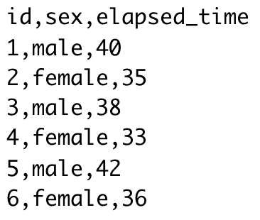

# Data Entry

```{r, include=FALSE}
library(tidyverse)
```

## Required Packages


The data files below are used in this chapter. The files are available at: https://github.com/dstanley4/psyc3250bookdown


| Required Data |
|-------------------|
|data_item_scoring.csv |


The following CRAN packages must be installed:

| Required CRAN Packages |
|-------------------|
|apaTables          |
|Hmisc              |
|janitor            |
|psych              |
|skimr              |
|tidyverse          |

**Important Note:** You should NOT use library(psych) at any point! There are major conflicts between the psych package and the tidyverse. We will access the psych package commands by preceding each command with psych:: instead of using library(psych).


## Overview

In this chapter we strongly advocate that you use a naming convention for file, variable, and column names. This convention will save you hours of hassles and permit easy application of certain tidyverse commands. However, we must stress that although the naming convention we advocate is based on the tidyverse style guide, it is not "right" or "correct" - there are other naming conventions you can use. Any naming convention is better than no naming convention. The naming convention we advocate here will solve many problems. We encourage to use this system for weeks or months over many projects - until you see the benefits of this system, and correspondingly its shortcomings. After you are well versed in the strengths/weaknesses of the naming conventions used here you may choose to create your own naming convention system.

### Structuring data: Obtaining tidy data

When conducting analyses in R it is typically necessary to have data in a format called tidy data [@tidy-data]. [Tidy data](https://cran.r-project.org/web/packages/tidyr/vignettes/tidy-data.html), as defined by Hadley, involves (among other requirements) that: 

1. Each variable forms a column.

2. Each observation forms a row.

The tidy data format can be initially challenging for some researchers to understand because it is based on thinking about, and structuring data, in terms of observations/measurements instead of participants. In this section we will describe common approaches to entering animal and human participant data and how they can be done keeping the tidy data requirement in mind. It's not essential that data be entered in a tidy data format but it is essential that you enter data in a manner that makes it easy to later convert data to a tidy data format. When dealing with animal or human participant data it's common to enter data into a spreadsheet. Each row of the spreadsheet is typically used to represent a single participant and each column of the spreadsheet is used to represent a variable.

**Between participant data**. Consider Table \@ref(tab:betweenex) which illustrates between participant data for six human participants running 5 kilometers. The first column is id, which indicates there are six unique participants and provides and identification number for each of them. The second column is sex, which is a variable, and there is one observation per for row, so sex also conforms to the tidy data specification. Finally, there is a last column five_km_time which is a variable with one observation per row -- also conforming to tidy data specification. Thus, single occasion between subject data like this conforms to the tidy data specification. There is usually nothing you need to do to convert between participant data (or cross-sectional data) to be in a tidy data format.


```{r betweenex, echo = FALSE}
data_between <- read_csv("data_ex_between.csv", col_type = cols())
knitr::kable(
  head(data_between), caption = 'Between participant data entered one row per participant',
  booktabs = TRUE,
  linesep = c("","","","","","","\\addlinespace")
)
```


**Within participant data**. Consider  Table \@ref(tab:withinex) which illustrates within participant data for six human participants running 5 kilometers - but on three different occasions. The first column is id, which indicates there are six unique participants and provides and identification number for each of them. The second column is sex, which is a variable, and there is one observation per for row, so sex also conforms to the tidy data specification. Next, there are three different columns (march, may, july) each of which contains elapsed time (in minutes) for the runner in a different month. Elapsed run times are spread out over three columns so elapse_time is not in a tidy data format. Moreover, it's not clear from the data file that march, may, and july are levels of a variable called occasion. Nor is it clear that elapsed_times are recorded in each of those columns (i.e., the dependent variable is unknown/not labeled). Although this format is fine as a data entry format it clearly has problems associated with it when it comes time to analyze your data.


```{r withinex, echo = FALSE}
data_within <- read_csv("data_ex_within.csv", col_types = cols())
knitr::kable(
  head(data_within), caption = 'Within participant data entered one row per participant',
  booktabs = TRUE,
  linesep = c("","","","","","","\\addlinespace")
)
```

```{r, include=FALSE}
data_within_tidy <- data_within %>% 
  pivot_longer(cols = march:july,
               names_to = "occasion",
               values_to =  "elapsed_time")

```

```{r withintidyex, echo = FALSE}
knitr::kable(
  head(data_within_tidy,18), caption = 'A tidy data version of the within participant data',
  booktabs = TRUE,
  linesep = c("", "","\\addlinespace")
)
```


Thus, a major problem with entering repeated measures data in the one row per person format is that there are hidden variables in the data and you need insider knowledge to know what the columns represent. That said, this is not necessarily a terrible way to enter your data as long as you have all of this missing information documented in a data code book.


| Disadvantages one row per participant  | Advantages one row per participant | 
| ---------------|------------|
| 1) Predictor variable (*occasion*) is hidden and spread over multiple columns | 1) Easy to enter this way | 
| 2) Unclear that each month is a level of the predictor variable *occasion* | |
| 3) Dependent variable (*elapsed_time*) is not  indicated    | |
| 4) Unclear that *elapsed_time* is the measurement in each month column | |

\newpage

Fortunately, the problems with Table \@ref(tab:withinex) can be largely resolved by converting the data to the a tidy data format. This can be done with the pivot_longer() command that we will learn about later. Thus, we can enter the data in the format of Table \@ref(tab:withinex) and later convert it to a tidy data format. After this conversion the data will be appear as in Table \@ref(tab:withintidyex). For elapsed_time variable this data is now in the tidy data format. Each row corresponds to a single elapsed_time observed. Each column corresponds to a single variable. Somewhat problematically, however, sex is repeated three times for each person (i.e., over the three rows) - and this can be confusing. However, if the focus in on analyzing elapsed time this tidy data format makes sense. Importantly, there is an id column for each participant so R knows that this information is repeated for each participant and is not confused by repeating the sex designation over three rows. Indirectly, this illustrates the importance of having an id column to indicate each unique participant.

Why did we walk you through this technical treatment of structuring data at this point in time - so that you pay attention to the advice that follows. You can see at this point that you may well need to restructure your data for certain analyses. The ability to do so quickly and easily depends upon  following the advice in this chapter around naming conventions for variables and other aspects of your analyses. You can imagine the challenges for converting the data in Figure \@ref(tab:withinex) to the data in Figure \@ref(tab:withintidyex) by hand. You want to be able to automate that process and others - which is made substantially easier if you follow the forthcoming advice about naming conventions in the tidyverse.


## Data collection considerations 

Data can be collected in a wide variety of ways. Regardless of the method of data collection researchers typically come to data in one of two ways: 1) a research assistant enters the data into a spreadsheet type interface, or 2) the data is obtained as the output from computer software (e.g., Qualtrics, SurveyMonkey, Noldus, etc.). 

Regardless of the approach, it is critical to name your variables appropriately. For those using software, such as Qualtrics, this means setting up the software to use appropriate variable names PRIOR to data collection - so the exported file has desirable column names. For spreadsheet users, this means setting up the spreadsheet in which the data will be recorded with column names that are amenable to the future analyses you want to conduct. 

Although failure to take this thoughtful approach at the data collection stage can be overcome - it is only overcome with substantial manual effort. Therefore, as noted previously, we strongly encourage you to follow the naming conventions we espouse here when you set up your data recording regime. Additionally, we encourage you to give careful thought in advance to the codes you will use to record missing data.

### Naming conventions

To make your life easier down the road, it is critical you set up your spreadsheet or online survey such that it uses a naming convention prior to data collection. The naming conventions suggested here are adapted from the tidyverse [style guide](https://style.tidyverse.org).


* Lowercase letters only

* If two word column names are necessary, only use the underscore ("_") character to separate words in the name.

* Avoid short decontextualized variable names like q1, q2, q3, etc.

* Do use moderate length column names. Aim to achieve a unique prefix for related columns so that those columns can be selected using the starts_with() command discussed in the previous chapter. Be sure to avoid short two or three letter prefixes for item names. Instead, use unique moderate length item prefixes so that it will easy to select those columns using start_with() such that you don't accidentally get additionally columns you don't want - that have a similar prefix. See the Likert-type item section below for additional details.

* If you have a column name that represents the levels of two repeated measures variables only use the underscore character to separate the levels of the different variables. See within-participant ANOVA section below for details.


## Entering data into spreadsheets

You should usually enter data using the one row per person/animal rule. You can convert this format to the tidy data format if needed.

The first example uses a data file data_ex_between.csv that corresponds to a fictitious example where we recorded the run times for a number of male and female participants. How did we create this data file? We used a spreadsheet to enter the data, as illustrated in Figure  \@ref(fig:spreadsheetbetween). Programs like Microsoft Excel and Google Sheets are good options for entering data. 

```{r spreadsheetbetween, echo = FALSE, out.width="40%", fig.cap = "Spreadsheet entry of running data"}
knitr::include_graphics("ch_enter_load/images/screenshot_data_between.png")
```

The key to using these types of programs is to save the data as a .csv file when you are done. CSV is short for Comma Separated Values. After entering the data in Figure \@ref(fig:spreadsheetbetween) we saved it as data_ex_between.csv. There is no need to do so, but if you were to open this file in a text editor (such as TextEdit on a Mac or Notepad on Windows) you would see the information displayed in Figure   \@ref(fig:csvsheetbetween). You can see there is one row per person and the columns are created by separating each values by a comma; hence, comma separated values. 

```{r csvsheetbetween, echo = FALSE, out.width="25%", fig.cap = "Text view of CSV data"}

```

There are many ways to save data, but the CSV data is one of the better ones because it is a non-proprietary format. Some software, such as SPSS, uses a proprietary format (e.g., .sav for SPSS) this makes it challenging to access that data if you don't have that (often expensive) software. One of our goals as scientists is to make it easy for others to audit our work - that allows science to be self-correcting. Therefore, choose an open format for your data like .csv.


