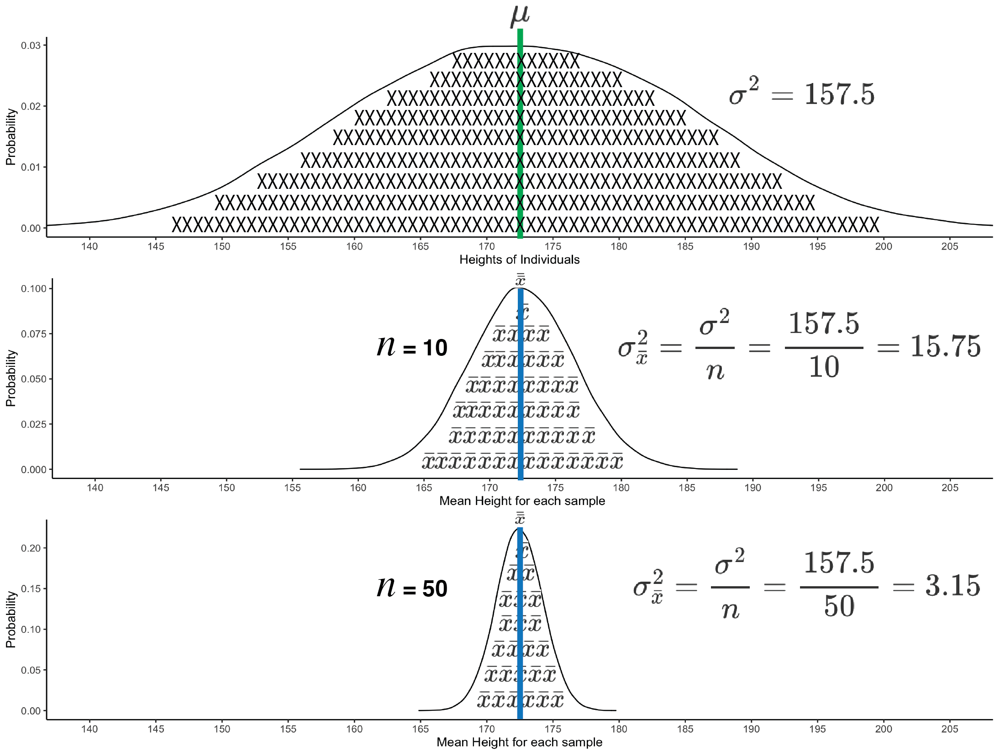

# Sampling Precision

## Overview

In the previous chapter we focused on examining the extent to which we could estimate a population parameter from a statistic in an unbiased manner. That is, we focused on the fact that, due to sampling error, a sample estimate (i.e., a statistic) of a population parameter will likely be wrong. Sample statistics may overestimate, or underestimate, a population parameter - often substantially. Consequently, we learned to think about the accuracy of sample statistics. More specifically, we learned to think about accuracy not in terms of a single study, but rather in terms of whether sample statistics correctly estimate the population parameter on average over many studies (as illustrated in Figure \@ref(fig:showbias2)). When the average of many sample statistics (e.g., sample means) equals the population parameter (e.g., population mean) there is no bias and the sample statistic can be considered accurate (on average). 

In this chapter, we assume there is no bias and that sample means are, on average, accurate. In doing so, we focus now on the precision of sample means as estimates of the population mean, see Figure \@ref(fig:showbias2). That is, assuming no bias, when you conduct a single study you know the sample mean will differ from the population mean due to sampling error. You might wonder, how much does my sample mean differ from the population mean? That's the question we address in this chapter. When we conduct a single study we can't know how much that particular sample mean differs from the population mean, but we can estimate the extent to which sample means differ from the population mean in general. We focus on two indices of precision -- variance of sample mean and standard error of sample means. By the end of the chapter you will understand how to a) conceptualize these indices with respect to a large number of samples/studies and  b) estimate them for a single study.


```{r showbias2, echo=FALSE, out.width = "80%", fig.cap = "Sampling accuracy and precision"}
knitr::include_graphics("ch_samples_precision/images/sampling_accuracy.png")
```


## Population / Individuals

We use a population of heights to learn about random sampling and the precision of sample estimates. We can obtain that population with the code below: 

```{r, include=FALSE}
library(tidyverse)
library(learnSampling)
```

```{r}
library(tidyverse)
library(learnSampling)

pop_data <- get_height_population() 
```

The glimpse() command can be used to confirm that the population contains 100,000 people.

```{r}
glimpse(pop_data)
```

We can use the head() command to see the first 10 rows of the 100,00 rows. We see that each row in pop_data represents a single person. There is a column called height that contains the height for everyone in the population.

```{r}
head(pop_data, 10)
```

We can calculate the descriptive parameters for the population with the code below:


```{r}
pop_data %>%
  summarise(pop_mean = mean(height),
            pop_var = var.pop(height),
            pop_sd = sd.pop(height)) %>%
  as.data.frame()
```

We see the mean of the population of heights is 172.5 ($\mu = 172.5$) and the variance is 157.5 ($\sigma^2 = 157.5$). Correspondingly, the standard deviation of the population of heights is 12.5 ($\sigma = 12.5$); simply the square root of the variance. 

$$
\begin{aligned} 
\mu &= 172.5 \\
\sigma^2 &= 157.5 \\
\sigma &= 12.5 \\
\end{aligned} 
$$


## Sampling distribution

A sampling distribution is composed of an infinite number of samples. For pedagogical purposes, we will use a sampling distribution of just 50000 samples. This large number of samples will lead us to roughly the same conclusions as using an infinite, but impractical, number of samples. We obtain 50000 samples with code below:

```{r, eval= FALSE}
many_samples <- get_M_samples(pop.data = pop_data, 
                              pop.column.name = height,
                              n = 10,
                              number.of.samples = 50000)
```
```{r, echo=FALSE}
many_samples <- readRDS("ch_samples_precision/many_samples_n10.RDS")
```

We can use the head() command to see the first few rows of many_samples. Every row represents a sample of 10 people. That is, each row represents a study with 10 participants for which we measured their heights. For each row/study we have the sample mean and variance (using n-1) for the 10 heights.


```{r}
head(many_samples)
```

We will study the precision of sample means as estimates of the population mean using the values in the sample_mean column.  Each of the 50000 values in the sample_mean column is a sample mean ($\bar{x}$), based on $n$ = 10. Each sample mean provides an estimate of the population mean ($\mu = 172.5$). Sample means often overestimate, or underestimate, the population mean. We can see this using the code below which reveals that the smallest sample mean is 155.6 ($\bar{x} = 155.6$) and the largest sample mean is 188.8 ($\bar{x} = 188.8$). Both are estimates of the population mean ($\mu = 172.5$) but differ from that value due to sampling error (i.e., the fact that sample means are based on a small subset of the population). You can see that the conclusions of any single study may differ rather substantially from what is true for the overall population.

```{r}
many_samples %>%
   summarise(min_mean = min(sample_mean),
             max_mean = max(sample_mean))
```

The 50000 means in the sample_mean column form a **sampling distribution**; specifically, the sampling distribution of the mean. It's critical to distinguish between a) the distribution of the sample means and b) the distribution of population heights. Examine Figure \@ref(fig:bothdist2) below. The top part of this figure illustrates the variability in the heights for the 100,000 people (represented by X’s). There are more people than X’s; the X’s are a reminder it is a distribution of people's heights. The bottom part of this figure illustrates the variability in sample means - each based on 10 people. Each sample mean is an estimate of the mean height of the population (172.5 cm). There are more sample means than $\bar{x}$’s; the $\bar{x}$’s are a reminder it is a distribution of sample means. When we describe how precisely sample means estimate the mean height for the population we are referring to the width of this distribution of means. 


```{r bothdist2, echo = FALSE, out.width = "80%", fig.scap = "Sampling distribution of the mean.", fig.cap = "Sampling distribution of the mean. The population of individual height's is presented at the top and filled with X's to remind you they are individuals. There are more individuals than X's. The sampling distribution of means is presented in the bottom part of the graph. The sampling distribution of means is filled with $\\bar{x}$'s to remind you that sample means are being graphed. There are more means than $\\bar{x}$'s. The population mean (green line) and the mean of sample means (blue line) are in the same spot, indicating high accuracy (i.e., no bias)."}

```

## Precision indices

The most common way of referring to the width of this distribution of sample means is with the term standard error. Standard error is simply the standard deviation of the sample means. We calculate the standard error of the mean  using Formula \@ref(eq:samplesechnext) below. We use $K$ in the formula to refer to the number of sample means in the distribution (i.e., $K = \infty$). Note that it doesn't really make sense to divide by infinity (i.e., $\infty$) so statistician's don't normally express the standard deviation of this distribution using the formula below - instead they talk about the **expected value** for the standard deviation. But for learning purposes - we present the formula below as means to bridge this learning with past learning.

\begin{equation} 
\sigma_{\bar{x}} = \sqrt{\frac{\sum{(\bar{x} - \bar{\bar{x}})^2}}{K}}
      (\#eq:samplesechnext)
\end{equation} 

Notice that the formula for standard error is actually just the formula for standard deviation but with notation adapted to reflect the fact we are examining sample means (i.e., $\bar{x}$'s) instead of people (i.e., X's).

Often we will not talk about standard error but rather the variance of the distribution of sample means. When we do so, we are talking about the same thing - the variability in sample means - but using different units. You can see that the formula for the variance of sample means, see Formula \@ref(eq:samplevarchnext) below, is just a squared version of the standard error equation, Formula \@ref(eq:samplesechnext) above.

\begin{equation} 
\sigma_{\bar{x}}^2 = \frac{\sum{(\bar{x} - \bar{\bar{x}})^2}}{K}
      (\#eq:samplevarchnext)
\end{equation} 

How do we interpret variance of sample means? Assuming the sample mean provides an unbiased estimate of the population mean (i.e., $\bar{\bar{x}} = \mu$), then the **variance of the sample means is simply the average of the squared differences between sample means and the population mean**. Standard error is simply the square root of the variance of sample means. Both are different ways of describing the same thing - the precision with which sample means estimate the population mean. 

If the variance of sample means is large, it indicates sample means differ considerably (on average) from the population mean. If the variance of sample means is small, it indicates sample means differ only slightly (on average) from the population mean. If the variance of sample means is zero, all the sample means are exactly the same as the population mean.

We can calculate the variance of sample means below:

```{r}
many_samples %>% 
   summarise(var_of_means = var.pop(sample_mean)) %>%
   as.data.frame()

```


The standard error of sample mean is just the square root of this value:

```{r}
many_samples %>% 
   summarise(sd_of_means = sqrt(var.pop(sample_mean))) %>%
   as.data.frame()

```

Thus, we can indicate the precision with which sample means ($\bar{x}$) estimate the population mean ($\mu$) using the notation below. We use $\sigma_{\bar{x}}^2$ to refer to the variance of sample means and $\sigma_{\bar{x}}$ to refer to the standard error of sample means. Again notice in the notation that for both of these symbols there is a subscript with an $\bar{x}$ to remind us we are talking about the variability of sample means (and not people).

$$
\begin{aligned} 
\sigma_{\bar{x}}^2 &= 15.73 \\
\sigma_{\bar{x}} &= 3.97 \\
\end{aligned} 
$$


## A short cut

In the previous section we used a computer simulation to calculate the variance of sample means. This involved several steps:

1. Obtaining the entire population
2. Creating 50000 samples (each n = 10) from the population
3. Calculating the mean for each of the 50000 samples
4. Calculating the variance of the 50000 sample means as per Formula \@ref(eq:samplevarchnext)

All those steps are a lot of work - and a lot of computer time. Interestingly, we don’t need to go to all that work to determine the variance of sample means. There is a quicker way to obtain the variance of sample means. That is, there is a quicker way to determine the precision with which sample means estimate the population mean when we use a sample size of $n$ = 10.

Statisticians have created a short-cut formula for obtaining the variance of sample means. The equation by itself, see Formula \@ref(eq:samplevar2chnext) below, is extraordinarily simple to use. The formula, however, is not easy to understand. Over many years of teaching, we’ve seen students struggle to understand why the formula is structured in the way that it is - looking for a straightforward logic as to why the short-cut formula works. We encourage you to avoid going down that road. Understanding Formula \@ref(eq:samplevar2chnext) below is beyond the scope of this chapter and, likely, your mathematical background at this point. It was derived via a complex mathematical proof discussed in @hays1994 if you want more information. Simply accept that there is a short-cut formula and do not try to understand the logic of the formula. 

Variance sample means:

\begin{equation} 
\sigma_{\bar{x}}^2 = \frac{\sigma^2}{n}
      (\#eq:samplevar2chnext)
\end{equation} 

You can see that with this formula the variance of sample means, Formula \@ref(eq:samplevar2chnext), is simply the variance of heights of the individuals in the population divided by the sample size. Oddly, this short cut works and provides the variance of sample means. Notice that we don’t need to have the entire population, create thousands of samples, or go through any of the calculation work. All we need to know is the variance of the population and the sample size. In the context of the current example we can compute the variance of the sample means using this information. Recall the variance of people's heights in the population is $\sigma^2=157.5$ and our sample size is $n$ = 10.

$$
\begin{aligned} 
\sigma_{\bar{x}}^2 &= \frac{\sigma^2}{n} \\
&= \frac{157.5}{10}\\
&= \frac{157.5}{10}\\
&= 15.75
\end{aligned} 
$$

We see that the variance of the sample means from this short-cut approach is 15.75 (i.e., $\sigma_{\bar{x}}^2$ = 15.75). Likewise, the variance of the sample means from our simulation was 15.73; incredibly close. If we had used substantially more than 50000 samples in the simulation the 15.73 value would have been 15.75 -- making the two results identical. Thus, the short-cut formula gives us the variance of sample means without having to do all the simulation work.

Of course, the variance of sample means is only one of the two ways we can describe the precision of sample estimates of the population mean. Many people prefer to use standard error (i.e. standard deviation of sample means) instead. The calculation for standard error is below:

$$
\begin{aligned} 
\sigma_{\bar{x}} &= \sqrt{\frac{\sigma^2}{n}} \\
&= \sqrt{\frac{157.5}{10}}\\
&= \sqrt{\frac{157.5}{10}}\\
&= \sqrt{15.75} \\
&= 3.97 \\
\end{aligned} 
$$


## Estimates of precision
 
As wonderful as it is to have a short-cut formula for obtaining the variance of sample means (or standard error) there is a catch. The formula requires knowledge of the population variance  (or standard deviation). In a research scenario we don’t know the mean or standard deviation of the population - that's why we're conducting research. Consequently, we can’t directly calculate the variance of sample means (or standard error) using Formula \@ref(eq:samplevar2chnext) above.

Fortunately, if we have only a single study, we can use the sample variance (with n-1 in the denominator) to estimate the population variance. This estimate of the population variance may be higher or lower than the actual population variance - but it will, on average, be correct across many studies. With this estimate of the population variance in hand we can calculate an estimate of the variance of sample means (i.e, the precision of sample means) using Formula \@ref(eq:samplevar2estchnext) below.

Estimated variance sample means:
 
\begin{equation} 
s_{\bar{x}}^2 = \frac{s^2}{n}
      (\#eq:samplevar2estchnext)
\end{equation} 

Estimated standard error for the mean:

\begin{equation} 
s_{\bar{x}} = \sqrt{\frac{s^2}{n}} = \frac{s}{{\sqrt{n}}}
      (\#eq:samplese2estchnext)
\end{equation} 


```{r showallformulas, echo=FALSE, out.width = "80%", fig.cap = "Precision: Conceptual and calculation approaches. "}

```


### A worked example

Consider a worked example below. Imagine a scenario where we do not know anything about the population of heights. Therefore we conduct a study by taking a random sample of 10 people to estimate the average height of people in the population. The sample mean is 174.3cm and the sample variance is 30.90. Therefore, our best guess of the unknown population mean is 174.3cm. Because we used a sample (a small subset of the population) we know that 174.3cm is unlikely to be the actual mean height for the population. The mean height for the population might be higher or lower than 174.3cm. Nonetheless, at this point our best guess is that the mean of the population is 174.3cm; but we recognize that this is just an estimate of the population mean and is likely off by some amount.

Wouldn't it be great to know the extent to which the sample mean in our study might differ from the population mean? As budding statisticians, we know we can't know that for this particular sample/study, but we can try to figure out how much sample means differ from the population mean on average (when using $n$ = 10) to help us understand the precision of our current sample/study estimate (174.3cm) of the population mean. This precision information is exactly what is conveyed by the variance of sample means, $\sigma_{\bar{x}}^2$, or standard error of sample means, $\sigma_{\bar{x}}$. We can't obtain these precision indices but we can estimate them (via $s_{\bar{x}}^2$ and $s_{\bar{x}}$).

We want to know the precision with which sample means estimate the population mean. Said another way, we want to know the variance of sample means (or standard error of sample means) but we only have a single study. Therefore, we have to rely on the short-cut formula for determining the variability in sample means. Unfortunately, the short-cut formula for the variance of sample means formula requires the population variance which we don't know. We do, however, have an estimate of the population variance from our sample. The sample variance is 30.9cm$^2$. Therefore, our best guess of the unknown population variance is 30.9cm$^2$. Because we used a sample (a small subset of the population) we know that 30.9cm$^2$ is likely to be different than the actual variance for the population. The variance for the population might be higher or lower than 30.9cm$^2$. So even though our estimate of the population variance may be "off" in this single sample we know it will be accurate in the long run averaging over many studies (see previous chapter).

Nonetheless, at this point our best guess is that the variance of the population is 30.9cm$^2$. We use this information to estimate the variance of sample means:

$$
\begin{aligned} 
s^2_{\bar{x}} &= \frac{s^2}{n} \\
&= \frac{30.90}{10} \\
&= 3.09 \\
\end{aligned} 
$$

Or alternatively, estimate standard error:

$$
\begin{aligned} 
s_{\bar{x}} &= \sqrt{\frac{s^2}{n}} \\
&= \sqrt{\frac{30.90}{10}} \\
&= \sqrt{3.09} \\
&= 1.76 \\
\end{aligned} 
$$


At this point we don't know the precision of sample means when $n$ = 10; that is, we don't know $\sigma_{\bar{x}}^2$ or $\sigma_{\bar{x}}$. We do have an estimate of the precision of sample means (i.e., with via $s_{\bar{x}}^2$ and $s_{\bar{x}}$).  Whenever you calculate the variance of sample means, or standard error, based on sample data it is ALWAYS just an estimate of the actual variance of sample means or the actual standard error. 

That fact that an estimate of the variance of sample means is the best you can do with sample data is evident when we calculate the estimate for the many samples. We do that with the R code below:

```{r}
many_samples <- many_samples %>% 
   mutate(est_se2 = sample_var_n_1/n)
```

The command above calculated the estimate variance of sample means (est_se2 or $s_{\bar{x}}^2$) for each of the 50000 samples. We can see the first few samples with the head() command.


```{r, eval = FALSE}
head(many_samples)
```

```{r, echo = FALSE}
many_samples_temp <- many_samples %>% select(-sample_var_n)
head(many_samples_temp)
```


Inspect the est_se2 column. Notice how each of these values is an $s_{\bar{x}}^2$ number that is an estimate of $\sigma_{\bar{x}}^2$ = 15.75. The first estimate, $s_{\bar{x}}^2$ = 3.09, is the one we did by hand above. This estimate of the variance of sample means ($s_{\bar{x}}^2$ = 3.09) is much lower than the actual variance of sample means ($\sigma_{\bar{x}}^2$ = 15.75). Notice how the other values in the est_se2 column tend to either overestimate, or underestimate, the variance of sample means. That is, the other studies also overestimate, or underestimate, the precision with which sample means ($n$ = 10) estimate the population mean.


## Bias of precision estimates

At this point, you might be a bit concerned about our ability to estimate the variance of sample means ( $\sigma_{\bar{x}}^2$ = 15.75). In the simulation above, we calculated an estimate of the variance of sample means ($s_{\bar{x}}^2$) and placed those values in the est_se2 column. We saw that the values in this column mostly differed from the actual variance of sample means (15.75). You might wonder if these estimates of the variance of sample means are themselves biased? The answer is no - they are not biased. Our estimate of the population variance (n-1 in the denominator) was not biased so there is no reason to suspect that the estimate of the variance of sample means is biased. But we can confirm this by averaging over the 50000 samples. If the average of the est_est2 column is 15.75 (or very close) than $s_{\bar{x}}^2$ is not a biased estimate of $\sigma_{\bar{x}}^2$ = 15.75.


```{r}
many_samples %>% 
   summarise(avg.of.est_se2 = mean(est_se2))
```


We see that the average of the 50000 estimates of the variance of sample means ($s_{\bar{x}}^2$) is 15.73 which is very close to the actual value of $\sigma_{\bar{x}}^2$ = 15.75. Any sample estimate of the variance of sample means will be off somewhat due to sampling error. But, on average, estimates of the variance of sample means will be unbiased/accurate.

## Where are we?

So where are we? We've learned that sample means may overestimate, or underestimate, the population mean. Over many studies, on average, sample means will approximate the population mean. In other words, on average, sample means are accurate. As well, we've learned that the variability in estimates of the population mean is referred to as **precision**. We can index the precision of sample means, for a given sample size, using two indices: variance of sample means and standard error of sample means (i.e., standard deviation of sample means). Both of these formulas require knowledge of the population variance - something we never have.

When we conduct a single study, we get a sample mean. We cannot estimate how precise that sample mean is; we can however, estimate how precise sample means are in general -- via the variance of sample means (or standard error). There is a formula for calculating the variance of sample means, Formula \@ref(eq:samplevar2chnext), but it requires knowledge of the (unknown) population variance. Consequently, we use an estimate of the population variance in these formulas rather than the actual population variance, see Formula \@ref(eq:samplevar2estchnext). As a result, when we calculate variance of sample means (or standard error) using an estimate of the population variance (from our sample) we only obtain an estimates of the variance of sample means. Moreover, this estimate of the variance of sample means is itself influenced by sampling error - but accurate when averaged over many studies.


## Precision for means: Causes

The formula for variance of the sampling distribution for the mean reveals that it is influenced only by the population variance and sample size. In a research scenario we don't have any control over the population variance (it is what it is), but we do have control over sample size. Increasing the sample size decreases the variability in sample means - as illustrated in the formulas below. 
 

$$
\begin{aligned} 
\sigma^2 &= 157.5 \\
\sigma_{\bar{x}}^2 &= \frac{\sigma^2}{n} = \frac{157.5}{10} = 15.75 \\
\sigma_{\bar{x}}^2 &= \frac{\sigma^2}{n} = \frac{157.5}{50} = 3.15 \\
\end{aligned} 
$$

We also show in Figure \@ref(fig:threedist) the difference that increasing the sample size makes. The larger the sample size the less sample means vary due to sampling error. A larger sample size means a more precise estimate of the population parameter.

```{r, eval = FALSE, echo = FALSE}
# n = 50
many_samples2 <- readRDS("ch_samples_precision/many_samples_n50.RDS")

pg <- ggplot(data = pop_data,
       mapping = aes(x = height)) +
  geom_density() +
  coord_cartesian(xlim = c(140, 205)) +
  labs(x = "Heights of Individuals", y = "Probability") +
  scale_x_continuous(breaks = seq(120, 220, by = 5)) +
  theme_classic()


sdg <- ggplot(data = many_samples,
       mapping = aes(x = sample_mean)) +
  geom_density(adjust = 1.3) +
  coord_cartesian(xlim = c(140, 205)) +
  labs(x = "Mean Height for each sample", y = "Probability") +
  scale_x_continuous(breaks = seq(120, 220, by = 5)) +
  theme_classic()


sd2g <- ggplot(data = many_samples2,
       mapping = aes(x = sample_mean)) +
  geom_density(adjust = 1.3) +
  coord_cartesian(xlim = c(140, 205)) +
  labs(x = "Mean Height for each sample", y = "Probability") +
  scale_x_continuous(breaks = seq(120, 220, by = 5)) +
  theme_classic()

png(filename = "ch_samples_precision/images/threedist.png", width = 12*300, height = 9*300, res = 300)
gridExtra::grid.arrange(pg,sdg, sd2g, nrow=3)
dev.off()
```

```{r threedist, echo = FALSE, out.width = "80%", fig.scap = "Two sampling distributions illustrating variability in sample means based on sample size", fig.cap = "Two sampling distributions illustrating variability in sample means based on sample size. The top graph show the variance of individual's heights in the population. The graph is filled with X's to remind you it is a graph of individuals. There are more individuals than X's. The bottom two graphs show variability in sample means due to random sampling. Each of the lower two graphs is a sampling distribution for a given sample size. Each sampling distribution contains 50000 sample means. Each sample mean is the average of the heights of individuals in a sample. The sampling distributions are filled with $\\bar{x}$'s to remind you that it is sample means being graphed. There are more means than $\\bar{x}$'s. You can see that by using a larger sample size ($n = 50$, for 50000 samples) there is less variability in sample means than when using a smaller sample size ($n = 10$), for 50000 samples."}

```

Additionally, a larger sample size makes the sample estimate ($s^2$) of the population variance ($\sigma^2$) more precise. Consequently, it makes the sample estimate ($s_{\bar{x}}^2$ or $s_{\bar{x}}$) of the variance of sample means ($\sigma_{\bar{x}}^2$ or $\sigma_{\bar{x}}$) more precise. Therefore, increasing the sample size increases the precision of a) sample means ($\bar{x}$) and b) precision estimates ($s_{\bar{x}}^2$ or $s_{\bar{x}}$).

**The precision of sample means is influenced by:**

* population variance/standard deviation ($\sigma^2$ / $\sigma^2$)

* sample size (%n%)


\newpage

## Precision for $d$-values: Causes

Whenever we use a statistic (e.g., $\bar{x}$) to estimate a population-level parameter (e.g., $\mu$) the statistic will differ from the parameter due to sampling error. This is true of all statistics. Therefore, it is possible to generate a sampling distribution for all statistics. In this section we will focus on the factors that influence the precision with which $d$-value estimate the population-level standardized mean difference ($\delta$). More specifically, we focus on how the sample size and the size of the population-level effect influence width of the sampling distribution.

### Sample size


Consider the case of estimating the standardized mean difference (i.e., $\delta$) between the heights of males and females, illustrated in Figure \@ref(fig:ddistributions). The population-level height information is presented in Figure \@ref(fig:ddistributions)A. The sampling distribution for sample-level $d_{unbiased}$ values when you use 10 people per group (10 males, 10 females) is presented in Figure \@ref(fig:ddistributions)B. We could calculate the variance of $d_{unbiased}$ values or the standard error (i.e., standard deviation) of $d_{unbiased}$ values; just like we did for sample mean.

You can see in Figure \@ref(fig:ddistributions)B that even though the population-level standardized mean difference is 1.49 ($\delta$ = 1.49) there was considerable variability in sample-level $d_{unbiased}$ values. Indeed, inspecting the sample-level data reveals when the population difference is $\delta$ = 1.49, the sample level differences range from $d_{unbiased}$ = -0.38 to $d_{unbiased}$ = 5.50. That's a considerable range. When $d_{unbiased}$ = -0.38 you would conclude, in your study, that the mean female height is .38 standard deviations higher than the mean male height. Yet a colleague, conducting exactly the same study, could obtain a sample that leads him to observe $d_{unbiased}$ = 5.50. This would indicate to him that the mean male height is 5.50 standard deviations higher than the mean female height; an opposite conclusion. The results of both your study and the colleague's study differ considerably from the truth that $\delta$ = 1.49 -- which indicates the mean male height is 1.49 standard deviations higher than the mean female height.

We investigated the extent to which study-level $d_{unbiased}$ values differ from the population $\delta$ = 1.49 when using 100 people per group for the comparison (i.e., 100 males, 100 females).
You can see in Figure \@ref(fig:ddistributions)C that in this scenario the precision of the sample estimates ($d_{unbiased}$) of the population parameter ($\delta$) still vary considerably  - but substantially less than they did when it was 10 per group. With a 100 people per group, the $d_{unbiased}$ values range from 0.91 to 2.21.  For the lower end of this range, 0.91, a researcher would conclude that the mean for males is .91 standard deviations higher than the mean for females. At the upper end of this range, 2.21, a researcher would conclude that the mean for males is 2.21 standard deviations higher than the mean for females. The variability in $d_{unbiased}$ values is still large - but at least the conclusions are a) all in the same direction, and  b) would all be considered large (i.e, above 0.80) according to Cohen's standards.

These simulations illustrate a few important points. First, drawing any conclusion from a single study is problematic. The findings for a single study may differ substantially from the population parameter. Second, increasing sample size increases the precision with which a sample statistic estimates a population parameter. Third, drawing conclusions from small sample size studies (e.g., $n$ = 10 per group) is extraordinarily problematic. Finally, we note that single studies (even with small sample size) are useful because they serve as data points for a future meta-analysis.

```{r, echo = FALSE, eval = FALSE}

pop_data$sex <- as.factor(pop_data$sex)

textMean1 <- expression(Delta~"M" == 15)
textd1 <- expression(delta == 1.49)
textfemale1 <- expression("Female"~mu == 165)
textmale1 <- expression("Male"~mu == 180)
texts1 <- expression(sigma == 10.1)

many_samples_d_10 <- readRDS("ch_samples_precision/many_samples_d_n10.RDS")
many_samples_d_100 <- readRDS("ch_samples_precision/many_samples_d_n100.RDS")

ggd10 <- ggplot(data = many_samples_d_10,
                mapping = aes(x = d_unbiased)) +
  geom_density() +
  coord_cartesian(xlim = c(-.25, 3.5), ylim = c(0, 1.2)) +
  theme_classic() +
  scale_x_continuous(breaks = seq(0, 3.5, by = .25)) +
  labs(y = "Frequency", x = "sample d_unbiased", title = "Sampling distribution d_unbiased (n = 10)") +
  geom_segment(x = 1.49, xend = 1.49, y = 0, yend = 1, size = 2, color = "green") +
  annotate("text", x = 1.49, y = 1.1, parse = T, label = as.character(textd1)) 


ggd100 <- ggplot(data = many_samples_d_100,
                mapping = aes(x = d_unbiased)) +
  geom_density() +
  coord_cartesian(xlim = c(-.25, 3.5), ylim = c(0, 3.3)) +
  theme_classic() +
  scale_x_continuous(breaks = seq(0, 3.5, by = .25)) +
  labs(y = "Frequency", x = "sample d_unbiased", title = "Sampling distribution d_unbiased (n = 100)") +
  geom_segment(x = 1.49, xend = 1.49, y = 0, yend = 3, size = 2, color = "green") +
  annotate("text", x = 1.49, y = 3.2, parse = T, label = as.character(textd1)) 


ggall <- ggplot(data = pop_data, 
                mapping = aes(x = height, group = sex, linetype = sex)) +
  geom_density() +
  theme_classic() +
  scale_alpha_manual(values = c(.20, .50)) +
  scale_x_continuous(breaks = seq(100, 250, by = 10)) +
  geom_segment(x = 165, xend = 165, y = 0, yend = .7000, size = 1, linetype = "dotted") +
  geom_segment(x = 180, xend = 180, y = 0, yend = .7000, size = 1) +
  geom_segment(x = 170, xend = 180, y = .05500, yend = .05500, size = .7, arrow = arrow(length = unit(0.1, "inches"))) +
  geom_segment(x = 175, xend = 165, y = .05500, yend = .05500, size = .7, arrow = arrow(length = unit(0.1, "inches"))) +
  annotate("text", x = 172, y = .0520, 
           parse = T, label = as.character(textMean1)) +
  annotate("text", x = 172, y = .05800, 
           parse = T, label = as.character(textd1)) +
  annotate("text", x = 185, y = .04400, 
           parse = T, label = as.character(textmale1), hjust = 0) +
  annotate("text", x = 185, y = .04000, 
           parse = T, label = as.character(texts1), hjust = 0) + 
  annotate("text", x = 160, y = .04400, 
           parse = T, label = as.character(textfemale1), hjust = 1) +
  annotate("text", x = 160, y = .04000, 
           parse = T, label = as.character(texts1), hjust = 1) + 
  coord_cartesian(ylim = c(0, .060), xlim = c(120, 220)) +
  labs(x = "Height (cm)", y = "", title = "Populations", linetype = "Sex")

# png(filename = "ch_samples_precision/images/d_distribs.png", res = 300, width =8*300, height = 9*300)
# gridExtra::grid.arrange(ggall, ggd10, ggd100, nrow = 3)
# dev.off()

pdf(file = "ch_samples_precision/images/d_distribs.pdf", width =8, height = 9)
gridExtra::grid.arrange(ggall, ggd10, ggd100, nrow = 3)
dev.off()

```

```{r ddistributions, echo=FALSE, out.width = "80%", fig.cap = "Sampling distribution for $d_{unbiased}$"}
knitr::include_graphics("ch_samples_precision/images/d_distribs2.png")
```


\newpage

### Population effect size ($\delta$)

The precision with which sample $d$-values estimate the population standardized mean difference is influenced by the magnitude of the population standardized mean difference. This situation differs sharply from that of sample means. The magnitude of the population mean does not influence the shape of the distribution of sample means. The distribution of sample means is normal - regardless of whether the population mean is high or low. 

In contrast, the shape of the the sampling distribution of $d$-values changes depending on the magnitude of the population effect (i.e., $\delta$). In Figure \@ref(fig:dvalueskew) we illustrate two scenarios. Both scenarios are based on a repeated measures design. For each scenario we created a population-level difference and then obtained 50000 sample $d$-values. The sample size, $n$ = 10 for each $d$-value, was held constant across the two scenarios. In contrast, the population standardized mean difference was different across the two scenarios. In Figure \@ref(fig:dvalueskew)A the population standardized mean difference was $\delta$ = 0.50. In contrast, in Figure \@ref(fig:dvalueskew)B the population standardized mean difference was $\delta$ = 2.00. Compare the shape of the distributions of $d$-values in Figure \@ref(fig:dvalueskew)A and Figure \@ref(fig:dvalueskew)B. You can see how the shape changes when the population level effect size changes. Consequently, the size of the population standardized mean difference influences the precision with which sample $d$-values estimate the population level effect ($\delta$).

```{r, include= FALSE, eval = FALSE}
library(tidyverse)
library(learnSampling)

k <- 50000
n <- 10
ds <- rep(NA,k)
ks <- 1:k

get_rep_d <- function(x) {
  dout <- mean(x)/sd(x)
  return(dout)
}  

pop.d <- .50
for (i in ks) {
  cur_sample <- rnorm(n)+pop.d
  d <- get_rep_d(cur_sample)
  ds[i] <- d
}
ds10 <- ds


pop.d <- 2
ds <- rep(NA,k)
for (i in ks) {
  cur_sample <- rnorm(n)+pop.d
  d <- get_rep_d(cur_sample)
  ds[i] <- d
}
ds200 <- ds

dfd <- data.frame(ds10, ds200)
names(dfd) <- c("d10", "d200")

dp10 <- ggplot(dfd, mapping = aes(x = d10)) +
  geom_density(adjust = 2) +
  coord_cartesian(xlim = c(-1.5, 5), ylim = c(0, 1.2)) +
  scale_x_continuous(breaks = seq(-1.5, 5, by = .5)) +
  scale_y_continuous(breaks = seq(0, 1.2, by = .4)) +
  labs(x = "d-value", y = "Density") +
  theme_classic(18)
  
dp200 <- ggplot(dfd, mapping = aes(x = d200)) +
  geom_density(adjust = 2) +
  coord_cartesian(xlim = c(-1.5, 5), ylim = c(0, 1.2)) +
  scale_x_continuous(breaks = seq(-1.5, 5, by = .5)) +
  scale_y_continuous(breaks = seq(0, 1.2, by = .4)) +
  labs(x = "d-value", y = "Density") +
  theme_classic(18)


png(filename = "ch_samples_precision/images/dskew.png", width = 8*300, height = 10*300, res = 300)
gridExtra::grid.arrange(dp10, dp200)
dev.off()
```

```{r dvalueskew, echo = FALSE, out.width = "80%", fig.cap = "d-value skew graphs"}
knitr::include_graphics("ch_samples_precision/images/d_sampling_dist_delta_vary.png")
```


**Standard Error**

There is a standard error for $d$-values (i.e., $SE_d$ or $SE_{d_{unbiased}}$). It is simply the standard deviation of the thousands of $d$-values in the simulation. More generally, it is an index of how much $d$-values vary from a population standardized mean difference ($\delta$) due to sampling error for a given sample size. In geometric terms, the standard error is an index of the width of a sampling distribution. The standard error is larger in Figure \@ref(fig:ddistributions)B than in Figure \@ref(fig:ddistributions)C.

**The precision of sample $d$-values is influenced by:**

* population standardized mean difference ($\delta$)  - influences shape of the distribution

* sample size ($n$)


## Precision for sample correlations ($r$): Causes

Sample correlations ($r$) are likely to differ from the population correlation ($\rho$) due to sampling error. The precision with which sample correlations estimate the population correlation is influenced by sample size and the magnitude of the population correlation. These are reviewed below.


```{r, include= FALSE, eval=FALSE}
library(tidyverse)
library(learnSampling)
set.seed(1)
r30n50 <- get_r_samples(pop.r = .30,  n = 50, number.of.samples = 50000)
r30n500 <- get_r_samples(pop.r = .30, n = 500, number.of.samples = 50000)
r70n50 <- get_r_samples(pop.r = .70,  n = 50, number.of.samples = 50000)
r70n500 <- get_r_samples(pop.r = .70, n = 500, number.of.samples = 50000)

plr30n50 <- ggplot(r30n50, mapping = aes(x = r)) +
  geom_density(adjust = 2) +
  coord_cartesian(xlim = c(-.4, .8), ylim = c(0, 10)) +
  scale_x_continuous(breaks = seq(-.4, .8, by = .2)) +
  scale_y_continuous(breaks = seq(0, 20, by = 2)) +
  labs(x = "sample correlation", y = "Density") +
  theme_classic(18)


plr30n500 <- ggplot(r30n500, mapping = aes(x = r)) +
  geom_density(adjust = 2) +
  coord_cartesian(xlim = c(-.4, .8), ylim = c(0, 10)) +
  scale_x_continuous(breaks = seq(-.4, .8, by = .2)) +
  scale_y_continuous(breaks = seq(0, 20, by = 2)) +
  labs(x = "sample correlation", y = "Density") +
  theme_classic(18)


plr30n50v2 <- ggplot(r30n50, mapping = aes(x = r)) +
  geom_density(adjust = 2) +
  coord_cartesian(xlim = c(-.4, .8), ylim = c(0, 6)) +
  scale_x_continuous(breaks = seq(-.4, .8, by = .2)) +
  scale_y_continuous(breaks = seq(0, 6, by = 2)) +
  labs(x = "sample correlation", y = "Density") +
  theme_classic(18)

plr70n50 <- ggplot(r70n50, mapping = aes(x = r)) +
  geom_density(adjust = 2) +
  coord_cartesian(xlim = c(-.35, 1), ylim = c(0, 6)) +
  scale_x_continuous(breaks = seq(-.4, 1, by = .2)) +
  scale_y_continuous(breaks = seq(0, 6, by = 2)) +
  labs(x = "sample correlation", y = "Density") +
  theme_classic(18)

print(plr30n50v2)  
print(plr70n50)  


png(filename = "ch_samples_precision/images/rvaluensize.png", width = 8*300, height = 10*300, res = 300)
gridExtra::grid.arrange(plr30n50, plr30n500)
dev.off()

png(filename = "ch_samples_precision/images/rvaluerhosize.png", width = 8*300, height = 10*300, res = 300)
gridExtra::grid.arrange(plr30n50v2, plr70n50)
dev.off()

```


### Sample size

Consider a situation where the population-level relation between two variables is $\rho = .30$. For example, when looking at 300000 people the correlation between weight and height is .30. Then consider two scenarios where we sample from the population. In Scenario 1, we use a sample size of 50 people. We take 50000 samples (each comprised of 50 people) and calculate for each sample the correlation ($r$). The distribution of these sample correlations for Scenario 1 are presented in Figure \@ref(fig:rvaluen)A.  In Scenario 2, we use a sample size of 500 people (ten times more per sample). We take 50000 samples (each comprised of 500 people) and calculate for each sample the correlation ($r$). The distribution of these sample correlations for Scenario 2 are presented in Figure \@ref(fig:rvaluen)B. If you contrast these two graphs you see the sampling distribution is narrower in Scenario 2 where the sample size is larger, see Figure \@ref(fig:rvaluen)B. This means that sampling error is less when the sample size is larger. In other words, a larger sample size results in more precise sample correlations.


```{r rvaluen, echo = FALSE, out.width = "80%", fig.cap = "Correlation precision and sample size"}

```


### Population effect size ($\rho$)

Consider a situation where we look at the correlation between height and weight in two different cities. Each city has 300000 people and we consider each city a population. 
In City 1 the population correlation is $\rho = .30$ whereas in City 2 the population correlation is $\rho = .70$. For City 1, we take 50000 samples (each comprised of 50 people) and calculate for each sample the correlation ($r$). The distribution of these sample correlations for City 1 are presented in Figure \@ref(fig:rvalueskew)A. We repeat the process and obtain 50000 sample correlations (each comprised of 50 people) for City 2; the distribution of these sample correlations is presented in Figure \@ref(fig:rvalueskew)B. If you contrast these two graphs you see the sampling distribution is narrower for City 2 where the population correlation is stronger, see Figure \@ref(fig:rvalueskew)B. This means that sampling error is less when the population correlation ($\rho$) is stronger. In other words, a larger population correlation results in more precise sample correlations. Importantly, also notice how the shape of the sampling distribution varies across the two effect-size scenarios (Figure \@ref(fig:rvalueskew) A vs B).


```{r rvalueskew, echo = FALSE, out.width = "80%", fig.cap = "Correlation precision and effect size"}

```


**Standard Error**

As with the other statistics reviewed, for sample correlations ($r$) you can calculate a standard error ($SE_r$). It is simply the standard deviation of the thousands of sample correlations ($r$'s) in the simulation. More generally, it is an index of how much sample correlations vary from a population correlation ($\rho$) due to sampling error for a given sample size. In geometric terms, the standard error is an index of the width of a sampling distribution. The standard error is larger in Figure \@ref(fig:rvaluen)A than in Figure \@ref(fig:rvaluen)B.

**The precision of sample correlations ($r$) is influenced by:**

* population correlation ($\rho$) - influences shape of the distribution

* sample size ($n$)
