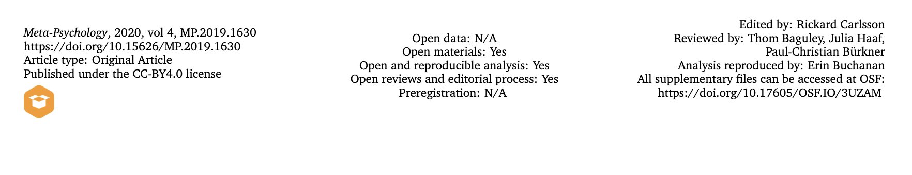

# An Emphasis on Workflow

```{r, include=FALSE}
library(tidyverse)
```

## Required Packages


The data files below are used in this chapter. 

| Required Data |
|-------------------|
|[data_ex_between.csv](data_ex_between.csv)|
|[data_ex_within.csv](data_ex_within.csv) |
|[data_item_scoring.csv](data_item_scoring.csv) |


The following CRAN packages must be installed:

| Required CRAN Packages |
|-------------------|
|apaTables          |
|Hmisc              |
|janitor            |
|psych              |
|skimr              |
|tidyverse          |

**Important Note:** You should NOT use library(psych) at any point! There are major conflicts between the psych package and the tidyverse. We will access the psych package commands by preceding each command with psych:: instead of using library(psych).


## Objective

Due to a number of high profile failures to replicate study results [@cos2015] it's become increasingly clear that there is a general crisis of confidence in many areas of science [@baker2016]. Statistical (and other) explanations have been offered [@simmons2011] for why it's hard to replicate results across different sets of data. However, scientists are also finding it challenging to recreate the numbers in their own papers using their own data. Indeed, the editor of Molecular Brain asked authors to submit the data used to create the numbers in published papers and found that the wrong data was submitted for 40 out of 41 papers [@miyakawa2020].

Consequently, some researchers have suggested that it is critical to distinguish between replication and reproducibility [@patil2019]. **Replication refers to trying to obtain the same results from a different data set. *Reproducibility refers to trying to obtain the same results from the same data set.* ** Unfortunately, some authors use these two terms interchangeably and fail to make any distinction between them. I encourage you to make the distinction and the use the terms consist with use suggested by [@patil2019].

It may seem that reproducibility should be a given - but it's not. Correspondingly, there is a trend for journals and authors to adopt Transparency and Openness Promotion (TOP) [guidelines](https://www.cos.io/our-services/top-guidelines
). These guidelines involve such things as making your materials, data, code, and analysis scripts available on public repositories so anyone can check your data. A new open science journal rating system has even emerged called the [TOP Factor](https://topfactor.org).

The idea is not that open science articles are more trustworthy than other types of articles -- the idea is that trust doesn't play a role. Anyone can inspect the data using the scripts and data provided by authors. It's really just the same as making your science available for auditing the way financial records can be audited. But just like in the world of business, some people don't like the idea of making it possible for others to audit their work. The problems reported in Molecular Brain (doubtless common to many journals) are likely avoided with open science - because the data and scripts needed to reproduce the statistics in the articles are uploaded prior to publication. 

The TOP open science guidelines have made an impact and some newer journals, such as Meta Psychology, have fully embraced open science. Figure \@ref(fig:metapsychology) shows the header from an [article](https://open.lnu.se/index.php/metapsychology/article/view/1630/2266) in Meta Psychology that clearly delineates the open science attributes of the article that used computer simulations (instead of participant data). Take note that the header even indicates who verified that the analyses in the article were reproducible.

```{r metapsychology, echo=FALSE, out.width="100%", fig.cap="Open science in an article header"}

```

In Canada, the majority of university research is funded by the Federal Government's Tri-Agency (i.e., NSERC, SSHRC, CIHR). The agency has a new [Data Management Policy](https://www.science.gc.ca/eic/site/063.nsf/eng/h_97610.html) in which they state that *"The agencies believe that research data collected through the use of public funds should be responsibly and securely managed and be, where ethical, legal and commercial obligations allow, **available for reuse** by others. To this end, the agencies support the FAIR (Findable, Accessible, Interoperable, and Reusable) guiding principles for research data management and stewardship."* [emphasis added] The perspective of the funding agency on data ownership differs substantially from that of some researchers who incorrectly believe "they own their data". In Canada at least, the government makes it clear that when tax payers fund research (through the Tri-Agency) the research data is public property. Additionally the [Tri-Agency Data Management Statement of Principles](https://www.ic.gc.ca/eic/site/063.nsf/eng/h_83F7624E.html) clearly indicates the responsibilities of funded researchers:

"Responsibilities of researchers include:

* incorporating data management best practices into their research;
* developing data management plans to guide the responsible collection, formatting, preservation and sharing of their data throughout the entire lifecycle of a research project and beyond;
* following the requirements of applicable institutional and/or funding agency policies and professional or disciplinary standards;
* acknowledging and citing datasets that contribute to their research; and
* staying abreast of standards and expectations of their disciplinary community."

As a result of this perspective on data, it's important that you think about structuring your data for reuse by yourself and others before you collect it. Toward this end, properly documenting your data file and analysis scripts is critical.


## Begin with the end in mind

In this chapter we will walk you though the steps from data collection, data entry, loading raw data, and the creation of data you will analyze (analytic data) via pre-processing scripts. These steps are outlined in Figure \@ref(fig:pipeline). This figure makes a clear distinction between raw data and analytic data. Raw data refers to the data as you entered it into a spreadsheet or received it from survey software. Analytic data is the data that has been structured and processed so that it is ready for analysis. This pre-processing could include such things as identifying categorical variables to the computer, averaging multiple items into a scale score, and other tasks.

It's critical that you don't think of the analysis of your data as being completely removed from the data collection and data entry choices you make. Poor choices at the data collection and data entry stage can make your life substantially more complicated when it comes time to write the pre-processing script that will convert your raw data to analytic data. The mantra of this chapter is *begin with the end in mind*.


```{r pipeline, echo = FALSE, out.width="85%", fig.cap = "Data science pipeline by Roger Peng"}
knitr::include_graphics("ch_enter_load/images/pipeline.png")
```


It's difficult to begin with the end in mind when you haven't read later chapters. So, here we will be providing you with some general thoughts around different approaches to structuring data files and the naming conventions you can use when creating those data files.


Indeed, in this chapter we strongly advocate that you use a naming convention for file, variable, and column names. This convention will save you hours of hassles and permit easy application of certain tidyverse commands. However, we must stress that although the naming convention we advocate is based on the tidyverse style guide, it is not "right" or "correct" - there are other naming conventions you can use. Any naming convention is better than no naming convention. The naming convention we advocate here will solve many problems. We encourage to use this system for weeks or months over many projects - until you see the benefits of this system, and correspondingly its shortcomings. After you are well versed in the strengths/weaknesses of the naming conventions used here you may choose to create your own naming convention system.

### Structuring data: Obtaining tidy data

When conducting analyses in R it is typically necessary to have data in a format called tidy data [@tidy-data]. [Tidy data](https://cran.r-project.org/web/packages/tidyr/vignettes/tidy-data.html), as defined by Hadley, involves (among other requirements) that: 

1. Each variable forms a column.

2. Each observation forms a row.

The tidy data format can be initially challenging for some researchers to understand because it is based on thinking about, and structuring data, in terms of observations/measurements instead of participants. In this section we will describe common approaches to entering animal and human participant data and how they can be done keeping the tidy data requirement in mind. It's not essential that data be entered in a tidy data format but it is essential that you enter data in a manner that makes it easy to later convert data to a tidy data format. When dealing with animal or human participant data it's common to enter data into a spreadsheet. Each row of the spreadsheet is typically used to represent a single participant and each column of the spreadsheet is used to represent a variable.

**Between participant data**. Consider Table \@ref(tab:betweenex) which illustrates between participant data for six human participants running 5 kilometers. The first column is id, which indicates there are six unique participants and provides and identification number for each of them. The second column is sex, which is a variable, and there is one observation per per row, so sex also conforms to the tidy data specification. Finally, there is a last column elapsed_time which is a variable with one observation per row -- also conforming to tidy data specification. Thus, single occasion between subject data like this conforms to the tidy data specification. There is usually nothing you need to do to convert between-participant data (or cross-sectional data) to be in a tidy data format.


```{r betweenex, echo = FALSE}
data_between <- read_csv("data_ex_between.csv", col_type = cols())
knitr::kable(
  head(data_between), caption = 'Between participant data entered one row per participant',
  booktabs = TRUE,
  linesep = c("","","","","","","\\addlinespace")
)
```


**Within participant data**. Consider  Table \@ref(tab:withinex) which illustrates within participant data for six human participants running 5 kilometers - but on three different occasions. The first column is id, which indicates there are six unique participants and provides an identification number for each of them. The second column is sex, which is a variable, and there is one observation per for row, so sex also conforms to the tidy data specification. Next, there are three different columns (march, may, july) each of which contains elapsed time (in minutes) for the runner in a different month. Elapsed run times are spread out over three columns so elapse_time is not in a tidy data format. Moreover, it's not clear from the data file that march, may, and july are levels of a variable called occasion. Nor is it clear that elapsed_times are recorded in each of those columns (i.e., the dependent variable is unknown/not labeled). Although this format is fine as a data entry format it clearly has problems associated with it when it comes time to analyze your data.


```{r withinex, echo = FALSE}
data_within <- read_csv("data_ex_within.csv", col_types = cols())
knitr::kable(
  head(data_within), caption = 'Within participant data entered one row per participant',
  booktabs = TRUE,
  linesep = c("","","","","","","\\addlinespace")
)
```

```{r, include=FALSE}
data_within_tidy <- data_within %>% 
  pivot_longer(cols = march:july,
               names_to = "occasion",
               values_to =  "elapsed_time")

```

```{r withintidyex, echo = FALSE}
knitr::kable(
  head(data_within_tidy,18), caption = 'A tidy data version of the within participant data',
  booktabs = TRUE,
  linesep = c("", "","\\addlinespace")
)
```


Thus, a major problem with entering repeated measures data in the one row per person format is that there are hidden variables in the data and you need insider knowledge to know what the columns represent. That said, this is not necessarily a terrible way to enter your data as long as you have all of this missing information documented in a data code book.


| Disadvantages one row per participant  | Advantages one row per participant | 
| ---------------|------------|
| 1) Predictor variable (*occasion*) is hidden and spread over multiple columns | 1) Easy to enter this way | 
| 2) Unclear that each month is a level of the predictor variable *occasion* | |
| 3) Dependent variable (*elapsed_time*) is not  indicated    | |
| 4) Unclear that *elapsed_time* is the measurement in each month column | |

\newpage

Fortunately, the problems with Table \@ref(tab:withinex) can be largely resolved by converting the data to the a tidy data format. This can be done with the pivot_long() command that we will learn about in the [Cookbook](https://dstanley4.github.io/psyc6060bookdown/cookbook.html) chapter. Thus, we can enter the data in the format of Table \@ref(tab:withinex) and later convert it to a tidy data format. After this conversion the data will be appear as in Table \@ref(tab:withintidyex). For elapsed_time variable this data is now in the tidy data format. Each row corresponds to a single elapsed_time observed. Each column corresponds to a single variable. Somewhat problematically, however, sex is repeated three times for each person (i.e., over the three rows) - and this can be confusing. However, if the focus in on analyzing elapsed time this tidy data format makes sense. Importantly, there is an id column for each participant so R knows that this information is repeated for each participant and is not confused by repeating the sex designation over three rows. Indirectly, this illustrates the importance of having an id column to indicate each unique participant.

Why did we walk you through this technical treatment of structuring data at this point in time - so that you pay attention to the advice that follows. You can see at this point that you may well need to restructure your data for certain analyses. The ability to do so quickly and easily depends upon  following the advice in this chapter around naming conventions for variables and other aspects of your analyses. You can imagine the challenges for converting the data in Figure \@ref(tab:withinex) to the data in Figure \@ref(tab:withintidyex) by hand. You want to be able to automate that process and others - which is made substantially easier if you follow the forthcoming advice about naming conventions in the tidyverse.


## Data collection considerations 

Data can be collected in a wide variety of ways. Regardless of the method of data collection researchers typically come to data in one of two ways: 1) a research assistant enters the data into a spreadsheet type interface, or 2) the data is obtained as the output from computer software (e.g., Qualtrics, SurveyMonkey, Noldus, etc.). 

Regardless of the approach, it is critical to name your variables appropriately. For those using software, such as Qualtrics, this means setting up the software to use appropriate variable names PRIOR to data collection - so the exported file has desirable column names. For spreadsheet users, this means setting up the spreadsheet in which the data will be recorded with column names that are amenable to the future analyses you want to conduct. 

Although failure to take this thoughtful approach at the data collection stage can be overcome - it is only overcome with substantial manual effort. Therefore, as noted previously, we strongly encourage you to follow the naming conventions we espouse here when you set up your data recording regime. Additionally, we encourage you to give careful thought in advance to the codes you will use to record missing data.

### File naming conventions

I **strongly** suggest you check out these excellent [slides](https://slides.djnavarro.net/project-structure/#1) by Danielle Navarro on file name convention best practices.

### Data column naming conventions

  To make your life easier down the road, it is critical you set up your spreadsheet or online survey such that it uses a naming convention prior to data collection. The naming conventions suggested here are adapted from the tidyverse [style guide](https://style.tidyverse.org).


* Lowercase letters only

* If using multiple words in a name (a good idea), only use the underscore ("_") character to separate words in the name.

* Avoid short decontextualized variable names like q1, q2, q3, etc.

* Do use moderate length column names. Aim to achieve a unique prefix for related columns so that those columns can be selected using the starts_with() command discussed in the previous chapter. Be sure to avoid short two or three letter prefixes for item names. Instead, use unique moderate length item prefixes so that it will be easy to select those columns using start_with() such that you don't accidentally get additionally columns you don't want - that have a similar prefix. 

* Likert items. Be sure to indicate the following information in the name of each Likert item or you will make your life substantially more complicated when you start to analyze your data. The information to include: a) the name of the measure, b) the item number for the measure, c) that it is a Likert item, d) the number of Likert response options, and e) whether the item is reverse keyed. That's five things to include in each Likert item name. But it's easy to do so. Consider two "affective commitment" items, the 2nd and 3rd items on scale. Both items use a 5-point Likert response format. However, item 3 is reverse keyed. **Names that conform to this convention are: aff_com3_likert5, aff_com3_likert5rev.**  Using this naming convention ensures you can easily select and convert the items later. You can select by "likert5", "likert5rev" or select by "aff_com".

* If you have a column name that represents the levels of two repeated measures variables only use the underscore character to separate the levels of the different variables. See within-participant ANOVA section below for details.

* Column content. Avoid numerical representation of categorical variables. Don't use 1 or 2 to represent a variable like sex. Use male and female in your spreadsheet - likewise in your survey program. Similarly, for between participant variables like drug_condition don't use 1 or 2 use "drug" and "placebo" but the actual drug name would be even better than the word "drug."  Following this approach ensure the data can "stand alone" for resuse by others (especially if a data codebook ([example](https://ces-eec.sites.olt.ubc.ca/files/2017/04/CES2015_Combined_Data_Codebook.pdf)) is not provided.) Note you will covert categorical variables such as sex (male/female) to numeric representations in your script - but then it will be clear what each value means.


### Likert-type items

A Likert-type item is typically composed of a statement with which participants are asked to agree or disagree. For example, participants could be asked to indicate the extent to which they agree with a number of statements such as "I like my job". Then they would be presented with response scale such as: 1 - Strongly Disagree, 2 - Moderately Disagree, 3 - Neutral, 4, Moderately Agree, 5 - Strongly Agree. A common question is, how should I enter the data?

**Export text responses not numbers** Software such as Qualtrics gives you the option of exporting the label (e.g., "Strongly Agree") or a value (e.g., 1). Make sure you export the text lable ("Strongly Agree). That way, the data file stands alone - and doesn't require additional knowledge to know what 1 means. You can easily convert the labels to numbers later.

* **High numbers should be associated with more of the construct being measured.** When designing your survey or data collection tools, it is important that you set the response options appropriately. If your scale measures job satisfaction, it is important that you collect data in a manner that ensures high numbers on the job satisfaction scale indicate high levels of job satisfaction. Therefore, assigning numbers makes sense using the 5-point scale: 1 - Strongly Disagree, 2 - Moderately Disagree, 3 - Neutral, 4, Moderately Agree, 5 - Strongly Agree. With this approach high response numbers indicate more job satisfaction. However, using the opposite scale would not make sense: 1 - Strongly Agree, 2 - Moderately Agree, 3 - Neutral, 4, Moderately Disagree, 5 - Strongly Disagree. With this opposite scale high numbers on a job satisfaction scale would indicate lower levels of job satisfaction - a very confusing situation. Avoid this situation, assign numbers so that higher numbers are associated with more of the construct being measured. 

* **Use appropriate item names.** As described in the naming convention section, use moderate length names with different labels for each subscale.

* **Use moderate length column names unique to each subscale**. Imagine you have a survey with an 18-item commitment scale [@meyer1993commitment] composed of three 6-item subscales: affective, normative, and continuance commitment. It would be a poor choice to prefix the labels of all 18 columns in your data with "commit" such that the names would be commit1, commit2, commit3, etc. The problem with this approach is that it fails to distinguish among the three subscales in naming convention; making it impossible to select the items for a single subscale using starts_with(). A better, but still poor choice for a naming convention would be use use a two letter prefix for the three scale such ac, nc, and cc. This would result in names for the columns like ac1, ac2, ac3, etc. This is an improvement because you could apparently (but likely not) select the columns using starts_with("ac"). The problem with these short names is that there could be many columns in data set that start with "ac" beside the affective commitment items. You might want to select the affective commitment items using starts_with("ac"); but you would get all the affective commitment item columns; but also all the columns measuring other variables that also start with "ac". Therefore, it's a good idea to use a moderate length unique prefix for column names. For example, you might use prefixes like affect_com, norm_com, and contin_com for the three subscales. But see below because you need to include more than this in each name. 

* **Indicate these 5 things in each Likert item name.** Be sure to indicate the following information in the name of each Likert item or you will make your life substantially more complicated when you start to analyze your data. The information to include: **1)** the name of the measure, **2)** the item number for the measure, **3)** that it is a Likert item, **4)** the number of Likert response options, and **5)** whether the item is reverse keyed. That's five things to include in each Likert item name. But it's easy to do so. Consider two "affective commitment" items, the 2nd and 3rd items on scale. Both items use a 5-point Likert response format. However, item 3 is reverse keyed. **Names that conform to this convention are: aff_com2_likert5, aff_com3_likert5rev.**  Using this naming convention ensure you can easily select and convert the items later. You can select by "likert5", "likert5rev" or select by "aff_com" (or both).

**Indicate in the item name if the item is reversed keyed. ** Sometimes with Likert-type items, an item is reverse keyed. For example, on a job satisfaction scale, participants will typically respond to items that reflect job satisfaction using the scale: 1 - Strongly Disagree, 2 - Moderately Disagree, 3 - Neutral, 4, Moderately Agree, 5 - Strongly Agree. Higher numbers indicate more job satisfaction. Sometimes, however, some items will use the same 1 to 5 response scale but be worded in the opposite manner such as "I hate my job". Responding with a 5 to this item would indicate high job *dissatisfaction*. But the columns for job satisfaction items should have high values that indicate high job satisfaction not high job dissatifaction. Consequently, we flag the names of columns with reversed responses (i.e., reverse-key items) so that we know to treat those column differently later. Columns with reverse-keyed items need to be processed by a script so that the values are flipped and scored in the right direction. The procedure for doing so is outlined in the next point.  

 **Indicate in the item name the range for reverse-key items.** If an item is reverse keyed, the process for the flipping the scores depends upon the range of a scale. Although 5-point scales are common, any number of points are possible. The process for correcting a reverse-key item depends upon: 1) the number of points on the scale, and 2) the range of the points on the scale. The reverse-key item correction process is different for an item that uses a 5-point scale ranging from 1 to 5 versus from 0 to 4. Both are 5-point scales but your correction process will be different. Therefore, for reverse-key items add a suffix at the end of each item name that indicates an item is reverse keyed and the range of the item. For example, if the third job satisfaction item was reversed keyed on scale using a 1 to 5 response format you might name the item: job_sat3_likert5rev. The suffix "_likert5rev" indicates the item is Likert item that is reverse keyed and the range of responses used on the item is 1 to 5. Be sure to set up your survey with this naming convention when you collect your data.

* If you collect items over multiple time points use a prefix with a short code to indicate the time followed by an underscore. For example, if you had a multi-item self-esteem scale you might call the column for the first time "t1_esteem1_likert5rev". This indicate that you have for time 1 (t1), the first self-esteem item (esteem1) and that item is a likert item that is reverse keyed on a 1 to 5 scale.


## Example: Single Occassion Survey

This section outlines a workflow appropriate for when you have cross-sectional single occasion survey data. Examples for other designs are presented in the [Cookbook](https://dstanley4.github.io/psyc6060bookdown/cookbook.html) chapter. The data corresponds to a design where the researcher has measured, age, sex, eye color, self-esteem, and job satisfaction. Two of these, self-esteem and job satisfaction, were measured with multi-item scales with reverse-keyed items. 

To Begin:

* Use the Files tab to confirm you have the data: data_item_scoring.csv

* Start a new script for this example. Don't forget to start the script name with "script_".


```{r, results='hide'}
# Date: YYYY-MM-DD
# Name: your name here
# Example: Single occasion survey

# Load data
library(tidyverse)

my_missing_value_codes <- c("-999", "", "NA")

raw_data_survey <- read_csv(file = "data_item_scoring.csv",
                     na = my_missing_value_codes)
```

We load the initial data into a raw_data_survey but immediately make a copy we will work with called analytic_data_survey. It's good to keep a copy of the raw data for reference if you encounter problems.

```{r}
analytic_data_survey <- raw_data_survey

```

Remove empty row and columns from your data using the remove_empty_cols() and remove_empty_rows(), respectively. As well, clean the names of your columns to ensure they conform to tidyverse naming conventions. 

```{r, results = "hide"}
library(janitor)

# Initial cleaning
analytic_data_survey <- analytic_data_survey %>%
  remove_empty("rows") %>%
  remove_empty("cols") %>%
  clean_names()
```

You can confirm the column names following our naming convention with the glimpse command - and see the data type for each column.

```{r}
glimpse(analytic_data_survey)
```

### Creating factors

Following initial cleaning, we identify categorical variables as factors. If you plan to conduct an ANOVA - it's critical that all predictor variables are converted to factors. Inspect the glimpse() output - if you followed our data entry naming conventions, categorical variables should be of the type character. 


```{r}
glimpse(analytic_data_survey)
```

We have two variables, sex and eye_color, that are categorical variable of type character (i.e., chr). The participant id column is categorical as well, but of type double (i.e., dbl) which is a numeric column. You can quickly convert all character columns to factors using the code below:

```{r}
analytic_data_survey <- analytic_data_survey %>%
  mutate(across(.cols = c(sex, eye_color),
                .fns = as_factor))
```

The participant identification number in the id column is a numeric column, so we have to handle that column on its own. 

```{r}
analytic_data_survey <- analytic_data_survey %>%
  mutate(id = as_factor(id))
```

You can ensure all of these columns are now factors using the glimpse() command. 

```{r}
glimpse(analytic_data_survey)
```

Inspect the output of the glimpse() command and make sure you have converted all categorical variables to factors - especially those you will use as predictors.

**Note:** If you have factors like sex that have numeric data in the column (e.g, 1 and 2) instead of male/female you need to handle the situation differently. The preceding section, Experiment: Within N-way, illustrates how to handle this scenario.

### Factor screening

Inspect the levels of each factor carefully. Make sure the factor levels of each variable are correct. Examine spelling and look for additional unwanted levels. For example, you wouldn't want to have the following levels for sex: male, mmale, female. Obviously, mmale is an incorrectly typed version of male. Scan all the factors in your data for erroneous factor levels. The code below displays the factor levels:

```{r}
analytic_data_survey %>%
  select(where(is.factor)) %>%
  summary()
```


Also inspect the output of the above summary() command paying attention to the order of the levels in the factors. The order influences how text output and graphs are generated. In these data, the sex column has two levels: male and female in that order. Below we adjust the order of the sex variable because we want the x-axis of a future graph to display columns in the left to right order: female, male.

```{r}
analytic_data_survey <- analytic_data_survey %>%
  mutate(sex = fct_relevel(sex,
                           "intersex",
                           "female",
                           "male"))
```

For eye color, we want a future graph to have the most common eye colors on the left so we reorder the factor levels:

```{r}
analytic_data_survey <- analytic_data_survey %>%
  mutate(eye_color = fct_infreq(eye_color))
```

You can see the new order of the factor levels with summary():
```{r}
analytic_data_survey %>%
  select(where(is.factor)) %>%
  summary()
```


### Numeric screening

For numeric variables, it's important to find and remove impossible values. For example, in the context of this example you want to ensure none of the Likert responses are impossible (e.g., outside the 1- to 5-point rating scale) or clearly data entry errors.

Because we have several numeric columns that we are screening, we use the skim() command from the skimr package. The skim() command quickly provides basic descriptive statistics. In the output for this command there are also several columns that begin with p: p0, p25, p50, p75, and p100 (p25 and p75 omitted in output due to space). These columns correspond to the 0th, 25th, 50th, 75th, and 100th percentiles, respectively. The minimum and maximum values for the data column are indicated under the p0 and p100 labels. The median is the 50th percentile (p50). The interquartile range is the range between p25 and p75.

Start by examining the range of non-scale items. In this case it's only age. Examine the output to see if any of the age values are unreasonable. As noted, in the output p0 and p100 indicate the 0th percentile and the 100th percentile; that is the minimum and maximum values for the variable. Check to make sure none of the age values are unreasonably low or high. If they are, you may need to check the original data source or replace them with missing values.

```{r, eval = FALSE}
library(skimr)
analytic_data_survey %>%
  select(age) %>%
  skim()
```
```{r, echo=FALSE}
library(skimr)

outdf <- analytic_data_survey %>%
  select(starts_with("age")) %>%
  skim_without_charts() %>%
  as_tibble() %>%
  select(-skim_type) %>%
    rename_with(.fn = str_remove,
              .cols = everything(),
              pattern = "numeric.") %>%
  select(-p25, -complete_rate, -p75) %>%
  as.data.frame()

outdf$mean = round(outdf$mean,2)
outdf$sd = round(outdf$sd,2)

outdf
```

With respect to the multi-item scales, it makes sense to look at sets of items rather than all of the items at once. This is because sometimes items from different scales use different response ranges. For example, one measure might use a response scale with a range from 1 to 5; whereas another measure might use a response scale with a range from 1 to 7. This is undesirable from a psychometric point of view, as discussed previously, but if it happens in your data - look at the scale items separately to make it easy to see out of range values.

We begin by looking at the items in the first scale, self-esteem. Possible items responses for this scale range from 1 to 5; make sure all responses are in this range. If any values fall outside this range, you may need to check the original data source or replace them with missing values - as described previously.


```{r, eval=FALSE}
analytic_data_survey %>%
  select(starts_with("esteem")) %>%
  skim()
```
```{r, echo=FALSE}
outdf <- analytic_data_survey %>%
  select(starts_with("esteem")) %>%
  skim_without_charts() %>%
  as_tibble() %>%
  select(-skim_type) %>%
    rename_with(.fn = str_remove,
              .cols = everything(),
              pattern = "numeric.") %>%
  select(-p25, -complete_rate, -p75) %>%
  as.data.frame()

outdf$mean = round(outdf$mean,2)
outdf$sd = round(outdf$sd,2)

outdf
```

Follow the same process for the job satisfaction items. Write that code on your own now. 

Possible item responses for the job satisfaction scale range from 1 to 5, make sure all responses are in this range. If any values fall outside this range, you may need to check the original data source or replace them with missing values - as described previously.


```{r, eval=FALSE}
analytic_data_survey %>%
  select(starts_with("jobsat")) %>%
  skim()
```
```{r, echo=FALSE}
outdf <- analytic_data_survey %>%
  select(starts_with("jobsat")) %>%
  skim_without_charts() %>%
  as_tibble() %>%
  select(-skim_type) %>%
    rename_with(.fn = str_remove,
              .cols = everything(),
              pattern = "numeric.") %>%
  select(-p25, -complete_rate, -p75) %>%
  as.data.frame()

outdf$mean = round(outdf$mean,2)
outdf$sd = round(outdf$sd,2)

outdf
```


### Scale scores

For each person, scale scores involve averaging scores from several items to create an overall score. The first step in the creation of scales is correcting the values of any reverse-keyed items.

#### Reverse-key items

The way you deal with reverse-keyed items depends on how you scored them. Imagine you had a 5-point scale. You could have scored the scale with the values 1, 2, 3, 4, and 5. Alternatively, you could have scored the scale with the values 0, 1, 2, 3, and 4. The mathematical approach you use to correcting reverse-keyed items depends upon whether the scale starts with 1 or 0.

In this example, we scored the data using the value 1 to 5; so that is the approach illustrated here. See the extra information box for details on how to fixed reverse-keyed items when the scale begins with zero.

In this data file all the reverse-keyed items were identified with the suffix "_likert5rev" in the column names. This suffix indicates the item was reverse keyed and that the original scale used the response points 1 to 5. We can see those items with the glimpse() command below. Notice that there are two reverse-keyed items - each on difference scales.

```{r}
analytic_data_survey %>%
  select(ends_with("_likert5rev")) %>%
  glimpse()
```

To correct a reverse-keyed item where the lowest possible rating is 1 (i.e, 1 on a 1 to 5 scale), we simply subtract all the scores from a value one more than the highest point possible on the scale (i.e., one more than 5). For example, if a 1 to 5 response scale was used we subtract each response from 6 to obtain the recoded value.

|  Original value | Math  | Recoded value |
|             :-: |  :-:  | :-:           |
| 1               | 6 - 1 | 5             |
| 2               | 6 - 2 | 4             |
| 3               | 6 - 3 | 3             |
| 4               | 6 - 4 | 2             |
| 5               | 6 - 5 | 1             |


The code below:

* selects columns that end with "_likert5rev" (i.e., both esteem and jobsat scales)
* subtracts the values in those columns from 6
* renames the columns by removing "_likert5rev" from the name because the reverse coding is complete

```{r,echo=TRUE,eval=TRUE}
analytic_data_survey <- analytic_data_survey %>% 
  mutate(6 - across(.cols = ends_with("_likert5rev")) ) %>% 
  rename_with(.fn = str_replace,
              .cols = ends_with("_likert5rev"),
              pattern = "_likert5rev",
              replacement = "_likert5")
```

You can use the glimpse() command to see the result of your work. If you compare these new values to those obtained from the previous glimpse() command you can see they have changed. Also notice the column names no longer indicate the items are reverse keyed.

```{r,echo=TRUE,eval=TRUE}
glimpse(analytic_data_survey)
```

```{block2, type='rmdcaution'}
If your scale had used response options numbered 0 to 4 the math is different.
For each item you would use subtract values from the highest possible point (i.e, 4) instead of one larger than the highest possible point.

|  Original value | Math  | Recoded value |
|             :-: |  :-:  | :-:           |
| 0               | 4 - 0 | 4             |
| 1               | 4 - 1 | 3             |
| 2               | 4 - 2 | 2             |
| 3               | 4 - 3 | 1             |
| 4               | 4 - 4 | 0             |

Thus, the mutate command would instead be:

  mutate(4 - across(.cols = ends_with("_likert5rev")) )
```

#### Creating scores

The process we use for creating scale scores deletes item-level data from analytic_data_survey. This is a desirable aspect of the process because it removes information that we are no longer interested in from our analytic data. That said, before we create scale score, we create a backup on the item-level data called analytic_data_survey_items. We will need to use this backup later to compute the reliability of the scales we are creating.

```{r}
analytic_data_survey_items <- analytic_data_survey
```

We want to make a self_esteem scale and plan to select items using starts_with("esteem"). But prior to doing this we make sure the start_with() command only gives us the items we want - and not additional unwanted items. The output below confirms there are not problems associated with using starts_with("esteem").

```{r}
analytic_data_survey %>%
  select(starts_with("esteem")) %>%
  glimpse()
```

Likewise, we want to make a job_sat scale and plan to select items using starts_with("jobsat"). The code and output below using starts_with("jobsat") only returns the items we are interested in.

```{r}
analytic_data_survey %>%
  select(starts_with("jobsat")) %>%
  glimpse()
```


We calculate the scale scores using the rowwise() command. The mean() command provides the mean of columns by default - not people. We use the rowwise() command in the code below to make the mean() command  work across columns (within participants) rather than within columns. The mutate command calculates the scale score for each person. The c_across() command combined with the starts_with() command ensures the items we want averaged together are the items that are averaged together. Notice there is a separate mutate line for each scale. The ungroup() command turns off the rowwise() command. We end the code block by removing the item-level data from the data set.

**Important:** Take note of how we name the scale variables (e.g., self_esteem, job_sat). We use a slightly different convention than our items. That is, these scale labels were picked so that they would *not* be selected by a starts_with("esteem") or starts_with("jobsat"). Why - because we later use those commands to remove the item-level data. We would not want the command designed to remove the item-level data to also remove the scale we just calculated! This example illustrates how carefully you need to think about your naming conventions.

```{r}
analytic_data_survey <- analytic_data_survey %>% 
  rowwise() %>% 
  mutate(self_esteem = mean(c_across(starts_with("esteem")),
                               na.rm = TRUE)) %>%
  mutate(job_sat = mean(c_across(starts_with("jobsat")),
                               na.rm = TRUE)) %>%
  ungroup() %>%
  select(-starts_with("esteem")) %>%
  select(-starts_with("jobsat")) 
  
```

We can see our data now has the self_esteem column, a job_sat column, and that all of the item-level data has been removed.

```{r}
glimpse(analytic_data_survey)
```

You now have two data sets analytic_data_survey and analytic_data_survey_items. You can calculate descriptive statistics, correlations and most analyses using the analytic_data_survey. To obtain the reliability of the scales you just created though you will need to use the analytic_data_survey_items. Both sets of data are ready for analysis.


