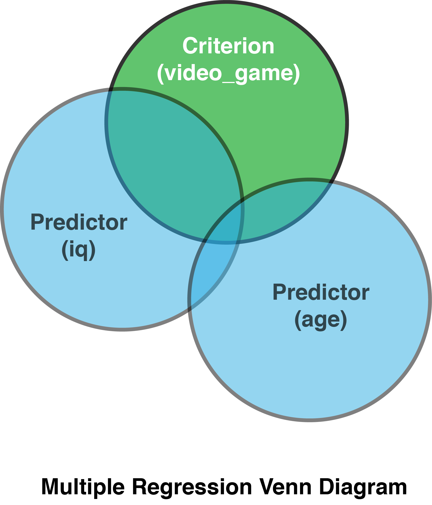
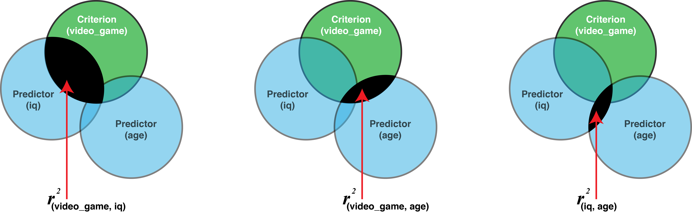
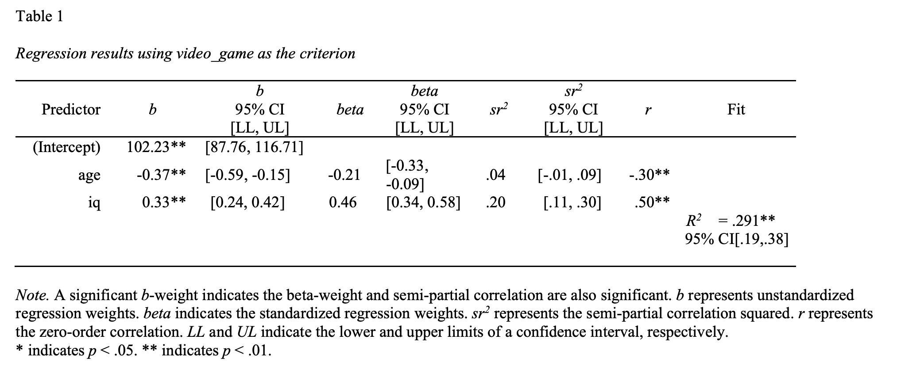
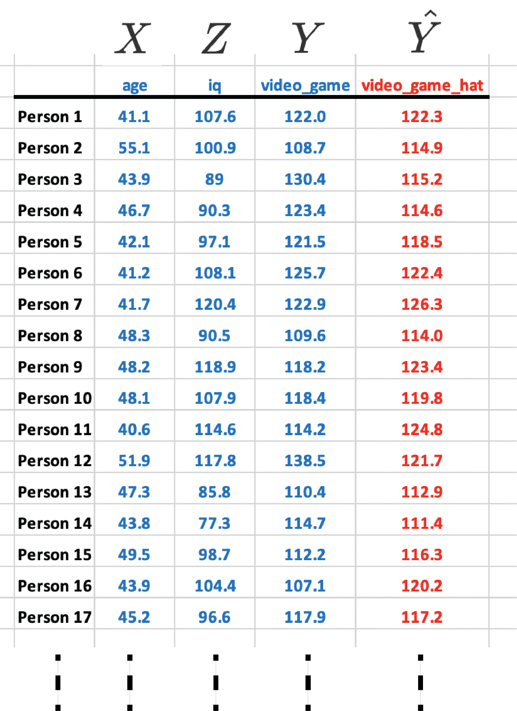
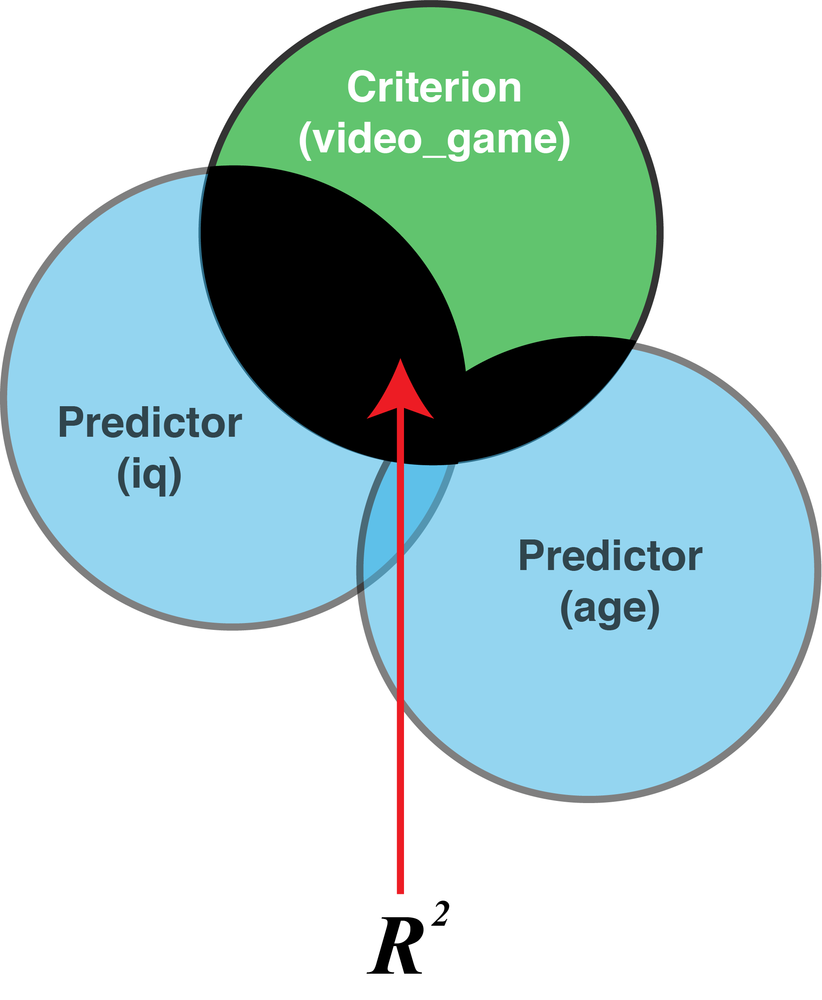

```{r, include=FALSE}
library(tidyverse)
library(janitor)
library(GGally)
```

# Multiple regression

The following CRAN packages must be installed:

| Required CRAN Packages |
|-------------------|
|tidyverse          |
|apaTables         |
|janitor            |
|remotes            |
|skimr             |

The following GitHub packages must be installed:

| Required GitHub Packages |
|--------------------------|
|dstanley4/fastInteraction |


After the remotes package is installed, it can be used to install a package from GitHub:

```{r, eval = FALSE}
remotes::install_github("dstanley4/fastInteraction")
```

## Overview

Multiple regression is a means relating multiple predictor variables to a single criterion variable. We can determine the amount of variance in the criterion accounted for by the set of predictors ($R^2$), a single predictor on it's own ($r^2$), or the extent to which a single predictor accounts for unique variance account for in the criterion that is not accounted for by any of the other predictors ($sr^2$).

## Example

In this chapter, we examine the extent to video game scores are predicted by age and IQ for people who live in the City of Guelph. As before, we treat citizens of Guelph as our population -- though in this chapter we move straight to the sample data (without showing the population-level data).

We are interested in using both IQ and age to predict video game scores so we refer to these variables as **predictor** variables. The value being predicted is video game score and we refer to that variable as the **criterion** (i.e., the dependent variable). 

You can think of the multiple regression problem using a venn diagram:

```{r. echo = FALSE}

```


## Load the data

We use a data set called  "data_mr_ex.csv" in this example. The data can be loaded with the command:

```{r,echo=TRUE,eval=TRUE, message=FALSE}
library(tidyverse)
library(janitor)

my_data <- read_csv("data_mr_ex.csv")

# ensure column names match desired naming convention
my_data <- my_data %>%
  clean_names()
```

We see the structure of the data with the glimpse() command:

```{r}
glimpse(my_data)
```


## Bivariate relations

When you conduct multiple regression analyses you should always report a correlation matrix with your predictors and criterion.

```{r}
library(apaTables)

apa.cor.table(my_data)

```

You should always check for curvilinear relations when reporting correlations via a graph. We quickly create a graph for doing so with the code below. In this case we don't see any curvilinear relations.

```{r}
library(GGally)

ggpairs(my_data)
```


You can think of each bivariate correlation as the shaded areas on the figure below. In this type of figure the degree of overlap between two circles is determined by the correlation squared (i.r., $r^2$). The value you obtain for $r^2$ indicates the proportion of the criterion that is covered by the predictor. For example, if $r$ = .50 then $r^2$ = .25 which indicates 25% of the criterion should be covered by the circle representing that predictor.


```{r, echo = FALSE, out.width="100%"}

```


## Single best predictor

What is the best predictor of video_game? Many researchers incorrectly believe you need multiple regression to answer this question - you do not. To determine the single best predictor in a set of predictors just look at the correlation matrix above - no need for regression (or beta-weights). The strongest correlation is the best predictor. In our current example, video_game_score is predicted by iq (*r* = .50) and age (*r* = -.30). The best predictor of video_game_score is iq because it has the strongest correlation (using absolute values .50 is larger than .30). 

## Multiple regression

Multiple regression is frequently used to ask two questions:

* How well we can predict the criterion using a set of predictors (see $R^2$)?

* What is the unique contribution of a single variable in a set or predictors? In other words, how much does one variable predict the criterion above and beyond another variable? For example, does study time predict exam grades above and beyond iq? Or phrased differently: Does study time predict unique variance in exam grades that is not accounted for by iq? (see $sr^2$).

We want to use age and IQ to predict video game score ($Y$). More specifically, we want to combine age and IQ to create a new variable ($\widehat{Y}$) that correlates as highly as possible with video game score. We do with the code below:

```{r,echo=TRUE,eval=TRUE}
lm_object <- lm(video_game ~ age + iq,
                    data = my_data)
```

Now look at the brief output:

```{r,echo=TRUE,eval=TRUE}
print(lm_object)
```

This output shows you how we can combine age, IQ, and a constant to create ($\widehat{Y}$). 

More specifically:
$\widehat{Y} = 102.233 - 0.0371(age) + 0.328(iq)$

The slopes for age and iq are -0.0371 and 0.328, respectively. These are also referred to as the *b*-weights or unstandardized regression coefficients. The computer picks these weight so that predicted video game scores ($\widehat{Y}$) will corresponds as closely as possible to actual video game scores.

A quick way to get more comprehensive regression output is to use the *apa.reg.table* function in the apaTables package.

```{r,echo=TRUE,eval=FALSE}
library(apaTables)

apa.reg.table(lm_object,
              filename = "table_regression.doc")
```

```{r, echo=FALSE, out.width= "90%"}

```

## *b*-weights

An inspection of the *b* column in the above table reveals the *b*-weights we previously discussed. The *b*-weights are also known as the slopes or the unstandardized regression weights. The *b*-weights are used to create predicted/estimated video game score via the regression equation:

$$
\begin{aligned}
\widehat{Y} &= 102.233 + 0.3285(Z) - 0.3712(X) \\
\widehat{\text{video game}} &= 102.233 + 0.3285(iq) - 0.3712(age) \\
\end{aligned}
$$

You can think of the regression equation as a receipe for making $\hat{Y}$. The variables in the regression (e.g., age and iq) are the ingredients. The *b*-weights (e.g., 0.3285 and 00.3712) are the amount of each ingredient you need to make $\hat{Y}$.

As previously noted, the computer picks the *b*-weights using a process that ensures the predicted video game scores ($\hat{Y}$) corresponds as closely as possible to actual video game scores ($Y$). Consider the regression calculation for Person 1, below, who is 41.7 years old and has an IQ of 107.6.

$$
\begin{aligned}
\widehat{Y} &= 102.233 + 0.3285(Z) - 0.3712(X) \\
\widehat{\text{video game}} &= 102.233 + 0.3285(iq) - 0.3712(age) \\
&= 102.233 + 0.3285(107.6) - 0.3712(41.1) \\
&= 122.3
\end{aligned}
$$


The above calculation reveals an estimated video game score for Person 1 of 122.3 (i.e., $\hat{Y} = 122.3$) -- which differs only slightly from their actual video game score of 122 (i.e.. $Y = 122$). You can see the similarity between actual video game scores ($Y$) and predicted video game scores ($\hat{Y}$) for the first several participants in the table below.

```{r, echo = FALSE, out.width="50%"}

```

You can interpret the *b*-weights as indicating how much the criterion changes when a predictor changes -- **holding the other predictors constant**. In this context, a 0.3285 *b*-weight for IQ indicates that for each one-unit increase in IQ video game score will increase 0.3285 points -- holding the effect of age constant. Don't forget the *b*-weight can only be interpreting in context of that specific regression equation. If you replaced the age predictor with, say, height as a predictor, then the *b*-weight for IQ would change. Context matters when interpreting *b*-weights.


## $R^2$

How effective is the set of predictors? We can calculate $R^2$ to determine the proportion of variance the criterion that is accounted for by the set of predictors. This value is illustrated graphically below:

```{r, echo = FALSE, out.width="26%"}

```

You will simply obtain $R^2$ from computer output. But how is $R^2$ calculated? Understanding how $R^2$ is calculated can help you to understand how to interpret it. There are two methods for doing so - that produce the same number:

### Method 1: Ratio Approach

What does the $R^2$ mean? It is the proportion variability in criterion scores ($Y$) accounted for by ($\widehat{Y}$). In other words, it is the proportion of the variability in criterion scores that can be accounted for by (a linear combination of) iq and age.

We begin by obtaining predicted video game scores ($\widehat{Y}$) using the regression:

$\widehat{Y} = 102.233 + 0.3285(iq) - 0.3712(age)$

predicted_video_game_scores  $= 102.233 + 0.3285(iq) - 0.3712(age)$


The code below uses the above equation to calculate predicted video game score for each person:

```{r, echo=TRUE, eval=TRUE}
predicted_video_game_scores  <- predict(lm_object)

actual_video_game_scores <- my_data$video_game

```

Recall the formula for $R^2$:

$$
\begin{aligned}
R^2 = \frac{\text{Variance of predicted scores}}{\text{Variance of actual scores}}
\end{aligned}
$$

We implement this formula using the code below:

```{r}
var_predicted_video_game_scores <- var(predicted_video_game_scores ) 
var_actual_video_game_scores   <-  var(actual_video_game_scores)

R2 <- var_predicted_video_game_scores / var_actual_video_game_scores

print(R2)
```

Thus, 29% of the variability in video game scores is predicted by the combination of age and IQ.


### Method 2: Correlation Approach

An alternative way of thinking about $R^2$ is as the squared correlation between predicted criterion scores and actual criterion scores:

$$
\begin{aligned}
R^2 &= r^2_{\hat{Y}, Y}\\
&= r^2_{(predicted_video_game_scores, actual_video_game_scores)}\\
\end{aligned}
$$

We implement this formula with the code below and obtain the same value:

```{r,echo=TRUE,eval=TRUE}
R <- cor(predicted_video_game_scores, actual_video_game_scores)

R2 <- R * R
print(R2)
```


### $R^2$ in practice


In practice we simply look at the apa.reg.table() output and obtain the $R^2$ value and 95% CI from this output:


```{r, echo=FALSE, out.width= "90%"}

```

From this table we determine: $R^2$ = .29, 95% CI [.19, .38]. to obtain the required *p*-value we use the summary() command on the previously calculated lm_object:

```{r}
summary(lm_object)
```
At the bottom of this output we see that the *p*-value is 1.912e-15 or 0.000000000000001912. Consequently, we report the $R^2$ value as:  $R^2$ = .29, 95% CI [.19, .38], $p$ < .001. Thus, 29% of the variability in video game scores is predicted by the combination of age and IQ.

## Semi-partial ($sr$)

A semi-partial correlation is represented by the symbol $sr$ and correspondingly a squared semi-partial correlation is represented by the symbol $sr^2$. What is a squared semi-partial correlation and why is it useful?

Semi-partial correlations are a way of determining the unique contribution of a variable to predicting the criterion (in the context of the other predictors). The semi-partial correlation is the correlation of one predictor (with all the other predictors removed) with the criterion. The semi-partial correlation squared is the amount $R^2$ would drop by if that variable was removed from the regression. It is the percentage of variability in criterion scores that is uniquely accounted for by a predictor. This is illustrated in the venn diagram below:


```{r, echo = FALSE, out.width="63%"}
knitr::include_graphics("ch_multiple_regression/images/mr_venn_sr.png")
```


### $sr^2$ in theory

In the text below we go "inside the black box" to show you how semi-partial correlations are computed. In practice, they are just displayed in R output - but understanding the text below where we calculate them "old school" will help with you interpret $sr^2$.

Overall, squared semi-partial correlations provide an index of how much that predictor contributes to the overall $R^2$ (with the effect of the other predictors removed). We calculate $sr^2$ for IQ (removing the effect of age) to demonstrate this fact. We do this with a regression equation in which **we make IQ the criterion ($Y$)**. Then we predict IQ with age. This produces my_iq_regression which has inside of it a predictor version of IQ, $\widehat{Y_{iq}}$, which in this case represents a best guess of IQ based on age. 

```{r,echo=TRUE,eval=TRUE}
my_iq_regression <- lm(iq ~ age, data = my_data)

print(my_iq_regression)
```
.
Thus, we find: $\widehat{Y_{iq}} = 124.763 - 0.506(age)$

Consequently, when you see $\widehat{Y_{iq}}$ recognize that it is really just an estimate of IQ **created entirely from age**. In contrast, $Y_{iq}$ is the actual IQ score we obtained from participants.

We want IQ with the effect of age removed. Therefore, we want IQ (i.e., $Y_{iq}$) with the effect of age (i.e.,$\widehat{Y_{iq}}$ ) removed.

Thus we want: residual = $Y_{iq}$ - $\widehat{Y_{iq}}$

or another way of thinking of it is:

iq_without_age = $Y_{iq}$ - $\widehat{Y_{iq}}$

iq_without_age = iq - (124.763 - 0.506(age) )

We do this below:

```{r,echo=TRUE,eval=TRUE}
iq_without_age <- resid(my_iq_regression) 
```

Then we correlate IQ without age (i.e., iq_without_age) with video game scores (i.e., video_game). This tells us how IQ correlates with video game scores when the effects of age have been removed from IQ; that is, the semi-partial correlation (i.e., $sr$). Once again refer to the venn diagram above illustrating $sr^2$.

```{r,echo=TRUE,eval=TRUE}
# apa.reg.table does this for you - this is for learning/illustration only.

sr  <- cor(iq_without_age, my_data$video_game)
sr2 <- sr * sr
```

### $sr^2$ in practice

The $sr^2$ values with confidence intervals are reported in apa.reg.table() output:

```{r, echo=FALSE, out.width= "90%"}

```

From this table we determine:

* age: $sr^2$ = .04 , 95% CI [-.01, .09]

* iq: $sr^2$ = .20, 95% CI [.11, .30]

However, to obtain the *p*-value for each $sr^2$ value we need to use the summary() command:

```{r}
summary(lm_object)
```

The *p*-value for the *b*-weight (i.e. Estimate) is the *p*-value for $sr^2$, Therefore, we simply look in the Pr(>|t|) column to obtain the required *p*-value. Adding this value to our reporting, we find:

* age: $sr^2$ = .04 , 95% CI [-.01, .09], *p* < .001

* iq: $sr^2$ = .20, 95% CI [.11, .30], *p* < .001

If a predictor is significant, this indicates that the predictor contributes unique variance to $\widehat{Y_{video game}}$ that can not be contributed by any of the other predictors. The amount of unique variance contributed by a predictor is indicated by $sr^2$ (semi-partial correlation squared).


### Blocks regression

Some researchers are unfamiliar with semi-partial correlations and prefer to think in term of how the $R^2$ value changes over two different regression. This approach is just an indirect way of calculating $sr^2$.

Consider the example below where the researcher conducts the first regression, block 1, in which age is the predictor. Then he conducts a second regression, block 2, in which both age and iq are the predictors.

```{r,echo=TRUE,eval=TRUE}
# apa.reg.table does this for you - this is for learning/illustration only.

block1 <- lm(video_game ~ age,
             data = my_data)

block2 <- lm(video_game ~ age + iq,
             data = my_data)
```

The goal is to examine the $R^2$ when only age is the predictor and see how much it increases when you have both age and iq as predictors. The resulting difference, $\Delta R^2$ tells you how much iq predicted video game score beyond age alone. Examine the output below.

```{r,echo=TRUE,eval=FALSE}
apa.reg.table(block1, block2,
              filename = "table_mr_blocks.doc")
```

```{r, echo=FALSE, out.width= "90%"}
knitr::include_graphics("ch_multiple_regression/images/mr_table_blocks.png")
```

This table illustrates that for the first regression when just age was a predictor that $R^2$ = .09. When both age and iq were predictors $R^2$ = .29. That indicates that $R^2$ increased by .20 when we added iq as a predictor. Thus,  $\Delta R^2$ = .20. This is the amount $R^2$ increased by due to adding iq as predictor. Conceptually, and mathematically, this is identical to the $sr^2$ value for iq. Indeed, if you look at this output in detail you see that for iq $sr^2$ = .20.

## Beta-weights

*Beta-weights* are often referred to as *standardized regression weights*. This is a poor description that makes beta weights hard to understand.  A better description of *beta-weights* is the regression weights for standardized variables; that is variables with a mean of 0 and a standard deviation of 1.0.

### In practice

Recall we ran a regression with the command below. This command used the original/raw form of the variables.

```{r,echo=TRUE,eval=TRUE}
lm_object <- lm(video_game ~ age + iq,
                    data = my_data)
```

From lm_object created we used apa.reg.table() to obtain this output:

```{r, echo=FALSE, out.width= "90%"}

```

Notice the beta column in this output. It reports beta weights of -.21 and .46 for age and iq, respectively. Where did these values come from?

To answer this question, we need to start with the lm_object. The apa.reg.table() command just formats the information contained in the lm_object. We can see an unformatted version of this information with the summary() command:

```{r}
summary(lm_object)
```

Notice that the values in the Estimates column correspond to the b-weights column in the apa.reg.table() output. We will use this fact to create beta-weights.


### Old school

To obtain beta-weights there are two steps. First, we create standardized score versions of each column. Second, we run a normal regression using those columns.

A set of standardized scores have a mean of 0 and a standard deviation of 1.0. To create the standardized score versions of each column in the regression we use the z-score formula:

$$
\begin{aligned}
\text{standardized scores}=z_{X} = \frac{X-\bar{X}}{\sigma_X}
\end{aligned}
$$

Consider the age column. We can calculate the mean for this column, mean(age), and the standard deviation for this column, sd(age). Then for every value in the age column we subtract the column mean and then divide by the column standard deviation. We do so with the calculation: (age-mean(age))/sd(age). The code below creates standardized score versions of the iq, age, and video_game columns called z_iq, z_age, and z_video_game, respectively.

```{r}
my_data <- my_data %>% 
  mutate(z_iq = (iq-mean(iq))/sd(iq),
         z_age = (age-mean(age))/sd(age),
         z_video_game = (video_game-mean(video_game))/sd(video_game))
```

We can confirm a mean of 0 and a standard deviation of 1.0 for these new columns with the skim command:

```{r, eval = FALSE}
library(skimr)
skim(my_data)
```

Now we conduct the regression again with standardized variables (i.e., z-score versions).

```{r}
lm_object_zscores <- lm(z_video_game ~ z_iq + z_age,
                        data = my_data)
```

We can obtain the regression weights for analysis using these standardized scores with the summary() command:

```{r}
summary(lm_object_zscores) 
```

Notice that the estimates above are 4.582e-01 -2.070e-01 which are, in decimal form, .46 and -.21, respectively. These are the beta-weights from the apa.reg.table on the previous page. Thus, when you conduct a normal regression **but used standardized variables in it** you obtain beta-weights.

*Interpretation*. The typically reported **b-weights** describe how a 1 unit change in IQ influences video_game points. Similarly, **beta-weights**, describe how a 1 unit change in z_iq influences z_video_game. Keep in mind, however, that 1 unit of z_iq (and z_video_game) is 1 standard deviation. As a result, a beta-weight indicates how much the criterion scores will change in SD units when a predictor increases by 1 SD -- holding the effect of the other predictors constant. Similar to b-weights, beta-weights can only be interpreted in the context of the other variables in the equation.

Hopefully, this description has made it clear that although beta-weights are often referred to as *standardized regression weights*; it would be more accurate to describe them as the **weights for standardized variables**.

## Graphing

Let's take a minute to consider the nature of the data we have so far - examine the first few rows of the data below (that includes the predicted value for each person).

```{r, echo = FALSE, out.width="50%"}

```


You can see that each person has three measured variables associated with them: video_game_score, iq, and age. These columns are in blue to indicate the fact they are measured variables. Because we have three measured variables we can't create a typical 2D scatter plot. That type of plot only work when there is one predictor and one criterion. Now we have two predictors and one criterion. Consequently, we need make a 3D scatter plot.

Correspondingly, because we have two predictors, we can't obtain a regression line (i.e., best-fit line). A regression line is only possible when there is one predictor. Now we have two predictors. Consequently, a regression surface is required to show the predicted values for combinations of age and iq. In this case, when there are two predictor variables, the regression surface is a plane.

Let's create the 3D scatter plot with a regression surface. You recall we previously created the lm_object when we ran our regression:

```{r,echo=TRUE,eval=FALSE}
lm_object <- lm(video_game ~ age + iq,
                    data = my_data)
```

The lm_object has the three data point for each person (age, iq, video_game) embedded inside it. So we can use the lm_object to create the scatter plot with regression plane. We do so using the fastInteraction package. More specifically,  we use the fast.plot command as illustrated below.Note:  The fast.plot command uses the argument "moderator" which is not appropriate in our context. When you see moderator in the command below just think of it as another predictor. 

```{r, warning=FALSE, message=FALSE}
library(fastInteraction)

surface_plot <- fast.plot(lm_object,
                          criterion = video_game,
                          predictor = iq,
                          moderator = age)

```

Then just type:

```{r, eval= FALSE}
surface_plot
```

You can see the graph below:

```{r, echo = FALSE, out.width="90%"}
knitr::include_graphics("ch_multiple_regression/images/mr_3d_snapshot.png")
```

All of the predicted scores fall on the regression surface. You can think of the regression surface as a best-fit plane. In some sense you can think of the plane as a collection of best-fit lines. Indeed, two illustrative best-fit lines are place on this surface. For all the best-fit lines on the plane the slopes are the same - just the intercepts differ. You can see the people relative to the predicted surface/plane by looking at the dots. Each dot represents a person. 

Try the interactive version of the graph below. Caveat, sometimes it doesn't appear correctly on the web. If the graph appears incorrectly (e.g., no data points or no surface) try using the Chrome browser. Safari sometimes has problems with this web object. You can rotate the graph to see a better view of the surface. The graph illustrates that predicted video game scores (i.e., the surface) change as a function of both age and iq.


```{r, eval= TRUE}
surface_plot
```

